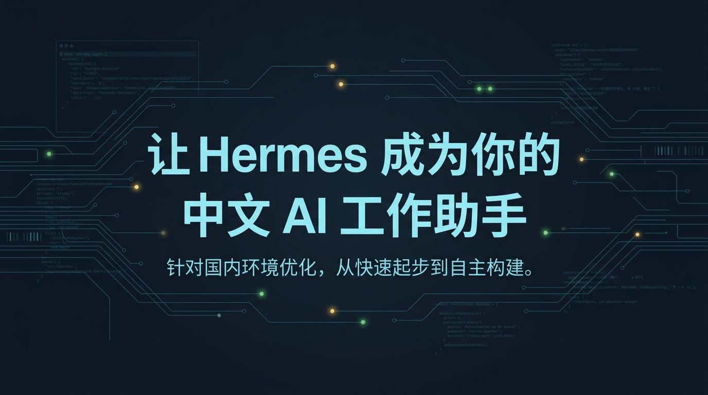
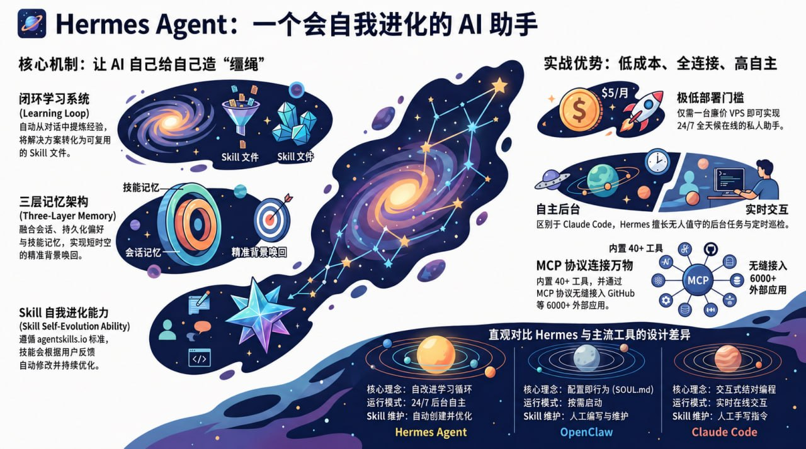

# 🌌 Hermes Agent 中文站

**一套面向中文用户的 Hermes Agent 实战入口**

从第一次跑通，到日常上手、现成方案、国内落地、排障参考，再到系统化搭建。  
这里不是零散笔记，而是一套可以顺着往下走的中文路径。

[🚀 01-从这开始](./docs/01-从这开始/总览.md) · [🧰 02-现成方案](./docs/02-现成方案/01-总览.md) · [🇨🇳 03-国内落地](./docs/03-国内落地/01-总览.md) · [🔄 04-从OpenClaw过来](./docs/04-从OpenClaw过来/01-总览.md) · [🩺 05-遇到问题](./docs/05-遇到问题/01-总览.md) · [📚 06-reference](./docs/06-reference/01-总览.md)

[🗺️ 文档总览](./docs/00-文档总览.md) · [🧭 治理说明](./governance/README.md) · [🧱 仓库结构](./governance/repo-structure.md) · [🧬 页面来源映射](./governance/page-source-map.md)

  

## 这是什么

Hermes Agent 中文站，是一套围绕 Hermes Agent 的中文实战文档入口。

它重点解决三件事：
- 帮第一次接触 Hermes 的人，先跑通第一轮
- 帮已经有明确目标的人，直接找到最短入口
- 帮已经开始长期使用的人，继续往定制、集成、自动化和系统化搭建走

如果你不想在英文文档、零散 issue、社区碎片和旧工作流之间来回跳，这个仓库就是你的中文主入口。

## 30 秒读懂

- 这是 **Hermes Agent 的中文实战路径**，不是资料堆
- 你可以按目标直接进入，不需要从头硬读全站
- 当前内容分成 6 个固定模块：上手、方案、国内落地、迁移、排障、参考
- README 负责给你入口；真正的细节，在 `docs/` 里逐页展开

## 先按你的目标选入口

| 你现在最想做什么 | 直接进入 | 你会得到什么 |
|---|---|---|
| 我第一次接触 Hermes，想先跑通一次 | [01-从这开始](./docs/01-从这开始/总览.md) | 安装、第一次互动、开始上手、个性化与系统化扩展路径 |
| 我不想自己从零搭，想直接拿现成工作流 | [02-现成方案](./docs/02-现成方案/01-总览.md) | 内容创作、办公效率、应用开发等现成方案与可下载包 |
| 我在国内使用，想先把模型、部署、入口方式理顺 | [03-国内落地](./docs/03-国内落地/01-总览.md) | 国内部署、国内模型、国内入口方式的完整中文路线 |
| 我已经在用 OpenClaw，想判断要不要迁、怎么迁 | [04-从OpenClaw过来](./docs/04-从OpenClaw过来/01-总览.md) | 对比、迁移判断、共存方式、迁移路径与检查清单 |
| 我现在卡住了，想快速定位问题 | [05-遇到问题](./docs/05-遇到问题/01-总览.md) | 安装、模型、CLI、Gateway、MCP、Profiles、远程后端排障 |
| 我不是来学概念，我只想查命令/配置/参考 | [06-reference](./docs/06-reference/01-总览.md) | CLI、Slash Commands、Profiles、环境变量、Tools、Toolsets、MCP、Skills 目录 |

## 如果你想先理解 Hermes 再决定从哪进

下面这张图更适合帮助你快速理解：Hermes 和普通“对话型助手”相比，为什么更适合长期运行、能力沉淀、记忆唤回和工具连接。

  

你可以先记住 4 个关键词：
- **闭环学习**：对话经验可以沉淀成可复用能力
- **多层记忆**：不只记当前会话，还能逐步形成长期背景
- **Skill 演化**：能力不是一次写死，而是能持续优化
- **MCP 扩展**：不只是聊天，还能连接更多工具与外部系统

说明：
- 这张图适合帮你建立整体认知
- 真正开始上手时，还是建议直接回到 [01-从这开始](./docs/01-从这开始/总览.md)

## 推荐阅读顺序

如果你是第一次来到这里，建议按这个顺序走：

1. 先看 [文档总览](./docs/00-文档总览.md)，知道当前已经开放了哪些内容
2. 再进入 [01-从这开始](./docs/01-从这开始/总览.md)
3. 跑通后，再根据目标分流到：
   - [02-现成方案](./docs/02-现成方案/01-总览.md)
   - [03-国内落地](./docs/03-国内落地/01-总览.md)
   - [04-从OpenClaw过来](./docs/04-从OpenClaw过来/01-总览.md)
4. 过程中卡住了，就回到 [05-遇到问题](./docs/05-遇到问题/01-总览.md)
5. 只想查资料时，直接去 [06-reference](./docs/06-reference/01-总览.md)

## 这套内容的设计目标

这套中文站追求的不是“文档很多”，而是“你每一步都知道下一步去哪”。

所以 README 和 docs 都按同一套思路组织：
- 先给入口，再给细节
- 先给判断，再给动作
- 先给最短路径，再展开能力边界
- 先让你能跑，再让你能定制、集成、自动化

## 仓库里主要有什么

- `README.md`：仓库首页入口
- `docs/`：公开文档正文
- `governance/`：外部仓最小治理层（结构、保留规则、来源映射）
- `packs/`：现成方案相关的可下载资源与工作流包
- `assets/`：README 和文档使用的图片资源

## 如果你准备继续往下走

- 想开始：看 [01-从这开始](./docs/01-从这开始/总览.md)
- 想直接拿方案：看 [02-现成方案](./docs/02-现成方案/01-总览.md)
- 想解决国内使用问题：看 [03-国内落地](./docs/03-国内落地/01-总览.md)
- 想处理迁移：看 [04-从OpenClaw过来](./docs/04-从OpenClaw过来/01-总览.md)
- 想查问题：看 [05-遇到问题](./docs/05-遇到问题/01-总览.md)
- 想查参考：看 [06-reference](./docs/06-reference/01-总览.md)
- 想看全站导航：看 [文档总览](./docs/00-文档总览.md)

## 仓库治理入口

如果你关心的是这个仓库怎么组织、哪些内容应该公开保留、页面从哪里来：

- [治理说明](./governance/README.md)
- [仓库保留原则](./governance/repo-policy.md)
- [仓库结构](./governance/repo-structure.md)
- [页面来源映射](./governance/page-source-map.md)
