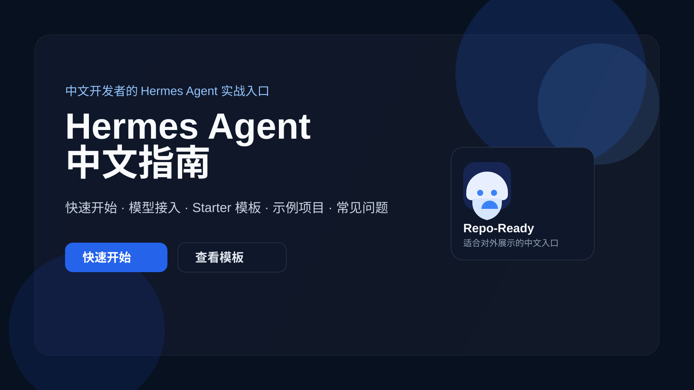

# Hermes Agent 中文站 V2

给中文开发者的上手、选型与落地入口。

Hermes Agent 中文站不是资料堆，也不是一份内部开发记录，而是把中文用户最常用的学习、选型、落地、排障与迁移路径收敛成同一套 GitHub-first 入口。

## 适合谁 / 不适合谁

### 适合谁
- 想先把 Hermes 真正跑起来，而不是先读完一整套英文文档的人
- 想判断该选哪个 provider、什么时候该走 custom endpoint 的人
- 想直接参考现成方案、真实案例或迁移路径的人

### 不适合谁
- 只想看抽象概念，不准备实际动手配置或落地的人
- 期待“一键全自动完成所有工作流”，不接受按步骤验证的人

## 你将获得什么

- 一条更适合中文开发者的最短上手路径
- 一套以官方 provider 优先为原则的选型口径
- 一组可直接进入实操的现成方案、排障入口与迁移指南
- 一份 GitHub 内容源与后续独立站表达一致的统一入口结构

## 六模块入口

- [首页](./docs/index.md) — 先快速理解 Hermes Agent 中文站是什么，以及你接下来该从哪条路径进入
- [从这开始](./docs/start/index.md) — 默认起点，按“先跑起来 → 开始上手 → 玩出花样 → 自己造东西”的四层路径递进
- [现成方案](./docs/solutions/index.md) — 先按内容生产、办公流程、项目管理、开发交付四类入口进入更接近真实工作的方案页
- [国内落地](./docs/china/index.md) — 先判断国内模型、成本、provider 与自托管路径，再决定是否需要 custom OpenAI-Compatible 接入
- [遇到问题](./docs/issues/index.md) — 先按安装、模型、部署等类别进入排障总览，再进入具体问题页

  - 当前首批专题页：[`install`](./docs/issues/install.md) / [`models`](./docs/issues/models.md) / [`deploy`](./docs/issues/deploy.md)
  - 旧版聚合页 [`docs/known-issues.md`](./docs/known-issues.md) 保留为过渡参考，不再作为唯一主入口
- [从 OpenClaw 过来](./docs/openclaw-migration.md) — 判断是否值得迁移，以及该按什么顺序迁

## GitHub 与独立站的关系

- **GitHub 仓库**：正式内容源、治理层与页面来源映射基线
- **独立站**：把已确认的内容源做成更适合浏览与转化的页面表达

当前阶段请以 GitHub 仓库中的 README 与 `docs/` 页面为准；`site/` 仍视为 legacy 骨架，不作为 V2 完成证据。

## 立即开始

- 主入口：[从这开始](./docs/start/index.md)
- 次入口：[现成方案](./docs/solutions/index.md)
- 迁移用户入口：[从 OpenClaw 过来](./docs/openclaw-migration.md)

## 治理与冻结文件

- [治理说明](./docs/governance/README_GOVERNANCE.md)
- [正式页面来源映射](./docs/governance/page-source-map.md)
- [P0 冻结说明](./docs/governance/freeze.md)
