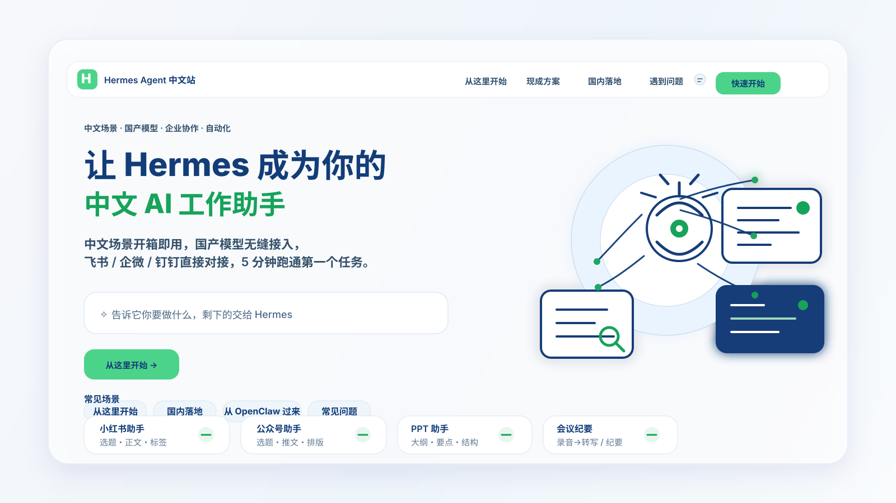

# 🌌 Hermes Agent 中文站

**一套面向中文用户的 AI Agent 全流程实战指南**

从先跑通，到会定制，再到能集成与自动化。

[🚀 从这开始](./docs/01-从这开始/总览.md) · [🇨🇳 国内落地](./docs/03-国内落地/01-总览.md) · [🔄 从 OpenClaw 过来](./docs/04-从OpenClaw过来/01-总览.md) · [📚 文档总览](./docs/00-文档总览.md) · [🧭 治理说明](./governance/README.md)

## 这是什么

Hermes Agent 中文站，是一套面向中文用户的 AI Agent 全流程实战指南。

如果你想先跑通、再定制、最后接入系统和自动化，这里就是起点。

AI Agent · 中文教程 · 国内落地 · 迁移指南 · 自动化

## 30 秒读懂

- 这是 Hermes Agent 的中文实战指南，不是零散笔记
- 它同时照顾新手、国内落地用户和迁移用户
- 目标是让你按路径找到最合适的入口

## 你可以怎么进

| 你的状态 | 先看这里 | 这一段会帮你解决什么 |
|---|---|---|
| 第一次接触 Hermes，想先跑通 | [01-从这开始](./docs/01-从这开始/总览.md) | 安装、首次互动、上手、个性化、扩展 |
| 在国内使用，想先把模型、Provider、部署和成本想清楚 | [03-国内落地](./docs/03-国内落地/01-总览.md) | 模型选择、代理路径、部署方式、最低成本起步、入口方式 |
| 已在用 OpenClaw，想比较、判断、结合使用或迁移 | [04-从 OpenClaw 过来](./docs/04-从OpenClaw过来/01-总览.md) | 差异对比、迁移判断、结合使用、迁移清单 |
| 想先看全站地图 | [文档总览](./docs/00-文档总览.md) | 当前已落仓页面一览 |
| 想看仓库治理和页面来源 | [治理说明](./governance/README.md) / [来源映射](./governance/page-source-map.md) | 仓库结构、保留原则、页面边界 |

## 四段主线

<table>
  <thead>
    <tr>
      <th>模块</th>
      <th>适合谁</th>
      <th>核心目标</th>
      <th>进入</th>
    </tr>
  </thead>
  <tbody>
    <tr>
      <td><strong>01-从这开始</strong></td>
      <td>第一次接触 Hermes 的人</td>
      <td>先准备环境，再装上 Hermes，完成第一次互动，然后进入上手和扩展</td>
      <td><a href="./docs/01-从这开始/总览.md">打开总览</a></td>
    </tr>
    <tr>
      <td><strong>03-国内落地</strong></td>
      <td>中国境内使用 Hermes 的人</td>
      <td>把模型、Provider、部署、成本和入口方式先理顺</td>
      <td><a href="./docs/03-国内落地/01-总览.md">打开总览</a></td>
    </tr>
    <tr>
      <td><strong>04-从 OpenClaw 过来</strong></td>
      <td>已有 OpenClaw 工作流的人</td>
      <td>先做对比，再判断时机，接着看结合使用与迁移清单</td>
      <td><a href="./docs/04-从OpenClaw过来/01-总览.md">打开总览</a></td>
    </tr>
    <tr>
      <td><strong>文档总览</strong></td>
      <td>想快速找入口的人</td>
      <td>一眼看到当前已经开放了哪些内容</td>
      <td><a href="./docs/00-文档总览.md">打开总览</a></td>
    </tr>
  </tbody>
</table>

## 推荐阅读顺序

如果你是第一次来到这里，建议按这个顺序走：

1. 先看 [文档总览](./docs/00-文档总览.md)，知道当前已经开放了哪些内容
2. 再进入对应模块的总览页
3. 每个模块先看总览，再进入子页
4. 想最快上手就从 [01-从这开始](./docs/01-从这开始/总览.md) 进
5. 已经有现成工作流，就从 [04-从 OpenClaw 过来](./docs/04-从OpenClaw过来/01-总览.md) 进

## 这套内容的目标

Hermes Agent 中文站希望解决的不是“看起来很多文档”，而是“让你每一步都知道下一步该看什么”。

所以这里遵循三个原则：
- 先给入口，再给细节
- 先给判断，再给动作
- 先给路径，再给能力展开

## 仓库里有哪些部分

- `README.md`：主页入口
- `docs/`：对外文档正文
- `governance/`：仓库保留原则、结构、页面来源映射

## 继续往下看

- [文档总览](./docs/00-文档总览.md)
- [治理说明](./governance/README.md)
- [来源映射](./governance/page-source-map.md)
- [仓库结构](./governance/repo-structure.md)
