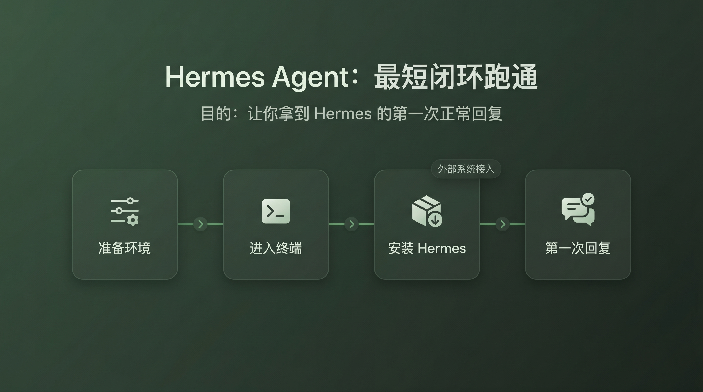

# 🚀 01-先跑起来

这一阶段只解决一件事：让你第一次把 Hermes 真正跑通。  
不要在这里提前研究高级配置，也不要试图一次搞懂所有功能。

## 🧩 一句话说明

先把第一次成功回复拿到手，再进入后面的能力学习。
这一阶段不是资料总览，也不是命令大全，而是一条最短跑通链路。

> ✅ 你在这里要完成的，不是“理解所有能力”，而是“把 Hermes 真正跑起来一次”。

## 🎯 本阶段目标

走完这一阶段，你应该已经完成这三件事：

- ✅ 已经把 Hermes 安装到一个可用环境里
- ✅ 已经接上一个可用模型
- ✅ 已经拿到 Hermes 的第一次正常回复

## 🗺️ 四个功能页

<table>
  <colgroup>
    <col style="width: 30%;" />
    <col style="width: 43%;" />
    <col style="width: 27%;" />
  </colgroup>
  <thead>
    <tr>
      <th>步骤</th>
      <th>这一页帮你完成什么</th>
      <th>查看说明</th>
    </tr>
  </thead>
  <tbody>
    <tr>
      <td><a href="./02-准备环境.md"><strong>🟢 第 1 步：准备环境</strong></a></td>
      <td>先确定 Hermes 跑在本地、WSL2，还是云主机。</td>
      <td>准备运行环境的详细说明</td>
    </tr>
    <tr>
      <td><a href="./03-连接终端.md"><strong>💻 第 2 步：进入终端</strong></a></td>
      <td>进入正确终端，并确认 SSH / Git / 基础环境已经可用。</td>
      <td>连接终端并准备基础环境</td>
    </tr>
    <tr>
      <td><a href="./04-安装Hermes.md"><strong>📦 第 3 步：安装 Hermes</strong></a></td>
      <td>执行官方安装，并确认 <code>hermes</code> 命令已经生效。</td>
      <td>安装 Hermes 的完整步骤</td>
    </tr>
    <tr>
      <td><a href="./05-配好AI大模型并完成第一次互动.md"><strong>💬 第 4 步：配好 AI 大模型并完成第一次互动</strong></a></td>
      <td>接上模型，启动 Hermes，并拿到第一次正常回复。</td>
      <td>完成配好 AI 大模型并完成第一次互动的操作说明</td>
    </tr>
  </tbody>
</table>

## 🧭 建议阅读顺序

按上面的顺序依次完成，不要跳步。

如果你是第一次安装用户，或者从来没有在终端里跑通过 Hermes，就默认从第 1 步开始。
如果你中途停过，也按当前状态回到对应步骤继续，不要提前跳到后面的阶段。

> 👉 最稳的节奏就是：先确认环境 → 再进终端 → 再安装 → 最后完成第一次互动。

## ✅ 成功标志

当下面这件事已经成立，这个阶段就完成了：

- 🎉 你已经完成安装、接入模型，并成功完成 Hermes 的第一次互动。

换句话说，这一阶段真正追求的是“第一次成功跑通”，不是“先把所有能力看懂”。

## ➡️ 下一步

完成后进入：
- [02-准备环境](02-准备环境.md)

如果你想先回到上一阶段入口重新确认位置：
- [上一阶段入口](../总览.md)
