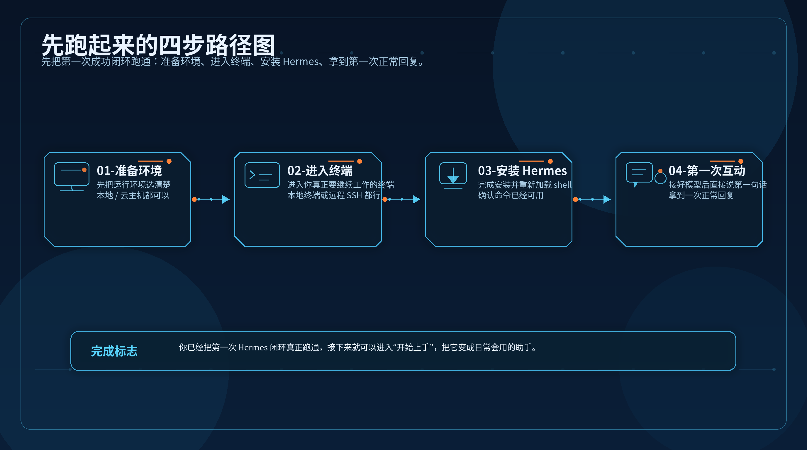

# 🚀 01-先跑起来

这一阶段只解决一件事：让你第一次把 Hermes 真正跑通。
不要在这里提前研究高级配置，也不要试图一次搞懂所有功能。现在最重要的，是先完成一次完整闭环：准备环境、进入终端、安装 Hermes、接上模型，并拿到第一次正常回复。

---

## ✅ 你现在适不适合进入这一阶段

符合下面这些状态，就直接从这里开始：

- 你还没有把 Hermes 真正跑通
- 你还没完成第一次正常互动
- 你现在最想确认的是“它到底能不能在我的环境里工作”
- 你不想先陷进高级配置、扩展功能和系统化玩法

如果你已经装好、会日常使用了，就别在这里停太久，可以直接去后面的阶段。

---

## 🎯 本阶段目标

走完这一阶段，你应该已经完成这三件事：

- ✅ 已经把 Hermes 安装到一个可用环境里
- ✅ 已经接上一个可用模型
- ✅ 已经拿到 Hermes 的第一次正常回复

一句话记住：

这一阶段追求的不是“理解所有能力”，而是“先成功一次”。

---

## 🗺️ 四个功能页

<table>
  <colgroup>
    <col style="width: 23%;" />
    <col style="width: 33%;" />
    <col style="width: 44%;" />
  </colgroup>
  <thead>
    <tr>
      <th>步骤</th>
      <th>主题</th>
      <th>这一页帮你完成什么</th>
    </tr>
  </thead>
  <tbody>
    <tr>
      <td><strong>第 1 步</strong></td>
      <td><a href="./02-先准备运行环境.md"><strong>先准备运行环境</strong></a></td>
      <td>先确定 Hermes 跑在本地、WSL2，还是云主机；如果还没有环境，也先在这里分流清楚。</td>
    </tr>
    <tr>
      <td><strong>第 2 步</strong></td>
      <td><a href="./03-进入终端并连接服务器.md"><strong>进入终端并连接服务器</strong></a></td>
      <td>进入正确终端，并确认 SSH / Git / 基础环境已经可用，后面命令可以真正执行。</td>
    </tr>
    <tr>
      <td><strong>第 3 步</strong></td>
      <td><a href="./04-把 Hermes 装上去.md"><strong>把 Hermes 装上去</strong></a></td>
      <td>执行官方安装，并确认 <code>hermes</code> 命令已经生效，不再停在安装前状态。</td>
    </tr>
    <tr>
      <td><strong>第 4 步</strong></td>
      <td><a href="./05-配好 AI 大模型并完成第一次互动.md"><strong>配好 AI 大模型并完成第一次互动</strong></a></td>
      <td>接上模型，启动 Hermes，并拿到第一次正常回复，真正完成“跑通”闭环。</td>
    </tr>
  </tbody>
</table>

---

## 🚦 默认顺序怎么走

最稳的顺序就是：

1. 先确认环境
2. 再进入正确终端
3. 再安装 Hermes
4. 最后才配模型并完成第一次互动

不要跳步。

如果你还没决定跑在哪里，就先别往安装页跳。
如果你还没进入正确终端，就先别急着执行安装命令。
如果你还没看到第一次正常回复，这一阶段就还没算结束。

---

## 🧩 这一阶段先别急着碰这些

这一阶段先别急着看这些内容：

- 高级工具配置
- 一堆 slash commands
- Skills 目录与筛选
- 持久人格、持久记忆
- Profiles、多助手、MCP、API、自动化

这些都不是“先跑起来”的核心任务。
先把最小闭环跑通，后面的理解才会稳。

---

## 🌱 什么时候算过关

当下面这件事已经成立，这个阶段就完成了：

- 🎉 你已经完成安装、接入模型，并成功完成 Hermes 的第一次互动。

换句话说，这一阶段真正追求的是“第一次成功跑通”，不是“先把所有能力看懂”。

---

## ➡️ 下一步

完成后进入：

- [02-先准备运行环境](./02-先准备运行环境.md)

如果你想先回到上一阶段入口重新确认位置：

- [从这开始](../总览.md)
