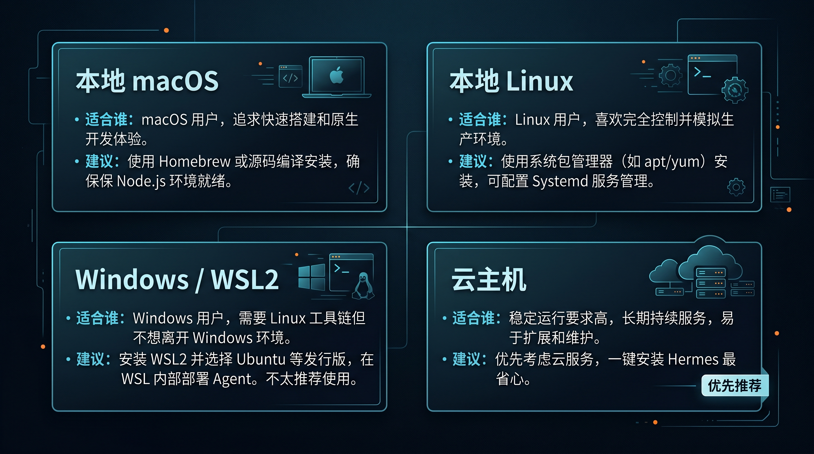

# 🧭 02-准备环境

安装 Hermes 之前，先决定它要跑在哪台机器上。你可以先用本地电脑试跑，也可以直接放到云主机上长期运行。

## 🧭 先选一条最适合你的路

这一页只帮你做一件事：先确定 Hermes 跑在哪里。

如果你已经有可用环境，就直接往下走；如果还没有，就先把环境准备好，再回来继续。

| 选项 | 适合谁 | 建议 |
| --- | --- | --- |
| 本地 macOS | 你想先在苹果电脑上快速跑通一次 | 可用，适合快速开始 |
| 本地 Linux | 你已经有 Linux 环境，想先本地跑通一次 | 可用，适合熟悉 Linux 的用户 |
| Windows / WSL2 | 你是 Windows 用户，但希望继续走本地路径 | 可用，但要先把 WSL2 准备好 |
| 云主机 | 你想长期运行、远程访问，或者本地暂时没有合适机器 | 优先推荐，尤其适合长期在线和后续扩展 |

## 🔎 如果你还没有环境

如果你现在还没有可用的机器，先别急着进入安装页。
先回到 [03-国内落地](../../03-国内落地/01-总览.md)，把“跑在哪里”这件事先选清楚。

你可以先把下面这三个方向看明白：

- 云主机怎么选
- 本地运行还是长期在线
- 预算够不够支撑你先跑起来

## 🔎 如果你已经有环境

如果你已经满足下面任意一种情况，就可以直接进入下一步：

- 已经有一台可用的 Linux 云主机
- 已经准备好本地 macOS 环境
- 已经准备好本地 Linux 环境
- 已经完成 Windows WSL2 准备

这时你就可以继续到终端页，开始真正连上环境。

## ➡️ 下一步

- 已经准备好环境 → [进入终端并连接服务器](./03-连接终端.md)
- 还没有可用环境 → 先去 [03-国内落地](../../03-国内落地/01-总览.md) 继续选环境路线
- Windows 用户还没准备好 WSL2 → 先完成 WSL2 准备再回来
