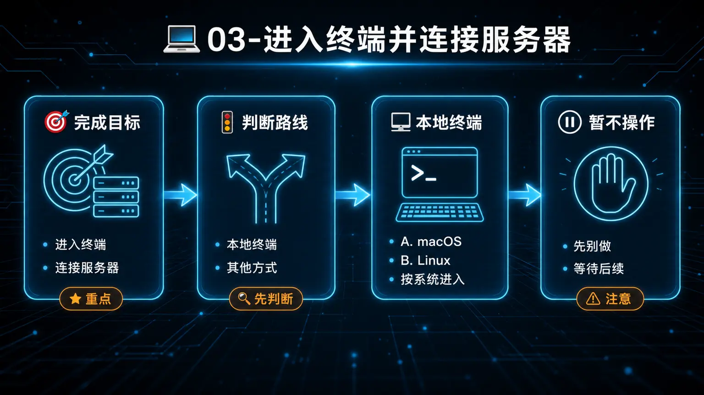
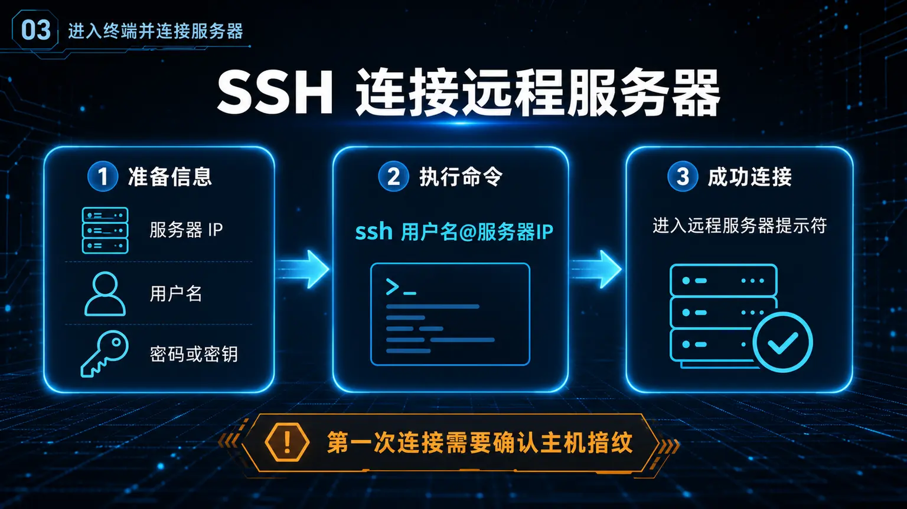
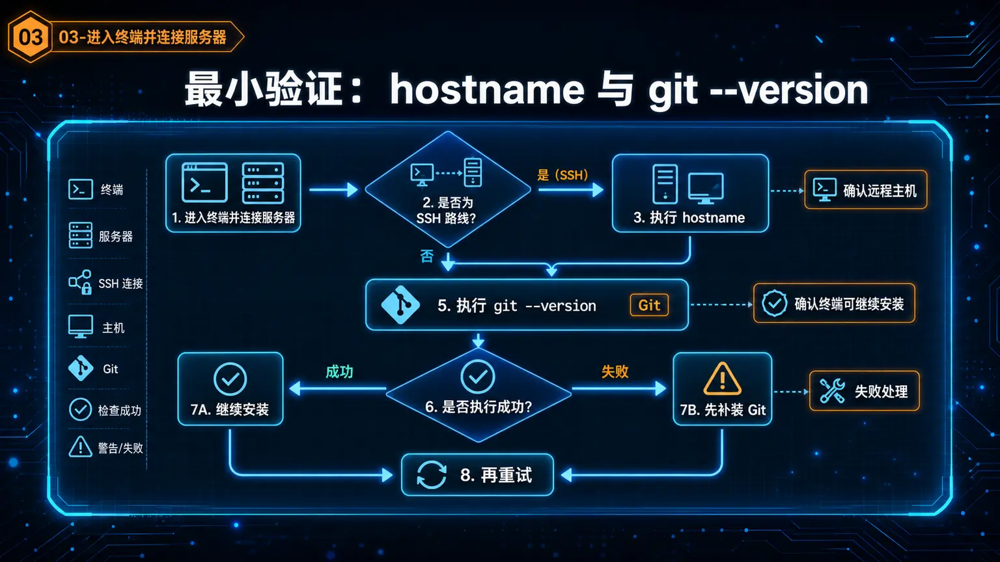
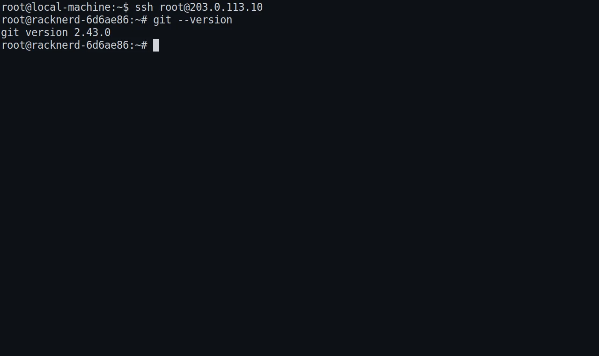

# 💻 03-进入终端并连接服务器



> 一句话先说清楚：这一页不教你安装 Hermes，而是先带你进入“后面真正要执行命令的那个终端”。

很多人后面安装失败，不是因为命令本身有问题，而是因为前一步根本没站到正确的终端里。
这一页只做一件事：
- 让你进入正确终端
- 确认你真的站在本地 Linux 终端、WSL2 Linux 终端，或远程云主机终端里
- 在继续安装前，用一个最小命令把终端可用性验清楚

---

## 🎯 这页做完以后，你应该得到什么

看完这页，你应该能明确回答这 3 个问题：
1. 我现在到底是在本地终端、WSL2 终端，还是远程服务器终端里
2. 我是不是已经进入后面真正要执行安装命令的那个环境
3. 我的终端里 `git --version` 能不能正常返回版本号

如果这 3 个问题你还答不出来，就先别急着进安装页。

---

## 🚦 第一步：先判断你现在走哪条连接路线

直接按你上一页做出的环境选择走：

- 我准备把 Hermes 跑在本地 macOS / Linux 上 → 走"本地终端"路线
- 我是 Windows 用户，准备跑在 WSL2 里 → 走"WSL2 终端"路线
- 我是 Windows 用户，想直接在 PowerShell 里用 → 走"Windows Native"路线（早期测试阶段）
- 我准备把 Hermes 跑在云主机上 → 走"SSH 连接远程服务器"路线

如果你现在突然发现：
- 其实还没决定 Hermes 跑在哪里
- 还没有云主机
- WSL2 还没准备好

那就先回上一页：
- [02-先准备运行环境](./02-先准备运行环境.md)

---

## 🖥 第二步：如果你走本地终端路线，按系统进入终端

### A. macOS
如果你是 macOS 用户，按这个顺序来：

1. 按 `Command + Space`
2. 输入 `Terminal`
3. 按回车打开

你也可以用 iTerm2；只要它是一个真正能输入命令的终端窗口就可以。

成功标志：
- 你看到一个新的终端窗口
- 窗口里有命令提示符
- 你可以输入命令，而不是停留在图形界面里

如果你看到的是 Finder、浏览器或别的 GUI 程序，不算成功。

### B. Linux
如果你是 Linux 用户，按这个顺序来：

1. 打开系统自带终端，或你平时常用的终端工具
2. 确认窗口里能直接输入命令

成功标志：
- 你看到命令提示符
- 能直接敲命令
- 不是停留在图形界面或文件管理器里

### C. 本地路线现在先别做什么
如果你走的是本地路线，现在先别做这两件事：

- 不要在这一步就 SSH 到别的机器
- 不要一边开着终端，一边其实准备把 Hermes 装到另外一台云服务器上

这一步最重要的是：
- 先确认“后面命令就是在这台本地机器里执行”

---

## 🪟 第三步：如果你是 Windows 用户，根据你选的路线进入正确环境

Windows 用户有两条路线可选，按你在第一步选的走：

### A. WSL2 路线（稳定推荐）

Windows 用户最容易在这里走错。
后面的命令按 Linux 终端思路来执行，所以你现在要做的是：
- 进入 WSL2 的 Linux shell
- 不要停在 PowerShell 或 CMD

按这个顺序来：

1. 打开 Windows Terminal
2. 选择你的 WSL2 Linux 发行版
   - 比如 Ubuntu
3. 进入后，确认你现在看到的是 Linux shell 提示符

成功标志：
- 你看到的是 WSL2 里的 Linux 终端
- 不是 `C:\Users\...` 这种 Windows 路径上下文
- 你清楚后面的 Linux 命令会在这里执行

如果你现在看到的还是：
- PowerShell
- CMD
- Windows 文件路径

那这一步还没成功。
先不要进入安装页。
先把 WSL2 Linux 终端真正打开。

### B. Windows Native 路线（早期测试）

> ⚠️ 这条路线目前处于**早期测试阶段**（Early Beta），可能存在一些未覆盖的边界情况。如果遇到问题，推荐回退到上面的 WSL2 路线。

如果你选择直接在 Windows PowerShell 里使用 Hermes，不需要安装 WSL2，也不需要进入 Linux 环境。

操作步骤：

1. 打开 **PowerShell**（推荐 Windows Terminal 里的 PowerShell 标签页）
2. 直接执行以下安装命令：

```powershell
iex (irm https://hermes-agent.nousresearch.com/install.ps1)
```

3. 安装完成后，后续所有 Hermes 命令都在这个 PowerShell 窗口里执行即可

成功标志：
- 你在 PowerShell 里执行命令没有报错
- `hermes` 命令可以被识别

> 📋 **注意：** Windows Native 路线目前**无法使用 Dashboard 的 `/chat` 终端面板**（该功能依赖 POSIX PTY），但其他所有功能（包括对话、工具调用等）都可以正常使用。详情参考 [官方文档 - Windows Native](https://hermes-agent.nousresearch.com/docs/user-guide/windows-native)。

---

## ☁️ 第四步：如果你走云主机路线，按 SSH 连上服务器

如果 Hermes 准备跑在云主机上，先把这三样放在手边：

| 你现在需要什么 | 它是干嘛的 | 没有它会怎样 |
|---|---|---|
| 服务器公网 IP | 告诉终端你要连哪台机器 | 你根本连不到目标服务器 |
| 登录用户名 | 告诉 SSH 你以谁的身份登录 | 终端不知道该用哪个账号进入 |
| 密码或密钥文件 | 真正完成登录认证 | 你会被拒绝在门外 |



### 最基础 SSH 写法
如果你用账号密码，最基础写法是：

```bash
ssh 用户名@服务器IP
```

示例：

```bash
ssh root@123.123.123.123
```

### 如果你使用密钥文件
如果你的云厂商给的是密钥文件，最基础写法是：

```bash
ssh -i /你的密钥路径 用户名@服务器IP
```

示例：

```bash
ssh -i ~/.ssh/my-key.pem ubuntu@123.123.123.123
```


### 第一次连接时你可能看到什么
第一次连接时，终端可能会提示你确认主机指纹。
如果这台服务器就是你自己的目标机器，确认无误后再继续。

成功标志：
- 命令执行后没有停留在你原来的本地提示符
- 你进入了新的远程服务器提示符
- 你知道自己现在站在云主机里，而不是本地机器里

如果你执行完 `ssh ...` 以后：
- 提示用户名或密码错误
- 提示连不上
- 提示超时
- 提示找不到密钥文件

那这一步还没成功。
现在不要跳到安装页，先把 SSH 连通性修通。

---

## 🧪 第五步：连上后立刻做两个最小验证

无论你走的是本地路线还是 SSH 路线，都先做下面两个最小验证。



### 验证 1：如果你走的是 SSH 路线，先执行 `hostname`

```bash
hostname
```

这一步的目的不是看炫酷输出，而是确认：
- 你现在真的站在远程服务器里
- 不是以为自己连上了，其实还停在本地终端

成功标志：
- 终端返回一个主机名
- 你能明确知道这是远程服务器的名字，而不是本地电脑的名字

如果你是本地路线，这一步可以不做。

### 验证 2：无论哪条路线，都执行 `git --version`

```bash
git --version
```



这一步的目的很简单：
- 确认你已经站在一个“后面可以继续做安装”的终端里

成功标志：
- 终端返回 Git 版本号
- 例如：`git version 2.x.x`

只要能正常返回版本号，这一页最关键的终端可用性检查就通过了。

---

## 🛠 第六步：如果 `git --version` 失败，先只修这一层

如果这里失败，先不要跳去研究 Hermes 安装命令。
先只查这几件事：

1. 我是不是还没进入真正要继续操作的那个终端
2. 如果是云主机路线，我是不是还没进入远程服务器提示符
3. `git --version` 有没有正常返回版本号
4. 如果 Git 还没装，我有没有先补装再重查

### 常见补装命令

#### Ubuntu / Debian
```bash
sudo apt update
sudo apt install -y git
```

#### CentOS / Rocky / AlmaLinux
```bash
sudo yum install -y git
```

或者：

```bash
sudo dnf install -y git
```

#### macOS
macOS 第一次执行 `git` 时，通常会提示安装开发者工具。
按提示完成后，再重新执行一次：

```bash
git --version
```

成功标志：
- 你重新执行后，终于看到了版本号

---

## 🚫 这一页先不要做的 3 件事

在终端还没确认正确前，先不要：

1. 直接抄 Hermes 安装命令开始跑
- 否则你很可能在错误机器、错误终端或错误环境里安装

2. SSH 一会儿连本地、一会儿连远程，却没搞清自己站在哪
- 后面最容易出现“明明装了，但怎么找不到”的问题

3. `git --version` 都还没过，就继续往安装页跳
- 这说明你还没完成这一页的最小验证

---

## ✅ 这一页什么时候算通过

当下面这些事已经成立，这一页就通过：
- 你已经进入后面真正要执行命令的那个终端
- 如果你走的是云主机路线，你已经确认自己真的站在远程服务器里
- 你的终端里 `git --version` 可以正常返回版本号

最小通过标准可以再说白一点：
- 你现在已经能明确回答：后面的 Hermes 安装命令，应该在这个终端里执行，而且这个终端已经可用

---

## ➡️ 下一步

完成后进入：
- [04-把 Hermes 装上去](<./04-%E6%8A%8A%20Hermes%20%E8%A3%85%E4%B8%8A%E5%8E%BB.md>)

如果你想先回到上一阶段入口重新确认位置：
- [01-先跑起来](./01-总览.md)
