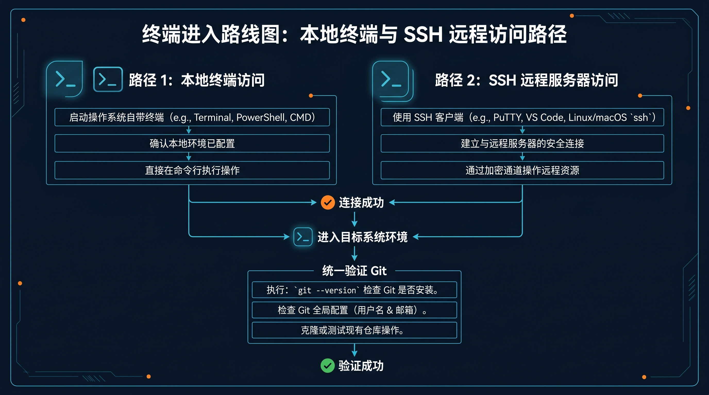
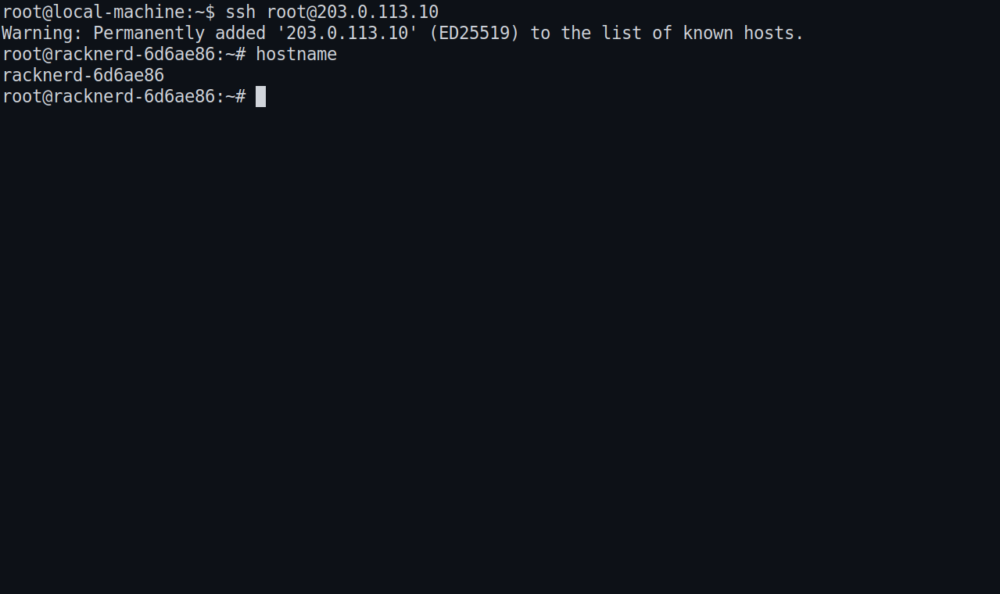

# 💻 03-进入终端并连接服务器

这一步只做一件事：让你进入后面真正要执行安装命令的终端。



## 🧭 先进入你要继续工作的那个终端

### 🔹 macOS / Linux

如果 Hermes 要跑在本地电脑上，先打开一个真正能输入命令的终端窗口：

- macOS：Terminal 或你常用的 iTerm2
- Linux：系统自带终端，或你平时使用的终端工具

看到命令提示符、可以直接输入命令，就算进入成功。

### 🔹 Windows / WSL2

如果你走 Windows 路线，先进入 WSL2 的 Linux 终端：

- 打开 Windows Terminal 或你常用的终端工具
- 进入 WSL2 的 Linux shell
- 不要停在 PowerShell 或 CMD

> 后面的命令按 Linux 终端来执行，所以一定要确认自己已经进入 WSL2 的 Linux 环境。

## 🔎 如果你要连云主机

如果 Hermes 准备跑在云主机上，先把这三样准备好：

- 服务器公网 IP
- 登录用户名
- 密码或密钥文件

SSH 的最基础写法：

```bash
ssh 用户名@服务器IP
```

如果你使用密钥文件：

```bash
ssh -i /你的密钥路径 用户名@服务器IP
```



第一次连接时，如果终端提示你确认主机指纹，确认无误后再继续。登录成功后，执行一次 `hostname`，确认自己确实站在远程服务器里。

## 📌 最后用 Git 再确认一次

无论你走的是本地终端还是云主机 SSH，最后都要执行一次：

```bash
git --version
```


如果返回了 Git 版本号，例如 `git version 2.x.x`，就说明你已经进入了后面可继续操作的正确终端。

如果这里失败，先只查这几件事：

1. 我是不是还没进入真正要继续操作的那个终端
2. 如果是云主机路线，我是不是还没进入远程服务器提示符
3. `git --version` 有没有正常返回版本号
4. 如果 Git 还没装，我有没有先补装再重查

### 🔹 常见补装命令

Ubuntu / Debian：

```bash
sudo apt update
sudo apt install -y git
```

CentOS / Rocky / AlmaLinux：

```bash
sudo yum install -y git
```

或者：

```bash
sudo dnf install -y git
```

macOS 第一次执行 `git` 时，通常会提示安装开发者工具。按提示完成后，再重新执行一次 `git --version`。

## ➡️ 下一步

完成后进入：
- <a href="04-%E6%8A%8A%20Hermes%20%E8%A3%85%E4%B8%8A%E5%8E%BB.md">04-把 Hermes 装上去</a>

如果你想先回到上一阶段入口重新确认位置：
- [上一阶段入口](01-总览.md)
