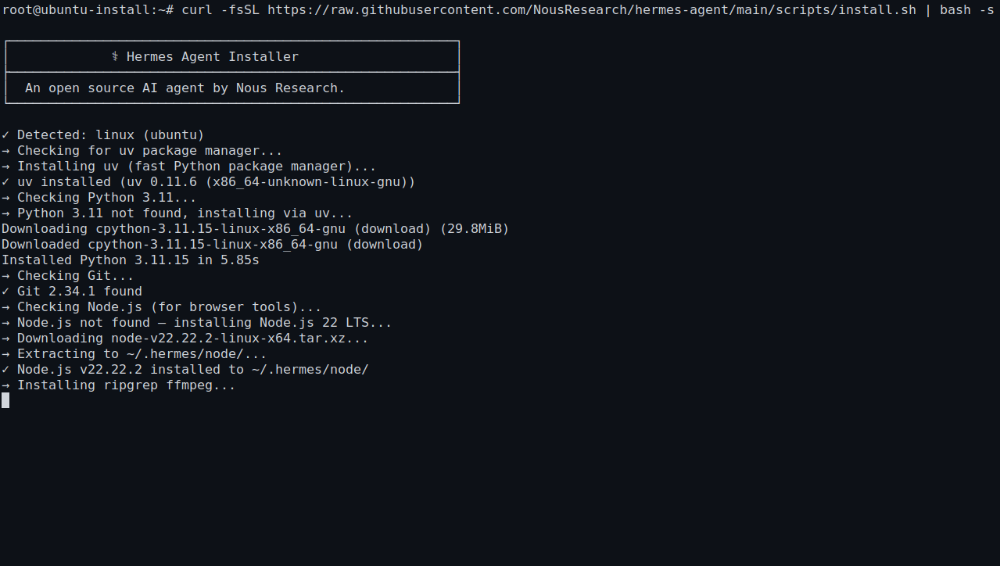

# 📦 04-把 Hermes 装上去



> 💡 **速答**：Hermes Agent 安装只需一条命令——Linux/macOS 用 `curl … | bash`，Windows Native（早期测试）用 PowerShell `iex (irm …)`。装完跑 `hermes version` 和 `hermes doctor` 验证，全过即安装成功。

> 一句话先说清楚：这一页不再帮你选环境、也不再帮你进终端，它只做一件事——把 Hermes 真正装上去，并确认 `hermes` 命令已经能用。

如果你已经完成上一页，那你现在应该已经满足这两个前提：
- 你已经站在后面真正要执行安装命令的那个终端里
- 你的终端里 `git --version` 已经能正常返回版本号

如果这两个前提有任何一个还没成立，先回上一页：
- [03-进入终端并连接服务器](./03-进入终端并连接服务器.md)

---

## 🎯 这页做完以后，你应该得到什么

看完这页，你应该能明确回答这 3 个问题：
1. Hermes 是不是已经真正装进当前环境里了
2. `hermes version` 和 `hermes doctor` 能不能正常跑
3. 我是不是已经可以继续去配模型并完成第一次互动

如果这 3 个问题你还答不出来，就先别急着进入模型页。

---

## 🚦 第一步：安装前最后确认一次

在你粘贴安装命令之前，先只确认这 4 件事：

1. 你现在在正确终端里
- 本地 macOS / Linux 终端
- WSL2 Linux 终端
- 或远程云主机终端

2. 你已经决定 Hermes 要装在这个环境里
- 不是一会装本地、一会又想装远程

3. `git --version` 已经能返回版本号
- 如果这里都不通，就先别跳安装

4. 当前网络至少能拉取安装脚本
- 如果你现在网络就明显不稳，后面很可能一开始就失败

如果这 4 件事都没问题，就直接进入安装。

### 📊 三种操作系统安装路线对比

| 系统 | 推荐路线 | 一键命令 | 状态 |
|------|---------|---------|------|
| **Linux / macOS / WSL2** | 官方 shell installer | `curl -fsSL …/install.sh \| bash` | ✅ 稳定主线 |
| **Windows Native** | PowerShell installer | `iex (irm …/install.ps1)` | ⚠️ 早期测试（early beta） |
| **任意 OS + Docker** | 拉官方镜像 | `docker run ghcr.io/nousresearch/hermes-agent` | ✅ 环境隔离 |

> 如果你用的是 Windows 但不确定走哪条，默认先走 WSL2 路线，它是当前最稳的 Windows 体验。Windows Native 路线适合不想装 WSL2 的用户，但仍在早期测试阶段。

---

## ⚡ 第二步：直接跑最短安装命令

这一页只走官方推荐的一键安装路径，不展开手动安装、模型配置或第一次互动。

直接把下面这条命令放到当前终端里执行：

```bash
curl -fsSL https://raw.githubusercontent.com/NousResearch/hermes-agent/main/scripts/install.sh | bash
```

### Windows 用户：如果你走的是 Windows Native 路线

在 PowerShell 里执行：

```powershell
iex (irm https://raw.githubusercontent.com/NousResearch/hermes-agent/main/scripts/install.ps1)
```

注意：
- Windows Native 目前处于早期测试阶段（early beta）
- 安装器会自动处理 uv、Python 3.11、Node.js 22、Portable Git、ripgrep、ffmpeg 等依赖
- 安装路径在 `%LOCALAPPDATA%\Hermes` 目录下

---

这就是当前最短、最直接的 Hermes 安装路线。

你现在不用先研究：
- 手动安装
- 高级配置
- provider 细节
- 多 profile
- MCP / API / 自动化

现在只做一件事：
- 先把 Hermes 安装成功

---

## 🇨🇳 如果你在国内环境里，先记住这个现实判断

如果你是在国内网络环境里执行安装，一开始就要接受一个现实：
- 官方安装路线没变
- 但下载脚本、拉依赖、访问 GitHub 或相关源时，更容易因为网络波动失败

所以这一步的正确心态不是：
- 一失败就认为 Hermes 装不了

而是：
- 先把失败层次分清楚
- 是脚本没拉下来
- 是依赖下载慢
- 还是终端 / shell / PATH 根本没走通

如果安装一开始就卡在“下载不到脚本”或“连接失败”，先不要立刻研究 Hermes 本体逻辑，优先回：
- [05-遇到问题 / 02-安装 / 更新 / 环境问题](../../05-遇到问题/02-安装更新与环境问题.md)

---

## 👀 第三步：安装过程中你应该看到什么

执行安装命令后，你应该能看到下面这类现象：
- 安装器启动
- 依赖检查开始执行
- 语言运行时准备或下载信息出现
- 安装输出持续刷新，而不是立即静默退出

> **Windows Native 用户注意**：如果你用的是 PowerShell 安装命令，看到的输出会和上面描述的不完全一样——比如你会看到 PowerShell 的进度条而不是 curl 的下载输出。只要安装器在持续推进、没有立刻报错退出，就说明在正常走流程。

这一步你真正想看到的不是"长得很专业的输出"，而是：
- 终端已经开始真正执行安装逻辑
- 它不是一敲就立刻报错退出

如果你一执行就立刻报错，先只查这 3 件事：
1. 安装命令是不是完整复制了
2. 当前网络是否正常
3. 你是不是还在正确的 Linux / macOS / WSL2 终端里执行

---

## 🔄 第四步：安装结束后，立刻重新加载 shell

安装结束后，先确认你当前用的是哪种 shell：

```bash
echo $SHELL
```

### 如果结果里是 Bash
执行：

```bash
source ~/.bashrc
```

### 如果结果里是 Zsh
执行：

```bash
source ~/.zshrc
```

### 如果你是 Windows Native 用户

不需要执行 `source` 命令。直接关闭当前 PowerShell 窗口，重新打开一个新的 PowerShell 窗口即可。安装器已经把 `hermes` 命令注册到了系统 PATH 里，新窗口会自动生效。

重新加载 shell 的目的只有一个：
- 让新的 `hermes` 命令立刻生效

如果你跳过这一步，最常见的结果就是：
- 其实已经装好了
- 但你马上执行 `hermes version` 却看到 `command not found`
- 然后误以为安装失败

---

## ✅ 第五步：安装后立刻做两次验证

安装结束后，不要凭感觉判断“应该装好了”。
直接按顺序跑下面两条命令。

### 验证 1：看 Hermes 命令是不是已经存在

```bash
hermes version
```

成功标志：
- 终端返回 Hermes 版本号
- 没有出现 `command not found`

### 验证 2：看当前环境是不是适合继续下一页

```bash
hermes doctor
```


成功标志：
- 命令可以正常执行
- 当前环境检查开始返回结果
- 你已经不是“连 Hermes 都打不开”的状态

只要这两条命令都能正常返回结果，就说明安装已经真正完成，而且当前环境可以继续下一页。

---

## 🛠 第六步：如果验证失败，先只修这一层

### 情况 1：`hermes version` 提示 `command not found`
这通常说明：
- shell 还没正确重新加载
- 或 PATH 还没生效

先做这两件事：
1. 重新执行上一节的 `source ~/.bashrc` 或 `source ~/.zshrc`
2. 再重新执行一次：

```bash
hermes version
```

### 情况 2：`hermes doctor` 报错
这通常说明：
- Hermes 命令已经存在
- 但当前环境还没有完全准备好

先做这两件事：
1. 只看当前 doctor 提示的这一层问题
2. 修完以后再重跑一次：

```bash
hermes doctor
```

### 情况 3：安装命令一开始就失败
这通常优先不是 Hermes 本体逻辑问题，而是：
- 网络不稳
- 脚本没拉下来
- 终端环境不对

这时优先回：
- [05-遇到问题 / 02-安装 / 更新 / 环境问题](../../05-遇到问题/02-安装更新与环境问题.md)

---

## 🚫 这一页先不要做的 4 件事

在安装还没验证通过前，先不要：

1. 一失败就跳去研究模型配置
- 你现在连 Hermes 本体都还没确认装好

2. 一看到长输出就默认安装成功
- 以 `hermes version` 和 `hermes doctor` 为准，不靠感觉

3. `command not found` 后立刻重装三遍
- 先查 shell 重新加载和 PATH

4. 同时改网络、终端、安装命令、模型配置四层变量
- 这会让你根本不知道问题在哪

---

## ✅ 这一页什么时候算通过

当下面这些事已经成立，这一页就通过：
- 你已经执行过官方一键安装命令
- `hermes version` 可以正常返回版本号
- `hermes doctor` 可以正常执行
- 你已经明确知道自己下一步可以进入模型配置页

最小通过标准可以再说白一点：
- 你现在已经能明确回答：Hermes 已经装好了，而且 `hermes` 命令在这个环境里已经能用

---

## ❓ 安装常见问题

### Hermes Agent 安装失败怎么办？

先分清失败层次：(1) 脚本拉不下来 → 网络问题，检查能否访问 GitHub；(2) 依赖下载慢 → 国内网络波动，重试或配置代理；(3) `command not found` → shell 没重载，先 `source ~/.bashrc` 再试。详见 [安装更新与环境问题](../../05-遇到问题/02-安装更新与环境问题.md)。

### Windows 用户应该选 WSL2 还是 Windows Native？

当前默认推荐 WSL2 路线，它是稳定主线。Windows Native（PowerShell 安装）仍处于早期测试（early beta），适合不想装 WSL2 的用户。两条路线安装的 Hermes 功能一致，区别在于底层运行环境。

### Hermes Agent 需要什么系统配置？

最低 2 GB RAM、10 GB 磁盘、能访问 LLM API 的网络。Hermes 本身不跑本地模型，推理是远程 API 调用，因此 2 GB VPS 就能跑。4 GB 更稳。详见 [VPS 自托管](../05-实战应用/06-VPS%20自托管%20Hermes.md)。

### 安装后 `hermes version` 显示 command not found？

99% 的情况是 shell 没有重新加载。先执行 `source ~/.bashrc`（Bash）或 `source ~/.zshrc`（Zsh），再重试。Windows Native 用户关闭并重新打开 PowerShell 即可。

### 在国内网络环境安装 Hermes 需要注意什么？

官方安装命令不变，但下载脚本和拉取依赖时可能因网络波动失败。建议：(1) 先确认能正常访问 GitHub；(2) 如果反复失败，考虑配置代理或使用国内云服务器（阿里云/腾讯云已有 Hermes 官方镜像，详见 [国内部署](../../03-国内落地/01-国内部署/01-总览.md)）。

---

## ➡️ 下一步

完成后进入：
- [05-配好 AI 大模型并完成第一次互动](<./05-%E9%85%8D%E5%A5%BD%20AI%20%E5%A4%A7%E6%A8%A1%E5%9E%8B%E5%B9%B6%E5%AE%8C%E6%88%90%E7%AC%AC%E4%B8%80%E6%AC%A1%E4%BA%92%E5%8A%A8.md>)

如果你想先回到上一阶段入口重新确认位置：
- [01-先跑起来](./01-总览.md)
