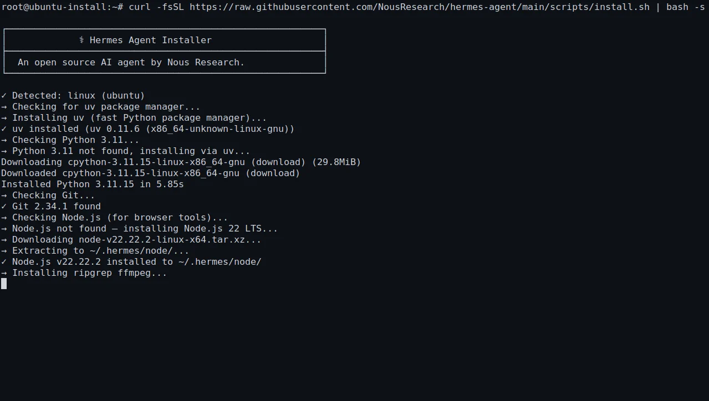
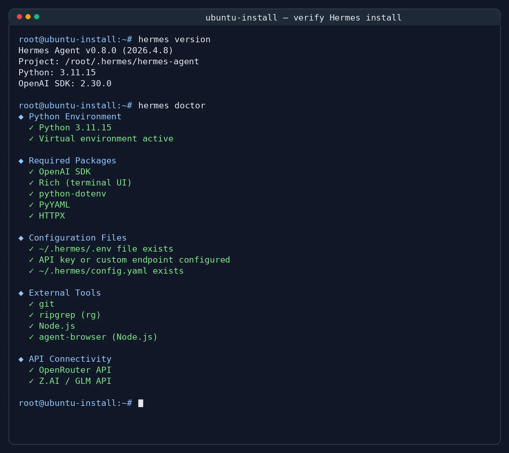

# 📦 04-把 Hermes 装上去

安装后按使用方式继续：[桌面 App 安装与首个任务](/docs/start/personalize/desktop-app)、[国内模型产品与 Key 配置](/docs/china/models)。终端安装或更新失败看[安装与环境排障](/docs/issues/install-environment)，模型请求返回 401、403、404 看[Provider 排障](/docs/issues/provider-endpoint)。

> 想从桌面窗口开始，先走[桌面版安装与首个任务](../03-玩出花样/07-用桌面端操作%20Hermes.md)；本页提供官方终端安装路线。安装结束后分别验证命令、环境和模型回复。

复核日期：2026-09-30；官方稳定标签 **v2026.9.24（Agent v0.21.5）**。安装器与桌面下载渠道可能继续更新，安装后记录实际版本；本文未执行真实安装或国内网络测试。



## 🧭 先选对应系统与入口

| 环境 | 官方入口 | 注意事项 |
|---|---|---|
| macOS Apple Silicon / Windows 10、11 | 官网桌面安装包，或各自终端安装器 | 桌面包版本与 Agent 后端版本分开记录 |
| macOS Intel | 固定标签明确不支持 | 不把 Apple Silicon 安装包当兼容路线 |
| Linux / WSL2 | 官方 shell 安装器 | Linux 准备 Git、curl、xz-utils；桌面还需图形会话和编译工具链 |
| Windows Native | 官方 PowerShell 安装器，Tier 1 支持路线 | 部分功能受平台限制，不能声称与 Linux 功能完全相同 |
| Docker | 官方镜像与持久数据挂载 | 见[VPS 自托管与 Docker 升级](../05-实战应用/06-VPS%20自托管%20Hermes.md) |

Windows 用户可按实际需要选择原生或 WSL2。固定标签已将 Windows 原生安装列为 Tier 1，不再沿用旧文“early beta”；具体功能仍对照官方 Windows 功能矩阵。

## ⚡ 使用官方安装器

### Linux / macOS Apple Silicon / WSL2

先确认安装发生在预期的本机或远端、`git --version` 正常。Debian/Ubuntu 可先准备依赖：

```bash
sudo apt update
sudo apt install -y git curl xz-utils
# 需要桌面时再准备 build-essential，并确认有图形会话
curl -fsSL https://hermes-agent.nousresearch.com/install.sh | bash
```

### Windows 原生 PowerShell

```powershell
iex (irm https://hermes-agent.nousresearch.com/install.ps1)
```

安装器管理 Python、Node.js 等依赖，具体版本以对应安装器与版本说明为准。手动准备源码环境时，固定标签的 Python 要求为 **>=3.11,<3.14**。

官方不支持 PyPI / `pip install hermes-agent`、`uv tool install hermes-agent` 发行安装，也不支持 `brew install hermes-agent` 路线。不要把同名第三方包当官方软件。

## 🔄 安装后重新加载 shell

Bash 可运行 `source ~/.bashrc`，Zsh 可运行 `source ~/.zshrc`；不确定时重新打开终端。Windows 原生关闭并重新打开 PowerShell。不要在 PowerShell 中执行 Bash 的 `source` 命令。

## ✅ 分层验证

```bash
hermes --version
hermes doctor
```



> 旧图中的界面与命令是历史示意，按本文 `hermes --version` 和当前安装版本实际输出验收，不把截图当成这次安装已经通过的证据。

版本命令成功证明 CLI 可启动；doctor 输出需要逐条看结果，能运行 doctor 不代表所有依赖、凭据与外部网络都通过。没有配模型时，先继续下一页，不必把所有可选工具一口气启用。

### 配置入口

```bash
hermes setup       # 总配置向导
hermes model       # 只设置 provider、凭据与模型
```

`hermes setup --portal` 是 Nous Portal 登录、模型和工具网关配置路线，是否可用、包含哪些权益以对应账户为准；不等于免除全部外部调用费用。配好自己的 provider 后，再发送一条最小问题并核对实际模型与用量。

已经用终端安装并希望切到桌面，可执行 `hermes desktop`。完整模型、文件任务与办公验收见[桌面版教程](../03-玩出花样/07-用桌面端操作%20Hermes.md)。

## 🩺 失败时只检查对应层

| 现象 | 先检查 | 继续条件 |
|---|---|---|
| 安装脚本取不到 | 下载域名、网络与第一条错误 | 能获取官方脚本 |
| 依赖或原生模块安装失败 | 完整错误、工具链、下载源与架构 | 依赖安装完成 |
| `hermes` 找不到 | 新 shell、PATH、安装器是否成功结束 | 版本命令能运行 |
| doctor 报错 | 对应的必需依赖或配置项 | 影响下一步的阻塞已解决 |
| 窗口能打开但模型不回复 | provider、模型 ID、Key、余额与网络 | 最小问答成功且来源可核对 |

国内环境要分别判断脚本、依赖、模型与消息平台的可达性。不要用替换成来源不明脚本的办法掩盖失败；排障见[安装更新与环境问题](../../05-遇到问题/02-安装更新与环境问题.md)。资源需求取决于浏览器、并发、本地模型和文件任务，不能把“2 GB 必够”作为通用门槛。

## 📖 官方依据

- [固定标签安装说明](https://github.com/NousResearch/hermes-agent/blob/v2026.9.24/website/docs/getting-started/installation.md)。
- [固定标签平台支持](https://github.com/NousResearch/hermes-agent/blob/v2026.9.24/website/docs/getting-started/platform-support.md)。
- [固定标签 Windows 功能矩阵](https://github.com/NousResearch/hermes-agent/blob/v2026.9.24/website/docs/user-guide/windows-native.md)。
- [固定标签 Python 要求](https://github.com/NousResearch/hermes-agent/blob/v2026.9.24/pyproject.toml)。

## ➡️ 下一步

- 下一步：[05-配好 AI 大模型并完成第一次互动](./05-配好%20AI%20大模型并完成第一次互动.md)
- 回到：[01-先跑起来](./01-总览.md)
- 桌面主线：[安装与办公实战](../03-玩出花样/07-用桌面端操作%20Hermes.md)
