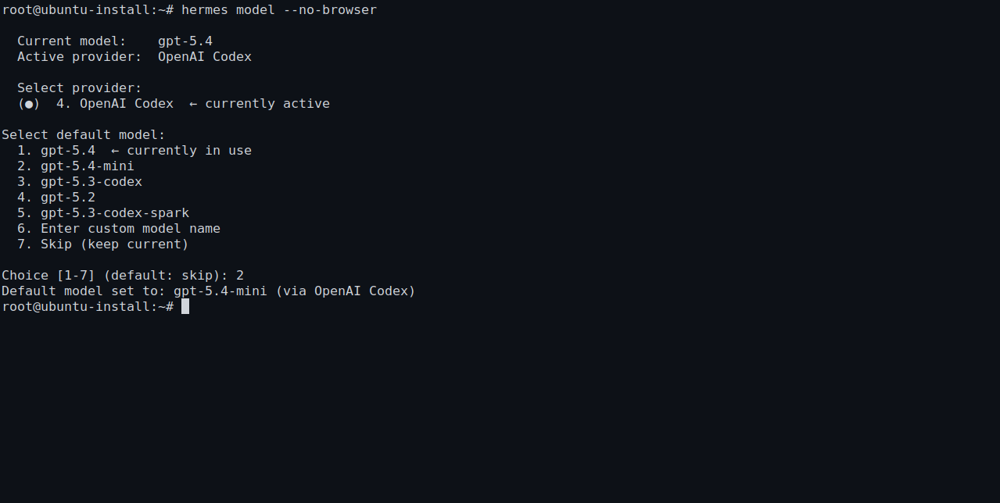
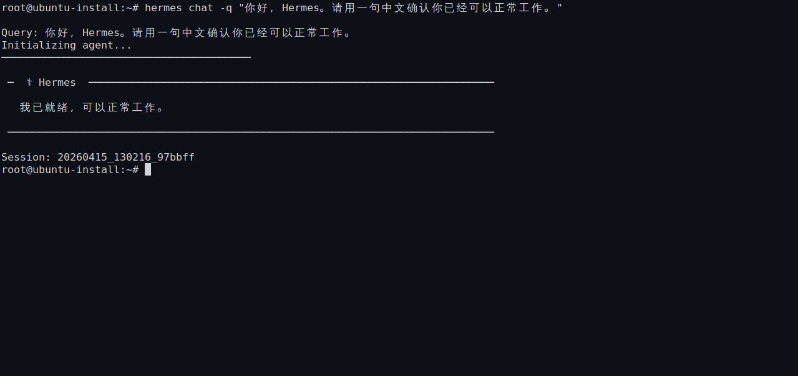

# 💬 05-第一次回复

现在 Hermes 已经装好了，下一步就是接上一个可用的 AI 大模型，然后在命令行里和 Hermes 说上第一句话。

## 🧭 先把最小闭环跑通

这一页只补齐三件事：

- 一个可用模型
- 一次最小模型配置
- 一次真实回复

先别去研究更复杂的 provider、多模型切换或高级工作流，先把第一次互动闭环跑通。

## 🧭 先配置默认模型

```bash
hermes model
```



在 `hermes model` 里，先选一个你当前能用的 provider，再选一个能直接跑通的默认模型并保存。

配置完成后，你应该能看到当前 provider / model 已经明确设置好。

## 🔹 启动 Hermes

```bash
hermes
```

模型配置完成后，直接启动 Hermes，确认它能进入交互状态，不要刚启动就退出。

如果启动阶段直接报错，先检查：

- 默认模型是否真的保存成功
- 上一页里的 `hermes version` 和 `hermes doctor` 是否已经通过
- 当前 provider / model 是否还能正常使用

## 🔹 对 Hermes 说第一句话

你可以直接发一句最简单的话，例如：

- 你好，Hermes
- 请介绍一下你自己
- 请用一句中文确认你已经可以正常工作

或者直接用这条命令快速验证：

```bash
hermes chat -q "你好，Hermes。请用一句中文确认你已经可以正常工作。"
```



如果这里能收到一条正常回复，就说明你已经真正完成了第一次互动。

## ✅ 这一页什么时候算通过

满足下面三件事，这一页就通过：

1. 你已经通过 `hermes model` 配好一个可用模型
2. 你已经能正常启动 `hermes`
3. 你已经收到 Hermes 的第一条正常回复

这也意味着你已经完成了“先跑起来”整个阶段。

## ➡️ 下一步

完成后进入：
- [02-开始上手](../02-开始上手/01-总览.md)
- [01-从这开始](../总览.md)

如果你想先回到上一阶段入口重新确认位置：
- [上一阶段入口](./01-总览.md)
