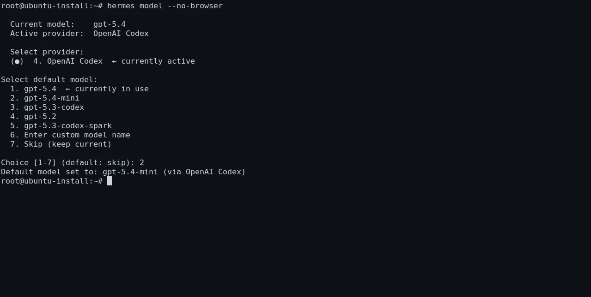
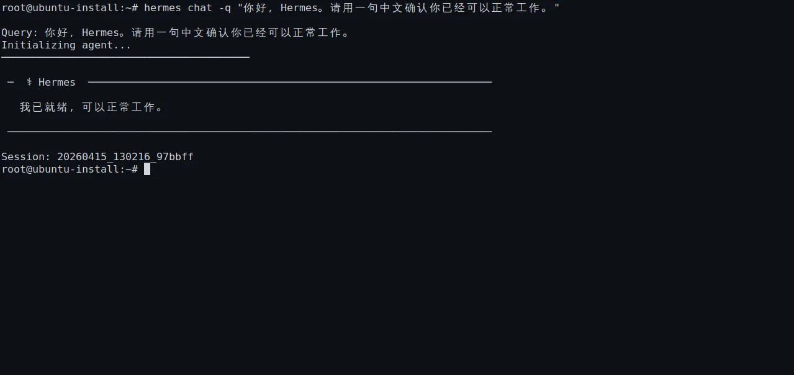

# 💬 05-配好 AI 大模型并完成第一次互动



> 这一页只做最后一个闭环：给 Hermes 配好一个现在就能用的模型，然后亲眼看到它回你第一句话。

如果你还没完成安装验证，先回上一页：
- [04-把 Hermes 装上去](<./04-%E6%8A%8A%20Hermes%20%E8%A3%85%E4%B8%8A%E5%8E%BB.md>)

---

## 🎯 这页做完以后，你应该得到什么

完成这页后，你应该能明确确认 3 件事：
1. Hermes 已经连上了一个可用的 provider 和默认模型
2. `hermes` 可以正常进入交互界面
3. 你已经收到了第一条真实回复

这 3 件事少一件，都不算真正“跑起来”。

---

## 🚦 第一步：先确认你手里真的有可用模型

在执行配置前，先只检查这 4 件事：

1. 你已经安装好了 Hermes
2. 你知道自己这次准备使用哪个 provider
3. 你已经准备好对应的 API Key、Token 或登录授权
4. 这个模型现在确实可用，而不是已经停用、没额度或没权限

为什么先检查这一步：
- `hermes model` 只是帮你把模型接进来
- 如果你手里没有可用凭证，后面所有步骤都会卡在“看起来配过了，但发不出请求”

如果你现在还不确定用哪个 provider，也没关系。
这一页的目标不是选最强模型，而是选“此刻能正常回复”的那个。

---

## ⚙️ 第二步：用 `hermes model` 配默认模型

在终端执行：

```bash
hermes model
```

进入后按界面提示完成这几步：
1. 选择一个你现在能用的 provider
2. 按提示填入 API Key、Token 或完成登录授权
   > **中国用户提示**：Hermes 已内建支持多家国内模型服务商。在 `hermes model` 里你可以直接选到：智谱（z.ai/GLM）、Kimi（月之暗面）、MiniMax（国内/国际）、阿里云百炼/DashScope/Qwen、DeepSeek、腾讯 TokenHub、小米等。不需要走 custom endpoint，直接选对应的 provider 即可。
3. 选择一个可直接使用的默认模型
4. 保存设置并退出

这一段你要特别留意的不是“选项很多”，而是下面这 3 个结果有没有真正出现：
- provider 已经选定
- 默认模型已经选定
- 设置已经保存，不是停在半路

成功时你应该能明确说出：
- 我当前接的是哪个 provider
- 我当前默认模型是什么
- 这些设置已经写进 Hermes 当前环境里了

如果这里没成功，先查这 4 件事：
1. API Key / Token 有没有填错
2. 你选的模型当前账号有没有权限
3. 你是不是在错误的 profile 或错误的环境里配置
4. 保存后有没有看到明确成功提示

---

## ▶️ 第三步：先把 Hermes 正常启动起来

模型保存后，立刻执行：

```bash
hermes
```

这一步的目标很简单：
- 不是研究功能
- 不是立刻切模型
- 只是确认 Hermes 能带着刚才那套模型配置进入交互状态

成功标志：
- 终端进入 Hermes 交互界面
- 没有停在 `command not found`、认证失败、模型不可用这类报错上
- 你可以继续输入问题，而不是刚启动就退出

如果启动就失败，先只查这一层：
1. `hermes version` 能不能正常返回
2. 刚才 `hermes model` 里默认模型有没有真的保存成功
3. provider 凭证是不是已经失效或没权限
4. 你是不是切到了另一个 shell / 另一个 profile 导致读到的不是同一套配置

---

## 🗣 第四步：直接让 Hermes 回你第一句话

进入交互界面后，直接输入一句最简单的话，例如：
- 你好，Hermes
- 请介绍一下你自己
- 请用一句中文确认你已经可以正常工作

如果你更想用一次性命令验证，也可以直接执行：

```bash
hermes chat -q "你好，Hermes。请用一句中文确认你已经可以正常工作。"
```



这一步真正的成功，不是“界面打开了”，而是你看到了完整链路：
- 你发出了输入
- Hermes 调用了模型
- Hermes 返回了可读回复

只要你已经看到一条正常回复，这一页的核心任务就完成了。

---

## 👀 第五步：怎么判断这次不是假成功

很多人会把下面这些情况误判成“已经跑通”：
- `hermes model` 打开过，但其实没保存
- `hermes` 启动过，但一提问就报错
- provider 连上了，但模型没有权限
- 有输出，但输出其实是报错提示，不是真正回复

真正通过的标准只有 3 条：
1. 你已经配置好默认模型
2. 你已经成功发出一条测试消息
3. 你已经收到一条正常自然语言回复

少任何一条，都先别往后走。

---

## 🛠 如果第一条消息没回来，先按这个顺序排查

先不要同时改很多地方。
按下面顺序一层一层查最快：

### 情况 1：`hermes model` 配完了，但交互里没有回复
先查：
1. 当前 provider 的 Key / Token 是否仍然有效
2. 这个默认模型是否真的可调用
3. 你是不是切换到别的环境导致读不到刚才保存的配置

### 情况 2：`hermes` 能启动，但一发消息就报认证错误
这通常优先说明：
- 凭证不对
- 凭证过期
- 账号没权限访问该模型

先回 `hermes model` 重查 provider 和模型选择。

### 情况 3：`hermes chat -q` 报错或直接退出
先查：
1. 引号有没有完整复制
2. 当前网络是否正常
3. provider 当前是否可访问

### 情况 4：你不确定到底坏在哪一层
直接执行：

```bash
hermes doctor
```

如果 doctor 有明确提示，先只修它指出的这一层，再重新测试一次第一条消息。

---

## 🚫 这一页先不要做的 4 件事

在第一条消息还没成功前，先不要：

1. 一上来研究多 provider 切换
- 你现在先要一个能用的默认模型

2. 一上来调 Skills、Tools、平台接入
- 这些都建立在模型已经可用之上

3. 同时改 provider、模型、profile、环境变量
- 变量太多时，你会很难知道到底哪里生效了

4. 没看到真实回复就默认“应该已经好了”
- 以第一条真实回复为准，不靠感觉

---

## ✅ 这一页什么时候算通过

当下面这些事已经成立，这一页就通过：
- 你已经通过 `hermes model` 配好了一个可用模型
- 你已经能正常启动 `hermes`
- 你已经发出并收到了第一条真实回复
- 你已经明确知道问题若出现，先查 provider、模型和凭证这一层

到这里为止，“先跑起来”这个阶段才算真正完成。

---

## ➡️ 下一步
完成后进入：
- [02-开始上手](<../02-开始上手/01-总览.md>)

如果你想先回到上一阶段入口重新确认位置：
- [01-先跑起来](<./01-总览.md>)
