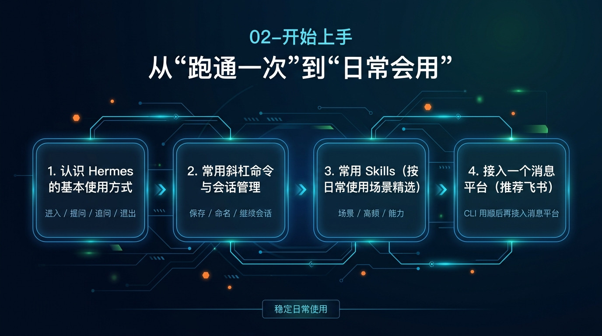

# 🧰 02-开始上手

这一阶段只做一件事：把 Hermes 从“能跑一次”变成“你会反复使用的日常助手”。

如果你已经完成过第一次互动，就从这里继续；如果还没跑通第一次回复，先回到 [01-先跑起来](../01-先跑起来/01-总览.md)。

---

## ✅ 你现在适不适合进入这一阶段

符合下面这些状态，就直接继续：

- 你已经装好 Hermes，并完成过至少一次正常互动
- 你现在的问题不再是“能不能装上”，而是“平时到底怎么用”
- 你想先把 Hermes 变成稳定可用的日常助手
- 你还不打算马上进入人格、记忆、多助手、自动化这些更重的玩法

如果你现在还没拿到第一次正常回复，先回到：

- [01-先跑起来](../01-先跑起来/01-总览.md)

---

## 🎯 这一阶段会帮你拿到什么

走完这一阶段，你会建立起 4 个最小能力：

1. 会进入 Hermes，知道怎么提问、追问、退出
2. 会保存、命名、继续、恢复重要会话
3. 会按场景挑第一批常用 Skills
4. 会判断什么时候该把 Hermes 接到消息平台里

一句话说完：

这一阶段不是让你知道更多名词，而是让你从“跑通过一次”进入“平时真的会用”。

---

## 🧭 这 4 页就是完整路径

<table>
  <colgroup>
    <col style="width: 18%;" />
    <col style="width: 34%;" />
    <col style="width: 48%;" />
  </colgroup>
  <thead>
    <tr>
      <th>步骤</th>
      <th>主题</th>
      <th>这一页会帮你解决什么</th>
    </tr>
  </thead>
  <tbody>
    <tr>
      <td><strong>第 1 步</strong></td>
      <td><a href="./02-认识 Hermes 的基本使用方式.md"><strong>认识 Hermes 的基本使用方式</strong></a></td>
      <td>先把 Hermes 的主入口、最小提问方式、追问方式、退出方式跑顺。</td>
    </tr>
    <tr>
      <td><strong>第 2 步</strong></td>
      <td><a href="./03-常用斜杠命令与会话管理.md"><strong>常用斜杠命令与会话管理</strong></a></td>
      <td>学会保存、命名、继续和恢复会话，不再把每次使用都当成一次性聊天。</td>
    </tr>
    <tr>
      <td><strong>第 3 步</strong></td>
      <td><a href="./04-常用 Skills（按日常使用场景精选）.md"><strong>常用 Skills（按日常使用场景精选）</strong></a></td>
      <td>先按实际任务场景认识第一批高频 Skills，而不是上来就装一堆。</td>
    </tr>
    <tr>
      <td><strong>第 4 步</strong></td>
      <td><a href="./05-接入一个消息平台（推荐飞书）.md"><strong>接入一个消息平台（推荐飞书）</strong></a></td>
      <td>CLI 用顺以后，再判断是否把 Hermes 带进消息流和团队沟通场景。</td>
    </tr>
  </tbody>
</table>

---

## 🚦 默认顺序怎么走

最稳的顺序就是：

1. 先把主入口和最基础使用动作搞清楚
2. 再学会会话管理，不让重要上下文断掉
3. 再认识第一批真的常用的 Skills
4. 最后才决定要不要接入消息平台

不要一上来就先接平台。
也不要还没学会会话怎么继续，就急着看一堆更高级的能力。

如果你只想记一句：

先把“怎么进入、怎么继续、怎么按场景用能力”理顺，再把 Hermes 带到更复杂的沟通场景里。

---

## 🧩 这一阶段先别急着碰这些

这一阶段先别急着碰这些更重的内容：

- 持久人格
- 持久记忆
- 自定义模型与兼容 endpoint 深调
- Toolsets 深配置
- Profiles、多助手、外部记忆系统
- MCP、API Server、Cron、IDE 集成

这些不是“开始上手”的主任务。
这一阶段先把“一个 Hermes 助手日常怎么用”这件事学顺。

---

## ✅ 过关标准

当下面这些事都成立，这一阶段就算通过：

- 你能自然进入 Hermes 做日常提问
- 你知道怎么保存、命名、继续一个会话
- 你做过至少一次按场景选择 Skills 的最小尝试
- 你能判断自己是不是该进入消息平台接入

真正的变化是：

Hermes 不再只是“跑通过一次的工具”，而是开始变成“你平时会真的拿出来用的助手”。

---

## ➡️ 下一步

既然你已经不再卡在“能不能装上”，接下来就先把最基础的日常使用动作跑顺。

- [02-认识 Hermes 的基本使用方式](<./02-认识 Hermes 的基本使用方式.md>)

如果你想先回到上一阶段入口重新确认位置：

- [01-先跑起来](../01-先跑起来/01-总览.md)
