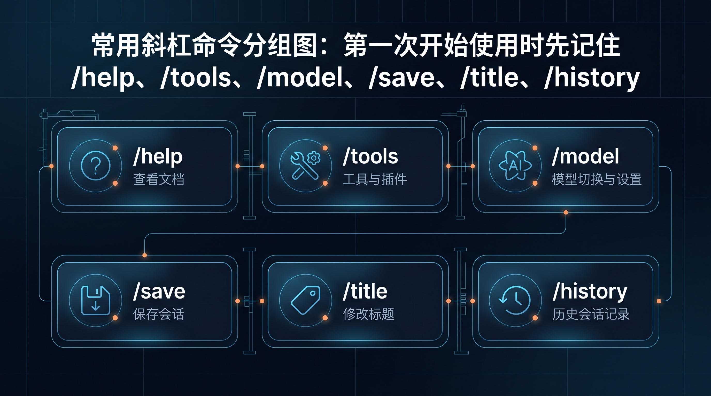
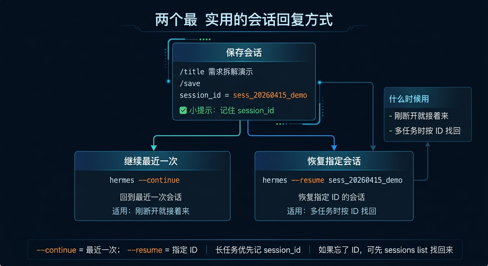

# ⌨️ 03-常用斜杠命令与会话管理



> 第一次开始用 Hermes，不需要背完整命令表。你现在最需要先学会的是两件事：找得到常用入口，以及别把正在做的会话弄丢。

如果你还没把最基础的使用方式练顺，先回上一页：
- [02-认识 Hermes 的基本使用方式](<./02-%E8%AE%A4%E8%AF%86%20Hermes%20%E7%9A%84%E5%9F%BA%E6%9C%AC%E4%BD%BF%E7%94%A8%E6%96%B9%E5%BC%8F.md>)

---

## 🎯 这页做完以后，你应该得到什么

完成这页后，你应该能做到：
1. 在交互界面里找得到最常用的斜杠命令
2. 知道哪些命令是看状态，哪些命令是在管理会话
3. 保存当前会话、给它命名，并在下次继续回来

如果你做不到第 3 条，这一页就还没真正过关。

---

## 第一步：先知道怎么把命令入口叫出来

进入 `hermes` 后，直接输入：

```text
/
```

你会看到可用的斜杠命令列表或自动补全菜单。

为什么先做这一步：
- 不是靠死记硬背
- 而是先知道命令入口从哪里出现
- 以后忘记时，你可以先打 `/` 再选

成功标志：
- 你知道斜杠命令必须在 Hermes 交互界面里输入
- 你已经亲眼看到命令入口出现
- 你知道忘了命令时先打 `/`

如果没有出现，先查：
1. 你是不是还没进入 Hermes 交互界面
2. 当前光标是不是在可输入状态
3. 你是不是在系统 shell 里直接输入了 `/`

---

## 🧭 第二步：第一批先记这 6 个命令就够了

第一次开始上手，先记住下面 6 个：
- `/help`：看命令入口和基本说明
- `/tools`：看当前会话里工具状态
- `/model`：查看或切换当前会话模型
- `/save`：保存当前会话
- `/title`：给当前会话起名字
- `/history`：回看历史对话

这 6 个命令已经足够覆盖第一阶段最常见的需求：
- 不知道能做什么时，先看 `/help`
- 不知道当前在哪个模型上，先看 `/model`
- 不知道工具现在开没开，先看 `/tools`
- 怕会话丢掉，就用 `/save` 和 `/title`
- 想回看之前聊过什么，就用 `/history`

你现在不用追求“全会”，而是先把“最常用”装进手里。

---

## 💾 第三步：先完成一次最小会话管理闭环

进入一个正常会话后，按这个顺序做一次：

1. 先聊一两轮
2. 输入 `/save`
3. 再输入 `/title`
4. 给会话起一个你以后看得懂的名字

比如标题不要起成：
- 测试
- 新会话
- aaa

更好的标题像这样：
- 安装后第一次练习
- 飞书接入排查
- AI Agents 论文查找

为什么标题很重要：
- 以后会话多了，标题就是你找回上下文的第一线索
- 标题乱，历史再多也很难快速接上

成功标志：
- 你已经手动保存过一次当前会话
- 你已经给它起了一个可识别的标题
- 你知道“保存”和“命名”不是一回事，但两者最好配套做

如果 `/save` 或 `/title` 没按预期工作，先查：
1. 你是不是还在当前会话里
2. 当前会话是不是已经异常退出
3. 你输入的是不是完整命令

---

## 🔁 第四步：下次回来时，先学会这 3 种继续方式



会话管理真正有价值，不在“保存那一下”，而在“下次还能继续”。

最常用的继续方式有 3 种：

### 方式 1：继续最近一次会话
```bash
hermes chat --continue
```

适合：
- 你刚刚离开不久
- 你就是想接着最近那条继续做

### 方式 2：恢复指定会话 ID
```bash
hermes chat --resume 会话ID
```

适合：
- 你明确知道要回哪一条会话
- 最近开过很多条，不想接错

### 方式 3：在会话里恢复命名会话
```text
/resume 会话标题
```

适合：
- 你记得标题
- 你正在 Hermes 交互界面里，想直接恢复某条命名会话

如果你忘了会话 ID，可以先用：

```bash
hermes sessions
```

去查看和管理现有会话，再决定恢复哪一条。

成功标志：
- 你知道“继续最近一次”和“恢复指定会话”不是一回事
- 你知道 CLI 恢复和会话内 `/resume` 的使用场景不同
- 你已经知道下次回来时要怎么把工作接上

如果恢复出来的不是你想要的会话，先查：
1. 你是不是误用了最近一次继续
2. 会话标题是不是起得太含糊
3. 会话 ID 是否看错

---

## 🎭 第五步：顺手试一次 `/personality`，但不要把它当长期配置

如果你想快速感受不同回复风格，可以在会话里试一次：

```text
/personality teacher
/personality concise
/personality technical
```


这一组命令的作用很简单：
- 临时试一种说话方式
- 看看当前任务更适合哪种表达风格

但你要立刻分清一件事：
- `/personality` 是会话内临时切换
- 它不是长期人格配置

长期人格怎么做，后面会在：
- [03-玩出花样 / 02-让 Hermes 更像你](<../03-%E7%8E%A9%E5%87%BA%E8%8A%B1%E6%A0%B7/02-%E8%AE%A9%20Hermes%20%E6%9B%B4%E5%83%8F%E4%BD%A0.md>)

---

## 🚫 这一页先不要急着学什么

在会话保存和恢复还没形成习惯前，先不要急着：
- 背完整 slash commands 总表
- 研究全部模型切换规则
- 深挖 toolsets、MCP、Profile
- 把人格、记忆、平台接入一起学

现在最值得先固定下来的习惯只有 1 条：
- 聊到一半别丢，记得保存、命名、继续

---

## ✅ 这一页什么时候算通过

当下面这些事已经成立，这一页就通过：
- 你知道进入会话后先打 `/` 可以叫出命令入口
- 你已经记住第一批最常用的 6 个命令
- 你已经完成过一次“保存—命名”的最小会话管理闭环
- 你知道怎么继续最近一次、恢复指定会话，或在会话里用 `/resume`
- 你知道 `/personality` 是临时风格入口，不是长期人格配置

---

## ➡️ 下一步

完成后进入：

- [04-常用 Skills（按日常使用场景精选）](<./04-常用%20Skills%EF%BC%88按日常使用场景精选%EF%BC%89.md>)

如果你想先回到上一阶段入口重新确认位置：

- [02-开始上手](<./01-总览.md>)
