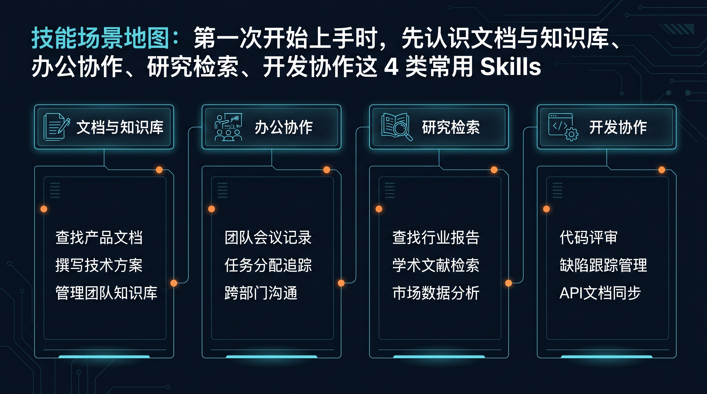
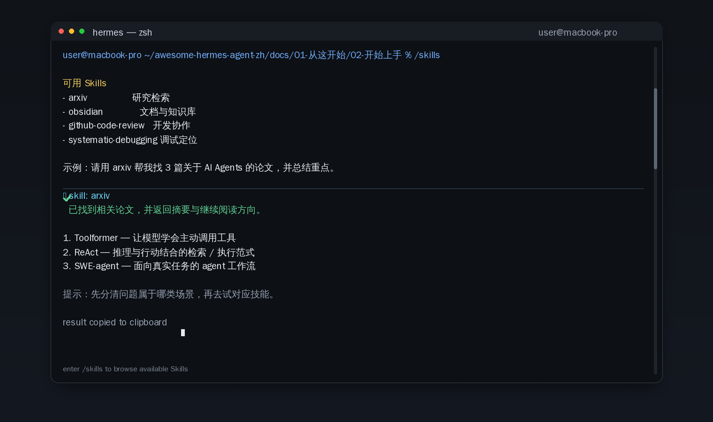

# 🏷️ 04-常用 Skills（按日常使用场景精选）



> 这一页不是让你背完整技能目录，而是帮你建立第一层判断：我现在手上的任务属于哪一类，应该先试哪一类 Skill。

如果你还没熟悉会话和斜杠命令，先回上一页：
- [03-常用斜杠命令与会话管理](./03-常用斜杠命令与会话管理.md)

---

## 🎯 这页做完以后，你应该得到什么

完成这页后，你应该能做到：
1. 知道 Skills 是做什么的
2. 知道第一次开始上手时，先试哪几类最值
3. 完成一次最小 Skill 使用或调用验证

如果你还处在“我看见很多 Skill，但完全不知道先碰哪个”的状态，这一页就是要解决这个问题。

---

## 🧭 第一步：先把 Skills 理解成“按任务拿工具包”

你现在可以把 Skill 理解成：
- 一套围绕某类任务整理好的能力包
- 它不是单纯一个命令
- 它通常对应一类明确场景

所以第一次开始用 Skills，不要问：
- 我是不是要把所有 Skill 都学完

而应该问：
- 我最近最常做的是什么事
- 那一类任务对应哪一类 Skill

只要你先建立这个判断，后面就不会被技能列表吓到。

---

## 🗂 第二步：先只认识 4 类最常见场景

### 1）文档与知识库
常见 Skill：
- `obsidian`
- `ocr-and-documents`
- `nano-pdf`
- `qmd`

适合什么时候先想到它：
- 你要读 PDF、长文档、扫描件
- 你要整理资料或笔记
- 你手里有内容，但读不快、找不快、提炼不出来

### 2）办公协作
常见 Skill：
- `powerpoint`
- `plan`
- `apple-notes`（更适合 macOS 用户）

适合什么时候先想到它：
- 你要整理提纲
- 你要做汇报或会议材料
- 你要把零散事项整理成可执行结构

### 3）研究检索
常见 Skill：
- `arxiv`
- `duckduckgo-search`
- `blogwatcher`
- `llm-wiki`

适合什么时候先想到它：
- 你要查论文、查资料、看新进展
- 你在做一个主题研究
- 你需要先把外部信息搜齐再继续

### 4）开发协作
常见 Skill：
- `github-auth`
- `codebase-inspection`
- `github-code-review`
- `systematic-debugging`

适合什么时候先想到它：
- 你要看仓库结构
- 你要做代码 review
- 你要查 issue、定位问题、做排查

第一次开始上手时，只要你能把手头任务归到这 4 类之一，就已经很够用了。

---

## 👀 第三步：先看当前会话里有哪些相关能力

先进入 `hermes`，然后在会话里执行：

```text
/tools list
```

这一步的目的不是深配工具，而是先看“当前会话里有哪些能力在场”。

如果你还想顺手看 Skill 入口，可以再输入：

```text
/skills
```

你现在只需要做到两件事：
- 知道去哪里看当前可用能力
- 知道 Skills 不是靠猜，而是可以从入口里查看

成功标志：
- 你已经能叫出工具列表或 Skill 入口
- 你知道当前会话里有哪些能力可用
- 你不会把 Tools 和 Skills 完全混成一层

如果这里没看到你预期的内容，先查：
1. 你是不是还没进入 Hermes 交互界面
2. 当前安装或环境里是否具备相关 Skill
3. 你是不是把 `/tools list` 输到了系统 shell 而不是 Hermes 会话里

---

## ✅ 第四步：第一次试 Skill，先只选一个贴近你工作的场景



第一次开始用，最稳的方式不是一口气试很多个，而是：
1. 先选一个你最近最常见的任务场景
2. 只试一个最贴近它的 Skill
3. 看看 Hermes 是否能围绕这个场景正常帮你完成一轮工作

你可以这样选：
- 最近在读资料很多 → 先试文档与知识库类
- 最近在查新东西很多 → 先试研究检索类
- 最近在做汇报很多 → 先试办公协作类
- 最近在看 repo、查代码很多 → 先试开发协作类

例如，如果你最近想查论文，可以直接在会话里说：
- 帮我找 3 篇和 AI Agents 相关的 arXiv 论文，并用中文概括重点

如果你最近想整理资料，可以直接说：
- 帮我先整理这份文档的重点，再列出 3 个后续行动项

这里最重要的不是命令形式本身，而是你已经开始按任务场景去调用能力，而不是乱试。

成功标志：
- 你已经完成过一次与实际工作场景相关的 Skill 使用
- 输出结果明显是在帮你做那类任务，而不是普通闲聊
- 你开始知道“这类任务先想到哪一类 Skill”

---

## 🧠 第五步：拿不准先试哪类时，就按最近 7 天的工作选

如果你还是不知道先试什么，直接用这个最简单判断法：
- 最近 7 天你在读资料最多 → 先试文档与知识库
- 最近 7 天你在写提纲汇报最多 → 先试办公协作
- 最近 7 天你在查新和做研究最多 → 先试研究检索
- 最近 7 天你在看代码和排查问题最多 → 先试开发协作

这个判断法的好处是：
- 不追求“最厉害”
- 只追求“今天就能用上”

先把一类用顺，远比把十几类都浅浅看一遍更有价值。

---

## 🚫 这一页先不要做的 4 件事

第一次开始用 Skills，先不要：

1. 把它当成必须一次学完的总目录
- 你需要的是场景判断，不是死背目录

2. 一上来就试最复杂、最冷门、最垂直的 Skill
- 先试离你最近的那类，正反馈最快

3. 还没看当前能力状态，就靠想象乱试
- 先看 `/tools list`，需要时再看 `/skills`

4. 把消息平台接入、自动化、复杂工具配置都混进来
- 这一页只解决“哪类任务先想到哪类 Skill”

---

## ✅ 这一页什么时候算通过

当下面这些事已经成立，这一页就通过：
- 你已经知道 Skills 更像按任务组织的能力包
- 你已经能把当前任务归到 4 类常见场景之一
- 你已经知道先看 `/tools list`，需要时再看 `/skills`
- 你已经完成过一次贴近日常工作的 Skill 使用或调用验证
- 你不再觉得第一次上手必须把所有 Skills 一次学完

---

## ➡️ 下一步
完成后进入：
- [05-接入一个消息平台（推荐飞书）](./05-接入一个消息平台（推荐飞书）.md)
如果你想先回到上一阶段入口重新确认位置：
- [02-开始上手](./01-总览.md)
