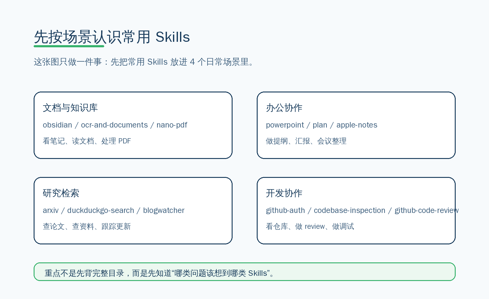
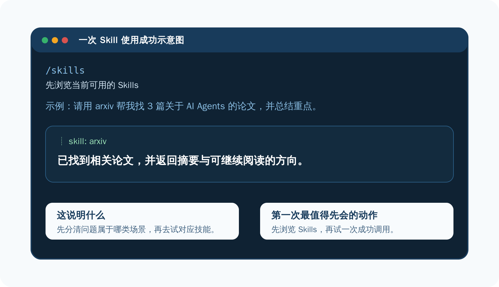

# 🏷️ 04-精选Skills

第一次看到很多 Skills 很正常。你不需要一次学完全部，先认识最常用的一小部分就够了。

## 🧭 先按 4 个日常场景来认识



### 🔹 文档与知识库

- `obsidian`
- `ocr-and-documents`
- `nano-pdf`
- `qmd`

适合：

- 看笔记
- 读长文档
- 抽取 PDF / 扫描件文字
- 整理资料

### 🔹 办公协作

- `powerpoint`
- `plan`
- `apple-notes`（更适合 macOS 用户）

适合：

- 出提纲
- 做汇报材料
- 整理任务和会议内容

### 🔹 研究检索

- `arxiv`
- `duckduckgo-search`
- `blogwatcher`
- `llm-wiki`

适合：

- 查论文
- 查资料
- 跟踪更新
- 做主题研究

### 🔹 开发协作

- `github-auth`
- `codebase-inspection`
- `github-code-review`
- `systematic-debugging`

适合：

- 看仓库
- 做代码巡检
- 做代码 review
- 做调试定位

## ✅ 成功标准



第一次开始用 Skills，最稳的做法是：

1. 先看看当前有哪些 Skills
2. 再选一个最贴近日常工作的场景试一次

例如：

- 研究检索场景 → 直接用 `arxiv` 查一篇论文并先读摘要
- 文档场景 → 用 `ocr-and-documents` 处理资料
- 开发场景 → 用 GitHub 相关技能检查仓库

## 🔹 Tools 先只会查看就够了

第一次开始使用时，Tools 这层先别展开太深。

先记住：

```bash
/tools list
```

这条命令可以帮助你看当前有哪些工具可用。

## 🔹 哪些先看，哪些先跳过

第一次开始使用，建议先看：

- 文档与知识库
- 研究检索
- 办公协作
- 开发协作

先跳过：

- 消息平台接入相关能力
- Open WebUI 这类接入型玩法
- 小众或非常垂直的 Skills

## ✅ 这一页什么时候算通过

当下面这些事已经成立，这一页就通过：

- 你已经完成过一次 Skills 调用
- 你已经知道至少一类场景该用哪一类技能
- 你已经知道 Tools 先看状态就够
- 你已经知道下一批最值得先试的是哪几类 Skills

## ➡️ 下一步

完成后进入：
- [02-开始上手/接入消息平台](./05-接入消息平台.md)
- [02-开始上手](./01-总览.md)

如果你想先回到上一阶段入口重新确认位置：
- [上一阶段入口](./01-总览.md)
