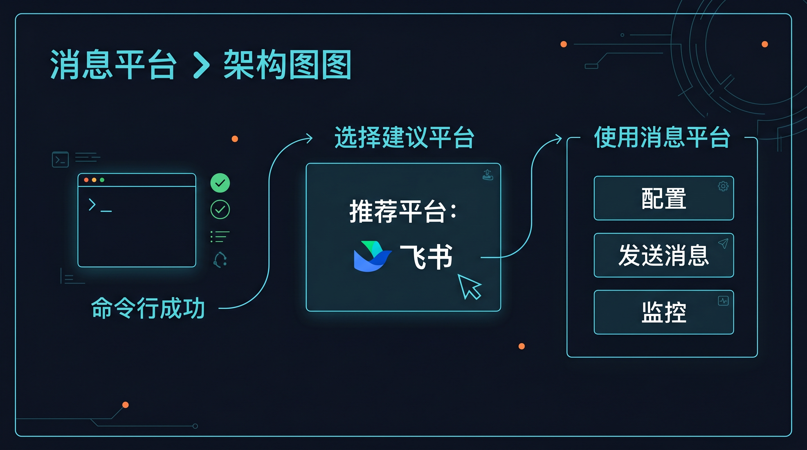
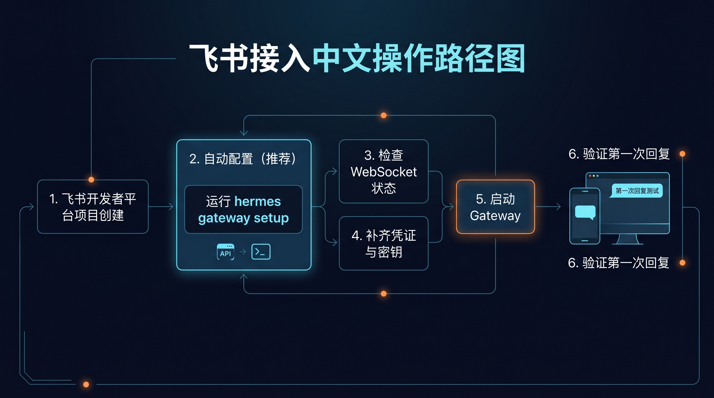
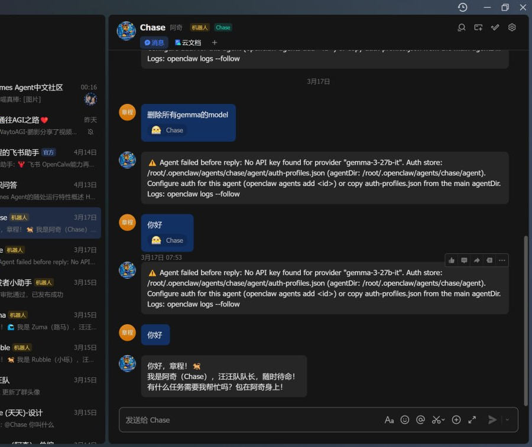

# 📡 05-接入一个消息平台（推荐飞书）

你已经在命令行里把 Hermes 跑通了。下一步，可以把它接到日常消息平台里，先从飞书开始。

这一页只做一件事：把“平台接入”讲成一条清晰的中文路径。

---

## 🧭 先回答一个问题：为什么现在才接平台



把消息平台放在这一页，而不是更前面，是有原因的：

- 先在 CLI 跑通，排错最简单
- 先把日常使用方式学会，再把它带进消息流
- 不然你很容易一边学 Hermes，一边学平台接入，最后两边都乱

所以这里的节奏是：

先把命令行用顺，再接平台。

---

## ❓ 为什么要接消息平台

把 Hermes 接到消息平台，价值很直接：

- 团队不用每次都切回终端
- 日常协作可以直接在消息流里完成
- Hermes 会更像一个真的接在工作流里的助手

这一页的重点不是“把所有平台讲完”，而是先把“为什么要接”讲明白。

---

## ❓ 为什么第一推荐是飞书

飞书适合先做第一站，原因只有几个：

- 更符合国内团队的日常使用习惯
- 更适合办公协作场景
- 官方支持路径比较清楚
- 先走 WebSocket 模式，起步更稳

先把飞书当成“最容易开始的国内消息平台入口”就行。

---

## ✅ 先确认你已经具备前提

接入前，至少先确认这 4 件事：

1. Hermes 已经能在命令行里正常工作
2. 你有一个飞书账号
3. 你准备创建一个飞书应用
4. 你有一台能继续运行 Hermes 的环境

如果这 4 件事还没齐，先别急着往下配。

更直接一点说：

如果你现在连 CLI 里的日常使用都还不顺，这一页先不要急着开工。

---

## 🔹 中文操作路径



### ➡️ 第 1 步：先跑交互式配置

```bash
hermes gateway setup
```

按提示先选：

- 平台：Feishu / Lark
- 连接模式：优先选 websocket
- 如果弹出二维码：用飞书手机端扫码

这一步的目标不是手动填完所有东西，而是先让 Hermes 把能自动处理的部分处理掉。

### ➡️ 第 2 步：把连接模式固定成 websocket

如果你先在本机或内网跑通，先固定成 websocket：

```env
FEISHU_CONNECTION_MODE=websocket
FEISHU_DOMAIN=feishu
```

如果之前试过 webhook，先不要混着用，先把 websocket 跑顺。

### ➡️ 第 3 步：补齐飞书凭证

把飞书的 App ID / Secret 写进当前 Hermes 使用的 `.env`：

```env
FEISHU_APP_ID=cli_xxx
FEISHU_APP_SECRET=***
FEISHU_DOMAIN=feishu
FEISHU_CONNECTION_MODE=websocket
```

如果你已经知道白名单和 Home Chat，再补这两个：

```env
FEISHU_ALLOWED_USERS=ou_xxx,ou_yyy
FEISHU_HOME_CHANNEL=oc_xxx
```

### ➡️ 第 4 步：启动 gateway

```bash
hermes gateway
```

你要确认三件事：

- 进程没有立刻退出
- 私聊机器人能直接回复
- 群里只有在 @ 机器人时才回复

### ➡️ 第 5 步：用真实消息验收第一次回复



真正的成功标准只有一个：

- 你在飞书里发出一条真实消息
- Hermes 真的回你一条真实消息

配置页看起来都对，不等于已经接通；真正接通，一定要在平台里看到一次真实回复。

---

## 🚫 这一页先不要扩展成什么

这一页先不要扩展成：

- 把所有消息平台一次讲完
- 把 gateway 运维细节一次讲完
- 把 webhook 和 websocket 全部细节一次讲完
- 把团队权限、自动化、平台治理都混在这里讲

这一页只解决“我能不能先把 Hermes 接到一个国内常用消息平台里”这件事。

---

## ✅ 这一页什么时候算通过

当下面这些事成立，这一页就通过：

- 你知道为什么先接消息平台
- 你知道为什么先推荐飞书
- 你知道接入前需要哪些前提
- 你知道从 setup 到启动 gateway 再到真实消息验证的顺序
- 你已经看到平台里的第一次真实回复

---

## ➡️ 下一步

既然你已经把 CLI 和消息平台这条日常使用链路走顺了，下一步就该开始调“这个助手到底更像不像你”。

- [03-玩出花样](../03-玩出花样/01-总览.md)

如果你想先回到上一阶段入口重新确认位置：

- [02-开始上手](./01-总览.md)
