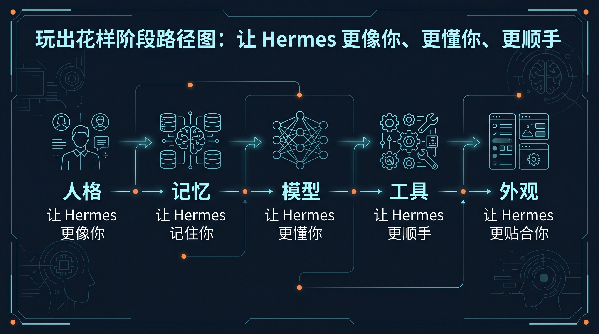

# 🎨 03-玩出花样

如果你已经会正常使用 Hermes，这一阶段只做一件事：
把“已经能用的一个助手”继续调成“更像你、更懂你、更顺手”的长期助手。

这一页仍然只围绕一个助手。
先不进入[多个助手一起工作](../04-自己造东西/02-多个助手一起工作.md)、[接入外部记忆系统](../04-自己造东西/03-接入外部记忆系统/01-总览.md)、[上下文系统](../04-自己造东西/04-上下文系统/01-总览.md)、[把 Hermes 接进外部系统](<../04-自己造东西/05-把 Hermes 接进外部系统.md>)这些更重的系统层玩法。

---

## ✅ 你现在适不适合进入这一阶段

符合下面 4 条，就直接继续：

- 你已经完成过 [02-开始上手](../02-开始上手/01-总览.md)
- 你已经能自然进入 Hermes 做日常提问
- 你已经知道会话怎么保存、继续、接回来
- 你现在想解决的是“怎么调得更贴合自己”，不是“怎么搭一整套系统”

如果你还没到这个状态，先回到：
- [02-开始上手](../02-开始上手/01-总览.md)

---

## 🎯 这一阶段会帮你拿到什么

走完这一阶段，你会逐步拿到这 5 个能力：

1. 让 Hermes 的语气、风格、默认行为更贴近你
2. 让 Hermes 记住真正值得长期保留的用户偏好和环境事实
3. 按你的模型来源、成本和稳定性，换成更合适的 LLM 配置
4. 把工具开关、工具组合和常用工作方式调顺
5. 让终端外观更清楚、更舒服、更符合你的使用习惯

一句话说完：
这一阶段不是学更多功能名词，而是把同一个 Hermes 助手调成更适合长期陪你做事的样子。

---

## 🧭 这 5 页就是完整路径

<table>
  <colgroup>
    <col style="width: 18%;" />
    <col style="width: 30%;" />
    <col style="width: 52%;" />
  </colgroup>
  <thead>
    <tr>
      <th>步骤</th>
      <th>主题</th>
      <th>这一页会解决什么</th>
    </tr>
  </thead>
  <tbody>
    <tr>
      <td><strong>第 1 步</strong></td>
      <td><a href="./02-让 Hermes 更像你.md"><strong>让 Hermes 更像你</strong></a></td>
      <td>先把长期人格放对位置，分清什么该写进 SOUL.md，什么不该塞进去。</td>
    </tr>
    <tr>
      <td><strong>第 2 步</strong></td>
      <td><a href="./03-让 Hermes 记住你.md"><strong>让 Hermes 记住你</strong></a></td>
      <td>学会持久记忆的边界，只留下真的该跨会话保留的信息。</td>
    </tr>
    <tr>
      <td><strong>第 3 步</strong></td>
      <td><a href="./04-自定义 AI 大模型.md"><strong>自定义 AI 大模型</strong></a></td>
      <td>把默认模型选择，推进到适合你成本、速度、来源和可控性的配置。</td>
    </tr>
    <tr>
      <td><strong>第 4 步</strong></td>
      <td><a href="./05-让工具更顺手.md"><strong>让工具更顺手</strong></a></td>
      <td>开始按场景整理 toolsets、工具开关和常用 workflow，而不是全开全背。</td>
    </tr>
    <tr>
      <td><strong>第 5 步</strong></td>
      <td><a href="./06-让终端更顺眼.md"><strong>让终端更顺眼</strong></a></td>
      <td>最后再调 skins 和 themes，把视觉层收尾，不和人格层混在一起。</td>
    </tr>
  </tbody>
</table>

---

## 🚦 默认顺序怎么走

最稳的顺序就是：

1. 先调人格，再调记忆
2. 再决定模型怎么配
3. 再整理工具和工作方式
4. 最后再改外观

别一上来先折腾皮肤。
也别还没想清楚人格和记忆边界，就急着上多模型、多系统、多助手。

如果你只想记一句：
先把“这个助手是谁、记什么、用什么模型、开哪些工具”理顺，再管它长什么样。

---

## 🗺️ 如果你是带着具体问题来的，直接从这里进

如果你不是想完整从头看完，而是已经知道自己卡在哪一层，可以直接按下面的入口跳：

- 我先想把这个助手的语气、默认行为、人设放稳 → [02-让 Hermes 更像你](<./02-让 Hermes 更像你.md>)
- 我现在卡在“该记住什么 / 不该记住什么” → [03-让 Hermes 记住你](<./03-让 Hermes 记住你.md>)
- 我真正想动的是模型来源、成本、上下文长度、fallback → [04-自定义 AI 大模型](<./04-自定义 AI 大模型.md>)
- 我已经不是模型问题，而是工具开关、toolsets、debugging / safe 这些工作方式问题 → [05-让工具更顺手](./05-让工具更顺手.md)
- 我前面几层都调顺了，只想把终端体验收尾 → [06-让终端更顺眼](./06-让终端更顺眼.md)

如果你现在拿不准自己到底卡在哪，别乱跳，还是按上面的默认顺序走最稳。

---

## 🧩 这一阶段的边界到底是什么

这一阶段最重要的边界只有一句话：

你现在在调“一个助手”，还不是在搭“一个系统”。

所以这里优先解决的是：

- 这个助手长期像谁
- 它该记住什么
- 它用哪条模型路由更合适
- 它开哪些工具更顺手
- 它的终端界面怎么更适合长期使用

而不是：

- [02-多个助手一起工作](../04-自己造东西/02-多个助手一起工作.md)
- [03-接入外部记忆系统](../04-自己造东西/03-接入外部记忆系统/01-总览.md)
- [04-上下文系统](../04-自己造东西/04-上下文系统/01-总览.md)
- [05-把 Hermes 接进外部系统](<../04-自己造东西/05-把 Hermes 接进外部系统.md>)
- [06-把 Hermes 暴露成后端服务](<../04-自己造东西/06-把 Hermes 暴露成后端服务.md>)
- [07-让 Hermes 自己自动跑](<../04-自己造东西/07-让 Hermes 自己自动跑.md>)

这些都会进入下一阶段[04-自己造东西](../04-自己造东西/01-总览.md)。

---

## 🌱 什么时候算过关

当下面这些状态已经成立，这一阶段就算通过：

- 你有一份稳定、克制、长期可用的人格设定
- 你知道哪些信息该进持久记忆，哪些不该记
- 你已经把模型配置调到适合自己的日常使用方式
- 你已经整理出一套自己常用的工具组合和使用习惯
- 你已经把终端外观调到长期看着舒服的状态
- 你能一眼分清：人格是人格，记忆是记忆，工具是工具，外观是外观

真正的变化是：
Hermes 不再只是“官方默认助手”，而是开始变成“你的那个 Hermes”。

---

## ✅ 看完这一页后你应该已经能判断什么

当下面这些问题你已经能答出来，这一页就算过了：

- 我现在是不是已经进入“调一个长期助手”的阶段？
- 我当前更该先动人格、记忆、模型、工具，还是外观？
- 为什么这一阶段还不该急着跳到多助手和系统接入？

---

## ➡️ 下一步

既然这一阶段的主线是“先调一个长期助手”，那第一步就先别碰模型和工具，先把长期人格放对位置。
- [02-让 Hermes 更像你](<./02-让 Hermes 更像你.md>)

如果你想先回到上一阶段入口重新确认位置：
- [02-开始上手](../02-开始上手/01-总览.md)
