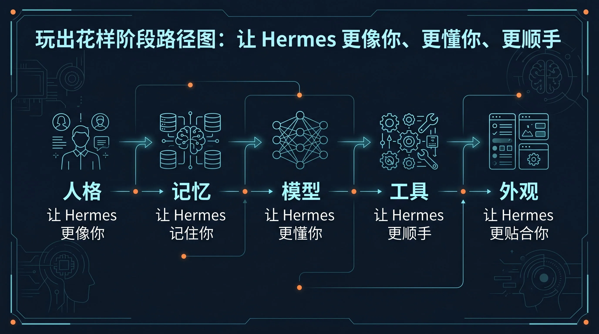

# 🎨 03-玩出花样

> **一句话结论**：这一阶段仍然只围绕一个助手，先把它调成"更像你、更懂你、更顺手"的长期助手，还不是进入多助手和系统层。

**适合谁**：已经能日常使用 Hermes（会提问、会话管理没问题），想让它更贴合自己的用户。
**不适合谁**：还没形成稳定使用习惯、连基本操作都不熟练的用户——先回 [02-开始上手](../02-开始上手/01-总览.md)。
**最短路径**：5 步依次走完 → [让 Hermes 更像你](./02-让%20Hermes%20更像你.md)（人格） → [让 Hermes 记住你](./03-让%20Hermes%20记住你.md)（记忆） → [自定义 AI 大模型](./04-自定义%20AI%20大模型.md)（模型） → [让工具更顺手](./05-让工具更顺手.md)（工具） → [让终端更顺眼](./06-让终端更顺眼.md)（终端外观）。
**关键限制**：必须先完成 [02-开始上手](../02-开始上手/01-总览.md)，否则人格、记忆、模型这些概念会踩空。
**下一步**：[让 Hermes 更像你](./02-让%20Hermes%20更像你.md)

如果你已经会正常使用 Hermes，这一阶段只做一件事：
把“已经能用的一个助手”继续调成“更像你、更懂你、更顺手”的长期助手。

先不进入[多个助手一起工作](../04-自己造东西/02-多个助手一起工作.md)、[接入外部记忆系统](../04-自己造东西/03-接入外部记忆系统/01-总览.md)、[上下文系统](../04-自己造东西/04-上下文系统/01-总览.md)、[把 Hermes 接进外部系统](<../04-%E8%87%AA%E5%B7%B1%E9%80%A0%E4%B8%9C%E8%A5%BF/05-%E6%8A%8A%20Hermes%20%E6%8E%A5%E8%BF%9B%E5%A4%96%E9%83%A8%E7%B3%BB%E7%BB%9F.md>)这些更重的系统层玩法。

---

## ✅ 你现在适不适合进入这一阶段

符合下面 4 条，就直接继续：
- 你已经完成过 [02-开始上手](../02-开始上手/01-总览.md)
- 你已经能自然进入 Hermes 做日常提问
- 你已经知道会话怎么保存、继续、接回来
- 你现在想解决的是“怎么调得更贴合自己”，不是“怎么搭一整套系统”

如果你还没到这个状态，先回到：
- [02-开始上手](../02-开始上手/01-总览.md)

---

## 🎯 这一阶段会帮你拿到什么

走完这一阶段，你会逐步拿到这 5 个能力：
1. 让 Hermes 的语气、风格、默认行为更贴近你
2. 让 Hermes 记住真正值得长期保留的用户偏好和环境事实
3. 按你的模型来源、成本和稳定性，换成更合适的 LLM 配置
4. 把工具开关、工具组合和常用工作方式调顺
5. 让终端外观更清楚、更舒服、更符合你的使用习惯

一句话说完：
- 这一阶段不是学更多功能名词，而是把同一个 Hermes 助手调成更适合长期陪你做事的样子

---

## 🧭 这 5 页就是完整路径

| 步骤 | 主题 | 这一页会解决什么 | 你什么时候先看它 |
|---|---|---|---|
| 第 1 步 | [让 Hermes 更像你](<./02-%E8%AE%A9%20Hermes%20%E6%9B%B4%E5%83%8F%E4%BD%A0.md>) | 把长期人格放对位置，分清什么该写进 SOUL.md，什么不该塞进去 | 你最先想调的是语气、人设、默认行为 |
| 第 2 步 | [让 Hermes 记住你](<./03-%E8%AE%A9%20Hermes%20%E8%AE%B0%E4%BD%8F%E4%BD%A0.md>) | 学会持久记忆的边界，只留下真的该跨会话保留的信息 | 你开始想让 Hermes 记住真正有价值的长期信息 |
| 第 3 步 | [自定义 AI 大模型](<./04-%E8%87%AA%E5%AE%9A%E4%B9%89%20AI%20%E5%A4%A7%E6%A8%A1%E5%9E%8B.md>) | 把默认模型选择推进到更适合你的成本、速度和来源配置 | 你最常卡在模型来源、成本、上下文长度和 fallback |
| 第 4 步 | [让工具更顺手](./05-让工具更顺手.md) | 按场景整理 toolsets、工具开关和常用 workflow | 你不是模型问题，而是工具开关和工作方式问题 |
| 第 5 步 | [让终端更顺眼](./06-让终端更顺眼.md) | 调 skins 和 themes，把视觉层收尾 | 你前面几层都调顺了，只想把终端体验收尾 |

---

## 🚦 如果你现在只想快速选一层

直接按当前问题走：
- 我先想把这个助手的语气、默认行为、人设放稳 → [让 Hermes 更像你](<./02-%E8%AE%A9%20Hermes%20%E6%9B%B4%E5%83%8F%E4%BD%A0.md>)
- 我现在卡在“该记住什么 / 不该记住什么” → [让 Hermes 记住你](<./03-%E8%AE%A9%20Hermes%20%E8%AE%B0%E4%BD%8F%E4%BD%A0.md>)
- 我真正想动的是模型来源、成本、上下文长度、fallback → [自定义 AI 大模型](<./04-%E8%87%AA%E5%AE%9A%E4%B9%89%20AI%20%E5%A4%A7%E6%A8%A1%E5%9E%8B.md>)
- 我已经不是模型问题，而是工具开关、toolsets、debugging / safe 这些工作方式问题 → [让工具更顺手](./05-让工具更顺手.md)
- 我前面几层都调顺了，只想把终端体验收尾 → [让终端更顺眼](./06-让终端更顺眼.md)

如果你现在拿不准自己到底卡在哪，别乱跳，还是按上面的默认顺序走最稳。

---

## 🗺 默认顺序怎么走

最稳的顺序就是：
1. 先调人格，再调记忆
2. 再决定模型怎么配
3. 再整理工具和工作方式
4. 最后再改外观

别一上来先折腾皮肤。
也别还没想清楚人格和记忆边界，就急着上多模型、多系统、多助手。

如果你只想记一句：
- 先把“这个助手是谁、记什么、用什么模型、开哪些工具”理顺，再管它长什么样

---

## 🧩 这一阶段的边界到底是什么

这一阶段最重要的边界只有一句话：
- 你现在在调“一个助手”，还不是在搭“一个系统”

所以这里优先解决的是：
- 这个助手长期像谁
- 它该记住什么
- 它用哪条模型路由更合适
- 它开哪些工具更顺手
- 它的终端界面怎么更适合长期使用

而不是：
- [02-多个助手一起工作](../04-自己造东西/02-多个助手一起工作.md)
- [03-接入外部记忆系统](../04-自己造东西/03-接入外部记忆系统/01-总览.md)
- [04-上下文系统](../04-自己造东西/04-上下文系统/01-总览.md)
- [05-把 Hermes 接进外部系统](<../04-%E8%87%AA%E5%B7%B1%E9%80%A0%E4%B8%9C%E8%A5%BF/05-%E6%8A%8A%20Hermes%20%E6%8E%A5%E8%BF%9B%E5%A4%96%E9%83%A8%E7%B3%BB%E7%BB%9F.md>)
- [06-把 Hermes 暴露成后端服务](<../04-%E8%87%AA%E5%B7%B1%E9%80%A0%E4%B8%9C%E8%A5%BF/06-%E6%8A%8A%20Hermes%20%E6%9A%B4%E9%9C%B2%E6%88%90%E5%90%8E%E7%AB%AF%E6%9C%8D%E5%8A%A1.md>)
- [07-让 Hermes 自己自动跑](<../04-%E8%87%AA%E5%B7%B1%E9%80%A0%E4%B8%9C%E8%A5%BF/07-%E8%AE%A9%20Hermes%20%E8%87%AA%E5%B7%B1%E8%87%AA%E5%8A%A8%E8%B7%91.md>)

这些都会进入下一阶段 [04-自己造东西](../04-自己造东西/01-总览.md)。

---

## ✅ 过关标准

当下面这些状态已经成立，这一阶段就算通过：
- 你有一份稳定、克制、长期可用的人格设定
- 你知道哪些信息该进持久记忆，哪些不该记
- 你已经把模型配置调到适合自己的日常使用方式
- 你已经整理出一套自己常用的工具组合和使用习惯
- 你已经把终端外观调到长期看着舒服的状态
- 你能一眼分清：人格是人格，记忆是记忆，工具是工具，外观是外观

真正的变化是：
- Hermes 不再只是“官方默认助手”，而是开始变成“你的那个 Hermes”

---

## ➡️ 下一步

完成后进入：
- [02-让 Hermes 更像你](<./02-%E8%AE%A9%20Hermes%20%E6%9B%B4%E5%83%8F%E4%BD%A0.md>)

如果你想先回到上一阶段入口重新确认位置：
- [02-开始上手](../02-开始上手/01-总览.md)
