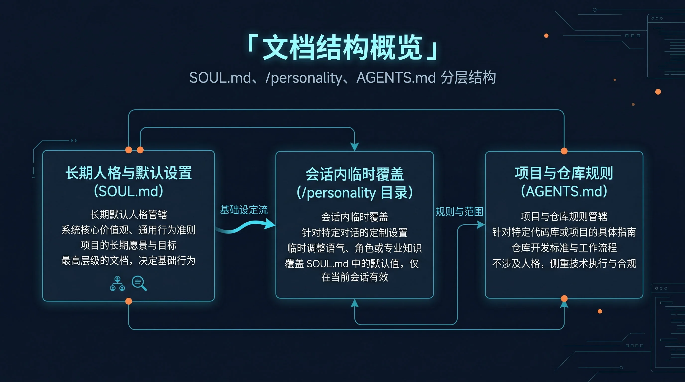
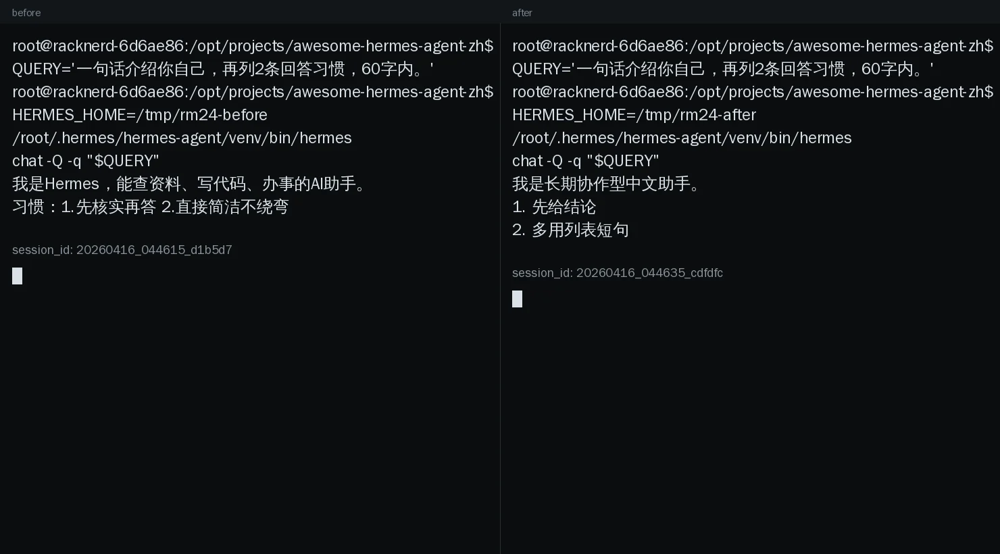

# 🪞 02-让 Hermes 更像你

这一页只解决一件事：
把 Hermes 的长期默认风格放到对的位置，让它不用你每次重复提醒，也能更像你希望长期合作的那个助手。



---

## 🎯 先说结论：现在先改 SOUL.md，不要乱改别的层

如果你现在最常说的话是：
- 短一点
- 直接一点
- 先说结论
- 少一点寒暄
- 中文优先

那你现在最该改的，通常不是模型，不是工具，也不是某个项目文件。
你该先改的是 `SOUL.md`。

因为这类要求解决的是：
- Hermes 平时怎么说话
- Hermes 默认更像什么风格的助手
- Hermes 长期协作时的行为底色

一句话记住：
`SOUL.md` 决定“这个 Hermes 长期是什么样的人”。

---

## ✨ 这件事为什么现在就值得做

把长期风格放对位置，最直接的好处有 4 个：

1. 你不用每次开新会话都重新讲一遍偏好
2. Hermes 的默认语气更稳定，不会忽冷忽热、忽技术忽客服
3. 你更容易分清“长期风格”和“当前任务要求”
4. 后面的[记忆](<./03-%E8%AE%A9%20Hermes%20%E8%AE%B0%E4%BD%8F%E4%BD%A0.md>)、[模型](<./04-%E8%87%AA%E5%AE%9A%E4%B9%89%20AI%20%E5%A4%A7%E6%A8%A1%E5%9E%8B.md>)、[工具](./05-让工具更顺手.md)也更容易分层

这一页的价值，不是让你写出一份很长的人设稿。
而是让你先把“长期默认风格”放到正确的地方。

---

## 🧠 SOUL.md 到底是什么

`SOUL.md` 是 Hermes 的主身份文件，也是长期默认人格入口。

你可以把它理解成：
- 它决定 Hermes 平时像谁
- 它决定默认语气、口吻、回答习惯
- 它是长期层，不是一次性提示词
- 它跟 Hermes 实例走，不跟某个仓库走

默认位置通常是：

```text
~/.hermes/SOUL.md
```

如果你使用了自定义 `HERMES_HOME`，位置就是：

```text
$HERMES_HOME/SOUL.md
```

所以别去项目仓库里到处找它。
也别把它当成“每个项目都要复制一份”的文件。

---

## ✅ 该写什么：只写长期稳定的风格约束

适合写进 `SOUL.md` 的，是那些“过一周、过一个月你也希望还成立”的东西。

最适合写这些：
- 语言偏好：中文优先、英文术语保留
- 语气：直接、冷静、少客套
- 回答结构：先结论后展开、能列表就列表
- 协作习惯：不确定就直说、不要假装确定
- 助手定位：偏工程搭档、偏研究助手、偏执行型支持

你可以用这个判断法：
如果这条要求是“长期默认如此”，它就像 `SOUL.md` 的内容。

---

## 🚫 不该写什么：别把 SOUL.md 写成垃圾抽屉

下面这些，不该往 `SOUL.md` 里塞：
- 某个项目的目录结构
- 某个仓库的代码规范
- 某次任务的临时要求
- 当前排障步骤和一次性 TODO
- API key、路径、账号、隐私数据
- [模型](<./04-%E8%87%AA%E5%AE%9A%E4%B9%89%20AI%20%E5%A4%A7%E6%A8%A1%E5%9E%8B.md>)、[工具](./05-让工具更顺手.md)、MCP 这类配置细节
- 试图覆盖系统安全边界的奇怪提示

一句话收口：
`SOUL.md` 写“这个助手长期怎么说、怎么做”，
不要写“这个项目今天怎么交付”。

---

## 📝 现在就能照着写：一个够用的最小模板

第一次不要追求大而全。
先写一份 6 到 10 行、你愿意长期保留的版本。

```md
# 我的长期默认风格
你是一个长期协作型中文助手。
默认风格：短句、直接、少客套、先结论后展开。

## 🗣️ 回答习惯
- 优先先给判断或结论
- 能列表就列表
- 不确定时直接说不确定
- 不要为了显得热情而加入无用寒暄
```

如果你想先得到最明显的变化，优先只改这 3 类：
- 先结论还是先分析
- 长句还是短句
- 寒暄多还是少

这 3 类最容易在下一次回复里直接感知出来。

---

## 🛠️ 现在具体怎么做

按这个顺序做就够了：

### 第 1 步：找到文件
确认你实际使用的 Hermes home 是哪一个：
- 默认：`~/.hermes/`
- 自定义：`$HERMES_HOME/`

然后找到：

```text
SOUL.md
```

### 第 2 步：先写最小版本
不要一口气写一大段华丽描述。
先只写：
- 语言偏好
- 回答长度
- 结构偏好
- 协作态度

### 第 3 步：删掉不属于人格层的内容
检查有没有这些混进去：
- 项目规则
- 临时任务要求
- 配置参数
- 秘钥和敏感信息

有就删掉。

### 第 4 步：开一个新会话再验证
不要在当前会话里死盯着看。
`SOUL.md` 这类长期层，最稳的验证方式是开一个新会话重新看默认表现。

---

## 🧭 SOUL.md、/personality、AGENTS.md 到底怎么分

这是最容易混的一组。

<table>
  <colgroup>
    <col style="width: 20%;" />
    <col style="width: 28%;" />
    <col style="width: 26%;" />
    <col style="width: 26%;" />
  </colgroup>
  <thead>
    <tr>
      <th>东西</th>
      <th>解决什么</th>
      <th>作用范围</th>
      <th>你该怎么理解</th>
    </tr>
  </thead>
  <tbody>
    <tr>
      <td><code>SOUL.md</code></td>
      <td>长期默认人格、语气、行为底色</td>
      <td>当前 Hermes 实例</td>
      <td>“这个 Hermes 平时像谁”</td>
    </tr>
    <tr>
      <td><code>/personality</code></td>
      <td>临时切一个会话风格</td>
      <td>当前会话</td>
      <td>“这次先换一种说话方式”</td>
    </tr>
    <tr>
      <td><code>AGENTS.md</code></td>
      <td>项目规则、仓库约定、执行边界</td>
      <td>当前项目 / 目录上下文</td>
      <td>“进这个仓库后要守什么规矩”</td>
    </tr>
  </tbody>
</table>

你现在只要先死记这 3 句：
- 长期人格改 `SOUL.md`
- 临时风格改 `/personality`
- 项目规则写 `AGENTS.md`

---

## 🔍 怎么判断自己改成功了

最稳的验证方式，是做一次 before / after 对照。

推荐做法：
1. 准备两个临时 `HERMES_HOME`
2. 两边都放同样可用的 `config.yaml`、`.env`、`auth.json`
3. 只有其中一边多一份 `SOUL.md`
4. 用同一条 query 各跑一次

最小命令思路：

```bash
HERMES_HOME=/tmp/hermes-before hermes chat -Q -q "请先给结论，再列出2条你的回答习惯。总共不超过60字。"
HERMES_HOME=/tmp/hermes-after  hermes chat -Q -q "请先给结论，再列出2条你的回答习惯。总共不超过60字。"
```

看什么算成功：
- before 更像通用默认助手
- after 明显更贴近你写的风格
- 同类问题重复问时，风格仍然稳定



---

## 🩺 如果没生效，先检查这 5 件事

不要先怀疑模型坏了。
先查最常见的问题：

1. 你是不是改错文件了
   - 是 `~/.hermes/SOUL.md`
   - 还是别的 `HERMES_HOME/SOUL.md`

2. 你是不是把项目规则写进去了
   - 仓库规范不属于 `SOUL.md`

3. 你是不是把临时需求写成长期人格了
   - 一次性要求不该放这里

4. 你是不是还在旧会话里验证
   - 先开一个新会话再看

5. 你是不是写得太散、太长、互相打架
   - 第一次先保留最少几条核心偏好

如果你不是人格层分不清，而是会话表现、CLI、会话切换本身出问题，去看：
- [04-CLI TUI 与会话问题](../../05-遇到问题/04-CLI TUI 与会话问题.md)

---

## ✅ 这一页的过关标准

当下面这些状态已经成立，这一页就算通过：
- 你知道 `SOUL.md` 是长期默认人格入口
- 你知道为什么这件事应该现在做，而不是以后再补
- 你能分清什么该写、什么不该写
- 你手里已经有一份最小可用的 `SOUL.md`
- 你能用一次新会话或 before / after 对照验证它真的生效
- 你不会再把 `SOUL.md`、`/personality`、`AGENTS.md` 混在一起

---

## ➡️ 下一步
完成后进入：
- [03-让 Hermes 记住你](<03-让 Hermes 记住你.md>)

如果你想先回到上一阶段入口重新确认位置：
- [03-玩出花样](01-总览.md)
