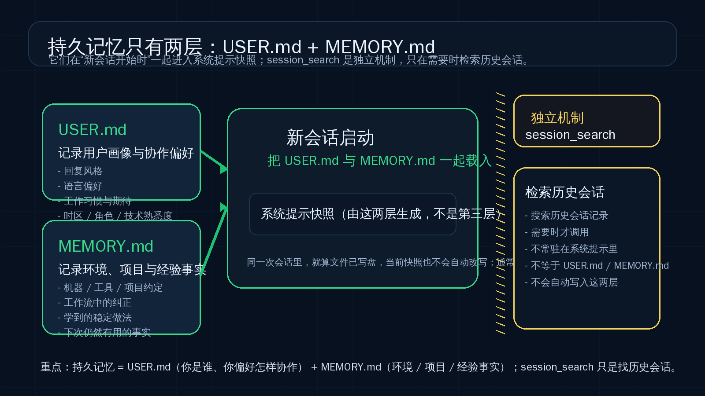
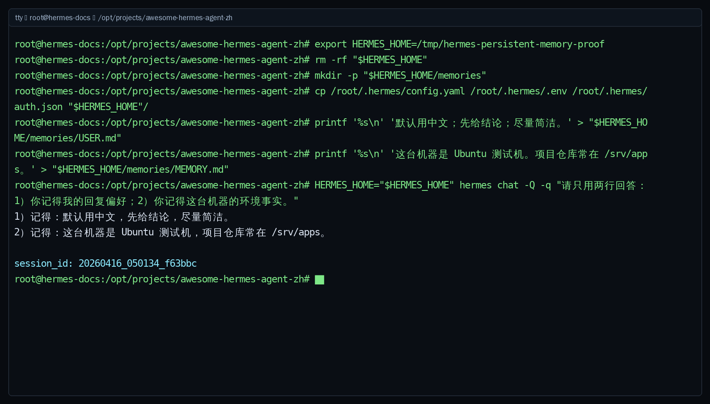

# 🧠 03-持久记忆

这一页只解决一件事：
把“跨会话长期有用的信息”放进对的位置，让 Hermes 在下一次新会话里更像是真的记住了你。



---

## ❓ 持久记忆到底是什么

官方把 Hermes 的持久记忆定义成一种有边界、经过整理、可以跨会话保留的小型记忆。

它不是“什么都记”。
也不是“把整段历史聊天自动塞回系统提示”。
它更像一个刻意压小、只留下高价值事实的长期备忘区。

默认位置在：

```text
~/.hermes/memories/
```

如果你用了自定义 `HERMES_HOME`，那就是：

```text
$HERMES_HOME/memories/
```

官方默认就两份文件：

- `USER.md`
- `MEMORY.md`

这两份合起来，才是这一页说的“持久记忆”。

---

## ❓ 由什么组成：USER.md / MEMORY.md

<table>
  <colgroup>
    <col style="width: 18%;" />
    <col style="width: 30%;" />
    <col style="width: 28%;" />
    <col style="width: 24%;" />
  </colgroup>
  <thead>
    <tr>
      <th>文件</th>
      <th>该记什么</th>
      <th>典型内容</th>
      <th>官方默认字符上限</th>
    </tr>
  </thead>
  <tbody>
    <tr>
      <td><code>USER.md</code></td>
      <td>用户是谁、喜欢怎样被协作</td>
      <td>语言偏好、回复风格、角色、时区、技术熟悉度、长期习惯</td>
      <td>1,375 chars（约 500 tokens）</td>
    </tr>
    <tr>
      <td><code>MEMORY.md</code></td>
      <td>环境、项目、约定、经验事实</td>
      <td>机器信息、工具约束、仓库常识、工作流纠正、稳定可复用的教训</td>
      <td>2,200 chars（约 800 tokens）</td>
    </tr>
  </tbody>
</table>

你可以先用一句话记住：

- `USER.md` 记“你这个人”
- `MEMORY.md` 记“你所在的环境与事情”

别把两者混写。
如果一条信息的主语是“你喜欢怎样回答、怎样协作”，更像 `USER.md`。
如果主语是“这台机器、这个项目、这个工作流有什么稳定事实”，更像 `MEMORY.md`。

---

## 🔹 这些记忆怎么生效

官方机制有两个关键点：

1. `USER.md` 和 `MEMORY.md` 会在“每次新会话开始时”一起载入
2. 它们进入的是系统提示里的一个 frozen snapshot（冻结快照）

这意味着：

- 新会话启动时，Hermes 会先读磁盘上的两份文件
- 然后把当时的内容注入系统提示
- 注入之后，这一会话里的这块内容就固定了

所以很多人第一次改完记忆，会有一个常见误解：
“我明明已经改了文件，为什么当前会话还像没吃进去？”

答案通常就是：
因为你改的是磁盘上的长期记忆，但当前会话已经拿着旧快照跑起来了。

---

## ❓ 为什么改完后通常要到“下一次新会话”才真正进入系统提示快照

这是这一页最容易混淆、但又最重要的点。

官方明确说明：

- 记忆文件改动会立刻写盘
- 但当前会话里的系统提示快照不会中途自动重写
- 真正重新把新内容带进系统提示，通常要等下一次新会话开始

这样设计的原因也不是“忘了刷新”，而是为了保住 prefix cache，避免每次记忆微调都把整段系统提示重新洗掉，影响性能。

你可以把它理解成：

- 磁盘文件是“最新真相”
- 当前会话系统提示是“启动那一刻拍下的快照”

所以同一次会话里：
- `memory` 工具的返回可以反映 live state
- 但模型真正正在吃的那块系统提示记忆，仍然是旧快照

这也是为什么验证持久记忆时，最稳的方法几乎总是：
改完之后，开一个全新的会话再问。

---

## ❓ 该记住什么

真正适合进持久记忆的，是“下次还值得直接带进来”的东西。

适合放进 `USER.md` 的：

- 你偏好中文还是英文
- 你喜欢短答还是展开答
- 你希望先结论后展开，还是先分析再结论
- 你讨厌什么表达方式
- 你的角色、时区、长期协作习惯

适合放进 `MEMORY.md` 的：

- 这台机器 / 这个环境的稳定事实
- 项目的长期约定
- 常见工作流纠正
- 之前踩坑后确认过的稳定做法
- 下次做同类事仍然有用的环境经验

一个简单判断法：
如果这条信息下周、下个月大概率还值得 Hermes 默认知道，那它才像持久记忆。

---

## ❓ 不该记住什么

下面这些，不要往 `USER.md` / `MEMORY.md` 里堆：

- 一次性任务进度
- 临时 TODO
- 某次排障时才有用的短期上下文
- 大段日志、代码、表格原文
- 明显能随时重新搜索到的通用知识
- 已经写在 `SOUL.md` 或 `AGENTS.md` 的内容
- API key、密码、令牌、隐私敏感数据

尤其要注意：
“上次我们做到了第几步”“这个需求今天改了三次”“刚刚某个命令输出了什么”
这些通常更像会话历史，不像长期记忆。

---

## 🔹 相关配置开关：你作为用户最需要知道的最小集合

如果你只是正常用内建持久记忆，最小必要就是知道这些配置项在 `~/.hermes/config.yaml` 里：

```yaml
memory:
  memory_enabled: true
  user_profile_enabled: true
  memory_char_limit: 2200
  user_char_limit: 1375
```

你先记住它们各自什么意思就够了：

- `memory_enabled`：是否启用 `MEMORY.md`
- `user_profile_enabled`：是否启用 `USER.md`
- `memory_char_limit`：`MEMORY.md` 的容量上限
- `user_char_limit`：`USER.md` 的容量上限

这一页先不展开更重的 memory provider 配置，也不进入外部知识图谱、语义记忆之类玩法。

---

## 🔹 基础记忆和 session_search 的区别

很多人会把这两个混成一句“反正都是记住过去”。
其实不是。

`session_search` 的官方定义是：
搜索过去会话记录，用 FTS5 在历史 session 里按需检索，再做摘要返回。

它的重点是：
- 查历史会话
- 按需调用
- 不常驻在每个新会话的系统提示里

而 `USER.md` / `MEMORY.md` 的重点是：
- 容量很小
- 刻意精选
- 每个新会话一开始就直接带入系统提示

所以正确理解应该是：

<table>
  <colgroup>
    <col style="width: 22%;" />
    <col style="width: 39%;" />
    <col style="width: 39%;" />
  </colgroup>
  <thead>
    <tr>
      <th>维度</th>
      <th>USER.md / MEMORY.md</th>
      <th>session_search</th>
    </tr>
  </thead>
  <tbody>
    <tr>
      <td>本质</td>
      <td>长期常驻的小型精选记忆</td>
      <td>对历史会话的按需搜索</td>
    </tr>
    <tr>
      <td>进入时机</td>
      <td>新会话开始时直接进系统提示</td>
      <td>只有需要时才调用搜索</td>
    </tr>
    <tr>
      <td>容量</td>
      <td>很小，故意受限</td>
      <td>面向全部历史会话</td>
    </tr>
    <tr>
      <td>适合放什么</td>
      <td>稳定、关键、反复有用的事实</td>
      <td>“上次我们聊到哪了？”这类回溯信息</td>
    </tr>
  </tbody>
</table>

一句话记忆：
`session_search` 是“翻旧账”，不是“长期常驻记忆”。
它能帮你找过去聊过什么，但不等于这些内容已经沉淀进 `USER.md` / `MEMORY.md`。

如果你想看看历史会话本身，官方 CLI 入口是：

```bash
hermes sessions list
```

---

## ✅ 成功标准

最稳的验证方法还是：
用一个临时 `HERMES_HOME`，只造最小记忆文件，然后直接开新会话问它记不记得。

推荐流程：

1. 准备临时 `HERMES_HOME`
2. 复制你当前能工作的 `config.yaml`、`.env`、`auth.json`
3. 创建 `memories/USER.md` 和 `memories/MEMORY.md`
4. 用这个临时目录启动一个全新会话
5. 直接问 Hermes 它记得什么

最小命令思路：

```bash
export HERMES_HOME=/tmp/hermes-persistent-memory-proof
mkdir -p "$HERMES_HOME/memories"
cp ~/.hermes/config.yaml ~/.hermes/.env ~/.hermes/auth.json "$HERMES_HOME"/
printf '%s\n' '默认用中文；先给结论；尽量简洁。' > "$HERMES_HOME/memories/USER.md"
printf '%s\n' '这台机器是 Ubuntu 测试机。项目仓库常在 /srv/apps。' > "$HERMES_HOME/memories/MEMORY.md"
HERMES_HOME="$HERMES_HOME" hermes chat -Q -q "请只用两行回答：1）你记得我的回复偏好；2）你记得这台机器的环境事实。"
```

下面这张图就是按这个思路实际跑出来的真实终端证据：临时创建两份记忆文件，再开一个新会话查询；输出里能直接看到偏好、环境事实和 `session_id`。



---

## ✅ 什么时候算通过

当下面这些判断你都已经清楚，这一页就通过：

- 你知道持久记忆只看 `USER.md` 和 `MEMORY.md` 这两层  
- 你知道两者分别该记什么、不该记什么  
- 你知道它们通常要到“下一次新会话”才真正进入系统提示快照  
- 你不会把 `session_search` 误当成长期记忆本身  
- 你能用一次临时 `HERMES_HOME` 验证新会话确实读到了记忆  

---

## ➡️ 下一步

完成后进入：
- [03-玩出花样/自定义模型](./04-自定义模型.md)

如果你想先回到上一阶段入口重新确认位置：
- [上一阶段入口](./01-总览.md)
