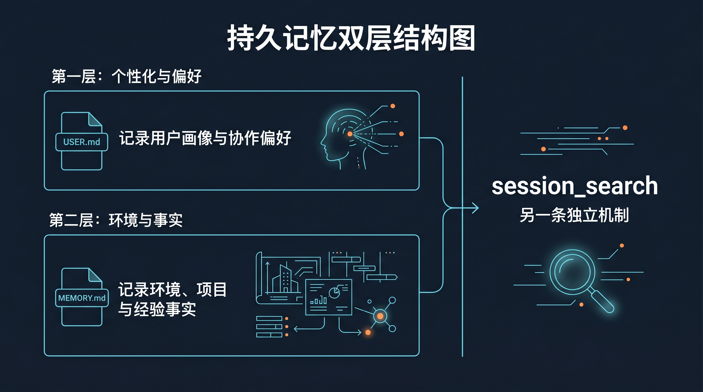

# 🧠 03-让 Hermes 记住你

这一页只解决一件事：
把“跨会话长期有用的信息”放进对的位置，让 Hermes 在下一次新会话里更像是真的记住了你。



---

## 🧭 先记住：这一页不是在讲“聊天记录会自动永远记住”

这一页真正要解决的，不是“历史会话去哪了”，而是：

什么信息值得被 Hermes 默认长期知道？

如果你没把这个边界弄清楚，就很容易出现两种误解：

- 以为 Hermes 会自动把所有聊天都长期带着
- 以为只要我刚刚说过，它下次新会话就一定会记得

这两种理解都不准确。

持久记忆的重点是：

有边界、被压小、只保留高价值事实。

---

## ❓ 持久记忆到底是什么

官方把 Hermes 的持久记忆定义成一种有边界、经过整理、可以跨会话保留的小型记忆。

它不是“什么都记”。
也不是“把整段历史聊天自动塞回系统提示”。
它更像一个刻意压小、只留下高价值事实的长期备忘区。

默认位置在：

```text
~/.hermes/memories/
```

如果你用了自定义 `HERMES_HOME`，那就是：

```text
$HERMES_HOME/memories/
```

官方默认就两份文件：

- `USER.md`
- `MEMORY.md`

这两份合起来，才是这一页说的“持久记忆”。

---

## ❓ 由什么组成：USER.md / MEMORY.md

<table>
  <colgroup>
    <col style="width: 18%;" />
    <col style="width: 30%;" />
    <col style="width: 28%;" />
    <col style="width: 24%;" />
  </colgroup>
  <thead>
    <tr>
      <th>文件</th>
      <th>该记什么</th>
      <th>典型内容</th>
      <th>官方默认字符上限</th>
    </tr>
  </thead>
  <tbody>
    <tr>
      <td><code>USER.md</code></td>
      <td>用户是谁、喜欢怎样被协作</td>
      <td>语言偏好、回复风格、角色、时区、技术熟悉度、长期习惯</td>
      <td>1,375 chars（约 500 tokens）</td>
    </tr>
    <tr>
      <td><code>MEMORY.md</code></td>
      <td>环境、项目、约定、经验事实</td>
      <td>机器信息、工具约束、仓库常识、工作流纠正、稳定可复用的教训</td>
      <td>2,200 chars（约 800 tokens）</td>
    </tr>
  </tbody>
</table>

你可以先用一句话记住：

- `USER.md` 记“你这个人”
- `MEMORY.md` 记“你所在的环境与事情”

别把两者混写。
如果一条信息的主语是“你喜欢怎样回答、怎样协作”，更像 `USER.md`。
如果主语是“这台机器、这个项目、这个工作流有什么稳定事实”，更像 `MEMORY.md`。

---

## 🔍 短期上下文 和 长期记忆 不是一回事

这是这一页最需要拆开的地方。

你可以先这样理解：

- 短期上下文：当前这段会话里刚刚聊过什么
- 长期记忆：下次新会话开始时，Hermes 仍然默认值得知道什么

所以：

- “我们刚刚排到第几步了”更像短期上下文
- “你偏好先结论后展开”更像长期记忆
- “这个项目默认用北京时间写状态”更像长期记忆
- “刚才某个命令报了什么错”更像短期上下文

一句话收口：

不是“刚说过的都该记”，而是“下次还值得直接带进来”的，才像持久记忆。

---

## 🔹 这些记忆怎么生效

官方机制有两个关键点：

1. `USER.md` 和 `MEMORY.md` 会在“每次新会话开始时”一起载入
2. 它们进入的是系统提示里的一个 frozen snapshot（冻结快照）

这意味着：

- 新会话启动时，Hermes 会先读磁盘上的两份文件
- 然后把当时的内容注入系统提示
- 注入之后，这一会话里的这块内容就固定了

所以很多人第一次改完记忆，会有一个常见误解：

“我明明已经改了文件，为什么当前会话还像没吃进去？”

答案通常就是：

因为你改的是磁盘上的长期记忆，但当前会话已经拿着旧快照跑起来了。

---

## ❓ 该记住什么

真正适合进持久记忆的，是“下次还值得直接带进来”的东西。

适合放进 `USER.md` 的：

- 你偏好中文还是英文
- 你喜欢短答还是展开答
- 你希望先结论后展开，还是先分析再结论
- 你讨厌什么表达方式
- 你的角色、时区、长期协作习惯

适合放进 `MEMORY.md` 的：

- 这台机器 / 这个环境的稳定事实
- 项目的长期约定
- 常见工作流纠正
- 之前踩坑后确认过的稳定做法
- 下次做同类事仍然有用的环境经验

一个简单判断法：
如果这条信息下周、下个月大概率还值得 Hermes 默认知道，那它才像持久记忆。

---

## ❓ 不该记住什么

下面这些，不要往 `USER.md` / `MEMORY.md` 里堆：

- 一次性任务进度
- 临时 TODO
- 某次排障时才有用的短期上下文
- 大段日志、代码、表格原文
- 明显能随时重新搜索到的通用知识
- 已经写在[SOUL.md](02-让 Hermes 更像你.md)或[AGENTS.md](../04-自己造东西/04-上下文系统/02-上下文文件.md)里的内容
- API key、密码、令牌、隐私敏感数据

尤其要注意：

“上次我们做到了第几步”“这个需求今天改了三次”“刚刚某个命令输出了什么”
这些通常更像会话历史，不像长期记忆。

---

## ✅ 最小自检：怎么验证它真的记住了

最稳的方法不是在当前会话里追着问，而是做一次“写入后开新会话”的验证。

你可以按下面的最小流程做：

1. 写入一条非常明确、容易识别的长期偏好
2. 结束当前会话
3. 开一个全新会话
4. 问一条能明显看出风格差异的问题

比如：

- 在 `USER.md` 里加：默认先给结论，再用列表展开，控制在短句内
- 然后新开会话问：请给我一个建议，说明你现在的回答方式

如果新会话里的默认风格明显开始贴近这条偏好，就说明它真的进了长期记忆链路。

你要验证的不是“它是不是复述了原文”，而是：

- 新会话一开始就更接近你的长期偏好
- 不用你重新提醒，它也开始按这个方式协作

---

## 🔹 基础记忆和 session_search 的区别

很多人会把这两个混成一句“反正都是记住过去”。
其实不是。

如果你这里还没分清，先记一句：
持久记忆是“新会话一开始就默认带着的长期事实”；
而 `session_search` 更像“需要时再去翻历史会话”。

`session_search` 的重点是：

- 查历史会话
- 按需调用
- 不常驻在每个新会话的系统提示里

而 `USER.md` / `MEMORY.md` 的重点是：

- 容量很小
- 刻意精选
- 每个新会话一开始就直接带入系统提示

一句话记忆：

`session_search` 是“翻旧账”，不是“长期常驻记忆”。
它能帮你找过去聊过什么，但不等于这些内容已经沉淀进 `USER.md` / `MEMORY.md`。

---

## ✅ 什么时候算通过

当下面这些事已经成立，这一页就通过：

- 你知道持久记忆不是“自动记住一切”
- 你能分清短期上下文和长期记忆的边界
- 你能分清 `USER.md` 和 `MEMORY.md` 各记什么
- 你知道什么该记、什么不该记
- 你知道为什么改完之后通常要到“下一次新会话”才真正生效
- 你能做一次最小自检，确认 Hermes 真的在新会话里开始按这些长期事实协作

---

## ➡️ 下一步

完成后进入：

- [04-自定义 AI 大模型](<04-自定义 AI 大模型.md>)

如果你想先回到上一阶段入口重新确认位置：

- [03-玩出花样](01-总览.md)
