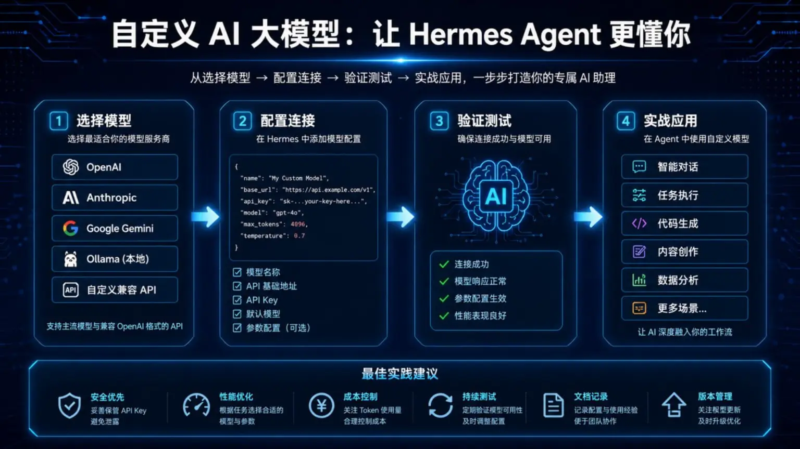
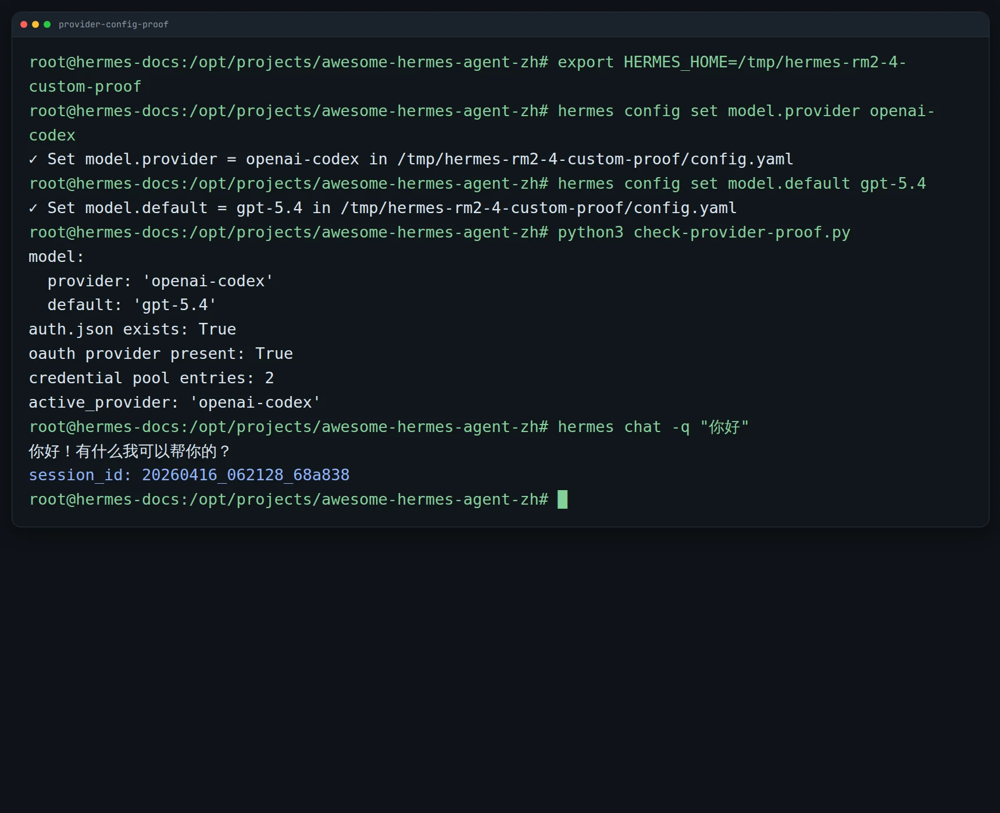
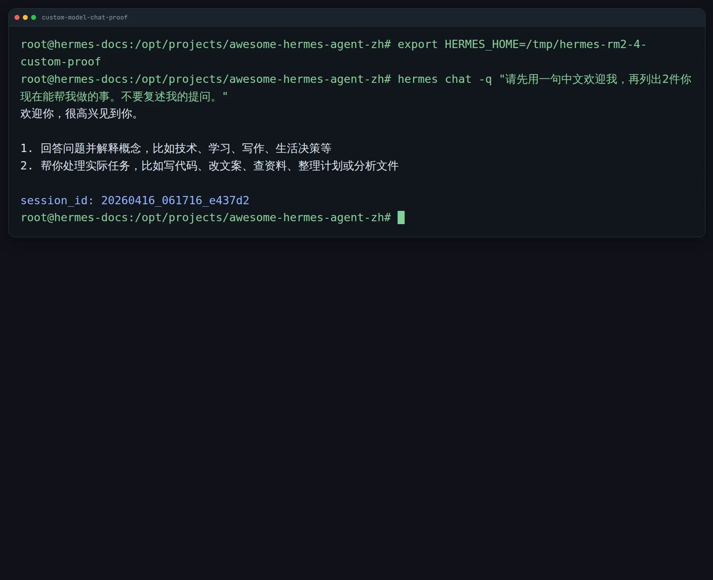

# 🤖 04-自定义 AI 大模型

这一页只解决一件事：
把 Hermes 接到更适合你自己的模型路由上，让它在成本、速度、稳定性和可用性上更贴近你的真实使用场景。



---

## 🎯 先说结论：优先走 hermes model，custom endpoint 不是默认起手式

很多人一到“自定义模型”这一步，就容易直接冲向：
- 统一网关
- 自托管 endpoint
- 一口气配置主模型、备用模型、多 key

但对大多数用户，最稳的主路仍然是：
先用 `hermes model` 选 provider，再定默认模型。

一句话记住：
- 官方 provider 是默认主路
- custom endpoint 是高级分支
- 先接通、再调优、最后再做复杂路由

---

## ✨ 什么时候你现在值得动模型层

不是一装好 Hermes 就必须折腾模型层。
通常只有在下面这些情况，你才值得动：
- 你已经能正常聊天，但想换更快、更便宜或更强的模型
- 你已经有固定 API 来源，想让 Hermes 直接走那一路
- 你想分开主模型和备用模型，提高稳定性
- 你有多个同 provider 的 key，想做轮换抗限流
- 你所在团队已经有统一 OpenAI-compatible 网关
- 你在使用本地或自托管模型，需要把 Hermes 指到自己的 endpoint

如果你现在还没把任何模型接通，先回到：
- [05-配好 AI 大模型并完成第一次互动](<../01-%E5%85%88%E8%B7%91%E8%B5%B7%E6%9D%A5/05-%E9%85%8D%E5%A5%BD%20AI%20%E5%A4%A7%E6%A8%A1%E5%9E%8B%E5%B9%B6%E5%AE%8C%E6%88%90%E7%AC%AC%E4%B8%80%E6%AC%A1%E4%BA%92%E5%8A%A8.md>)

---

## 🎁 你调这层，真正能得到什么

模型层调顺以后，你拿到的不是“知道更多模型名词”，而是这些实际收益：

1. 日常使用更稳，不容易被单一路线卡死
2. 成本、速度、能力更贴近你的任务类型
3. 你能分清主路、备路、网关、自托管各放哪一层
4. 出问题时，你更容易判断到底是 provider、认证、endpoint 还是上下文本身有问题

一句话收口：
模型层调顺以后，Hermes 不只是“能回答”，而是更像“能长期稳定工作”。

---

## 🧭 现在最推荐怎么做

### 路线 1：直接走 hermes model
这是大多数用户最推荐的入口。

原因很简单：
- 这是官方一等入口
- 它会把 provider / model 持久化到 `config.yaml`
- OAuth 类 provider 会把认证状态放进 `auth.json`
- 你不容易把 `.env`、`config.yaml`、认证状态改乱

你可以这样理解：
先决定“我要接哪家 provider”，再决定“默认模型用哪个”。

常见主路包括：
- Nous Portal
- OpenAI Codex
- Anthropic
- GitHub Copilot
- Google Gemini / Google AI Studio
- OpenRouter
- 智谱（z.ai / GLM）
- Kimi（月之暗面）
- MiniMax（国内 / 国际 / OAuth）
- 阿里云百炼 / DashScope / Qwen
- DeepSeek
- 腾讯 TokenHub
- 小米
- 以及 Hermes 已内建支持的其它 provider

如果 provider 是 API key 路线，再把对应 key 放进：

```text
~/.hermes/.env
```

例如：
- `OPENROUTER_API_KEY`
- GLM / Kimi / MiniMax / DashScope 对应 provider 的 key

### 路线 2：只有明确需要时，才走 custom endpoint
适合这些情况：
- 你要接本地模型
- 你要接 vLLM、Ollama、LM Studio、SGLang 这类服务
- 你要接 one-api、New API、CLIProxyAPI 或企业统一网关
- 你需要一个统一的 OpenAI-compatible 北向入口

这时才值得进入：
- `provider: custom`
- `base_url`
- 自定义认证
- 兼容性验证

---

## 📝 如果你要手动接模型，至少先搞清 5 件事

不管你是官方 provider，还是 custom endpoint，至少先把这 5 件事说清楚：

1. provider 是谁
   - 官方 provider 就写它自己的 provider 名
   - 只有直连 OpenAI-compatible endpoint 时，才是 `provider: custom`

2. model 是什么
   - 也就是 Hermes 默认要调用的模型 ID

3. base_url 在哪
   - 只在 custom endpoint 路线需要
   - 而且目标必须真的兼容 OpenAI API

4. 认证怎么放
   - 官方 provider：优先走 `hermes model` / `hermes auth`
   - API key：通常放 `~/.hermes/.env`

5. 真实可用上下文有多少
   - 不是宣传页写多少
   - 而是你的真实服务实际给 Hermes 开了多少

一句话记住：
你至少要知道“接谁、模型名、地址、认证方式、真实上下文”。

---

## 📏 为什么建议你尽量从 64K 上下文起步

官方没有把 64K 写成死门槛。
但官方明确给了两个很重要的边界：
- 对带工具的 agent，至少需要 16K 到 32K，上下文太小会被系统提示和工具 schema 吃掉
- 在本地或自托管场景里，32K 到 64K 是更适合 agent 使用的区间

所以落到实际建议，我会直接收束成一句：
如果你在认真给 Hermes 配长期主模型，能上 64K，就尽量别只停在 16K 或 32K。

原因不是“越大越酷”，而是：
- Hermes 不是纯单轮问答
- 系统提示本身就会占窗口
- 工具 schema、文件上下文、历史对话都会继续吃窗口
- 一旦开始做代码、排障、读文档，32K 很容易很快变紧

你可以把 64K 理解成：
不是奢侈配置，而是更不容易天天撞墙的起步线。

---

## 🔁 fallback_model 和多密钥轮换，各自解决什么

这两个常被混成一件事，但它们不是同一层。

### 多密钥轮换
解决的是：
同一家 provider 的 key 容易限流、撞 quota、偶尔不稳。

你该怎么理解：
同 provider 内部补冗余，不改主模型路线。

### fallback_model
解决的是：
主 provider 整条路挂了时，还有另一条备用路线可以接住。

你该怎么理解：
跨 provider 的备用路线，不是多 key 轮换的替代品。

最短记忆法：
- 多密钥轮换：保同一路 provider 更稳
- `fallback_model`：保主路挂了还能切另一条路

---

## 🌐 one-api / New API / CLIProxyAPI 这种统一网关，适合放在哪

最实用的理解方式是：
把它们放在 Hermes 的下面，而不是放在 Hermes 的上面。

也就是：

```text
Hermes → 统一网关 → 各家真实模型 / 多个 key / 多个后端
```

它们适合解决的是：
- 你想统一 API 入口
- 你想把多个 provider、多个 key、多个账单收在一个地方
- 你希望团队只暴露一个 OpenAI-compatible 地址给 Hermes

什么时候适合这么做：
- 你很清楚自己为什么需要网关
- 你需要统一审计、路由、配额、权限或账单
- 你不想让每台 Hermes 客户端直接知道底层 provider 细节

什么时候不值得一上来就这么做：
- 你只是个人日常使用
- 你还在试不同 provider
- 你还没把主 provider 想清楚

一句话收口：
统一模型网关是 Hermes 下游的一层路由器，不是普通用户一开始的默认主路。

---

## 🛠️ 现在具体怎么做

按这个顺序走最稳：

### 第 1 步：先确定你到底要哪条路
先选一种：
- 官方 provider
- 自带 API key 的 provider
- custom endpoint
- 团队统一网关

### 第 2 步：优先用 hermes model 完成主路配置
如果是官方支持的 provider，先跑：

```bash
hermes model
```

把 provider 和默认 model 选好。

### 第 3 步：如果是 key 路线，把 key 放到 .env
例如：

```text
~/.hermes/.env
```

只放这条 provider 真正需要的 key。

### 第 4 步：如果是 custom endpoint，再补 provider/model/base_url/auth
进入自定义路线时，至少确认：
- provider 是否应设为 `custom`
- model ID 是否正确
- `base_url` 是否真指向 OpenAI-compatible 服务
- 认证头或 key 是否放对

### 第 5 步：用最小 query 验证，而不是直接污染主环境
优先在临时 `HERMES_HOME` 里验证。
验证通过，再回写到你的长期环境。

---

## 🔍 怎么判断自己改成功了

最稳的方法：
用临时 `HERMES_HOME` 做一次“保存成功 + 回答成功”的双验证。

推荐顺序：
1. 复制现有可用的 `config.yaml`、`.env`、`auth.json` 到临时目录
2. 在临时目录里只改 provider / model
3. 检查配置是否真的写进去
4. 再跑一条最小 query

你实际要看 3 件事：
- `config.yaml` 里的 provider / model 是不是你想要的
- 如果是 custom endpoint，`base_url` 是否正确
- 一条最小 query 能不能稳定拿到正常回复





---

## 🩺 如果没成功，先检查这 7 件事

1. 你是不是还没完成最基础的模型接通
   - 先回 [05-配好 AI 大模型并完成第一次互动](<../01-%E5%85%88%E8%B7%91%E8%B5%B7%E6%9D%A5/05-%E9%85%8D%E5%A5%BD%20AI%20%E5%A4%A7%E6%A8%A1%E5%9E%8B%E5%B9%B6%E5%AE%8C%E6%88%90%E7%AC%AC%E4%B8%80%E6%AC%A1%E4%BA%92%E5%8A%A8.md>)

2. 你是不是把官方 provider 和 custom endpoint 混了
   - 不该 `custom` 的时候别硬改 `base_url`

3. 你是不是 model ID 写错了
   - 名称要和 provider 实际支持的一致

4. 你是不是 key 放错位置了
   - API key 通常在 `~/.hermes/.env`

5. 你是不是 `base_url` 指错了
   - custom 路线必须真的是兼容 OpenAI API 的服务

6. 你是不是误把“宣传上下文”当成“真实可用上下文”
   - 实测窗口太小会直接影响 agent 体验

7. 你是不是一改就直接改主环境，没有先做隔离验证
   - 先用临时 `HERMES_HOME` 跑通

如果你确认是 provider、endpoint、认证或模型路由问题，直接看：
- [03-模型 Provider 与自定义 endpoint 问题](../../05-遇到问题/03-模型 Provider 与自定义 endpoint 问题.md)
- [07-配置 Profiles 与环境隔离问题](../../05-遇到问题/07-配置 Profiles 与环境隔离问题.md)

---

## ✅ 这一页的过关标准

当下面这些状态已经成立，这一页就算通过：
- 你知道什么情况下才值得动模型层
- 你知道默认主路应优先走 `hermes model`
- 你知道 custom endpoint 不是默认起手式，而是高级分支
- 你知道手动配置至少要看 provider、model、base_url、auth、真实上下文
- 你知道为什么 64K 更适合作为长期 agent 主模型的起步线
- 你知道多密钥轮换和 `fallback_model` 分别解决什么
- 你已经完成一次“配置保存成功 + 最小 query 回复成功”的验证

---

---

## ➡️ 下一步
- 上一步：[03-让 Hermes 记住你](./03-让 Hermes 记住你.md)
- 下一步：[05-让工具更顺手](./05-让工具更顺手.md)
- 回到目录：[03-玩出花样](./01-总览.md)
