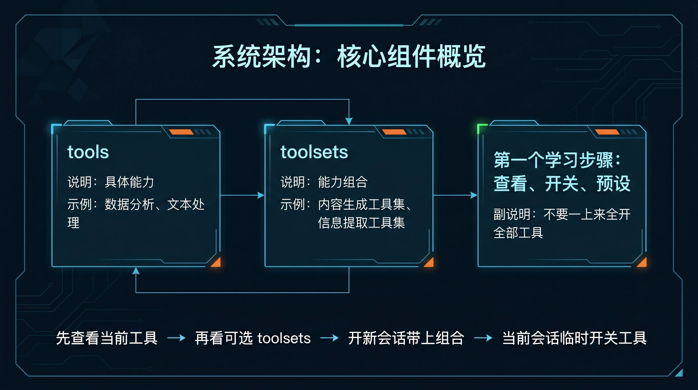
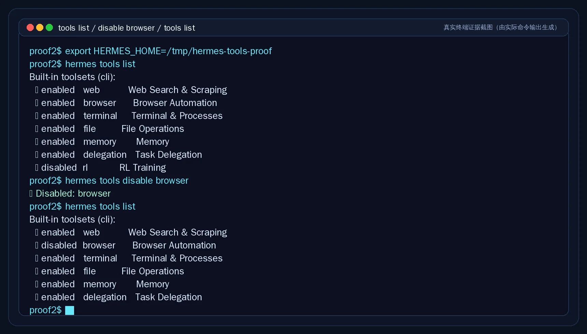
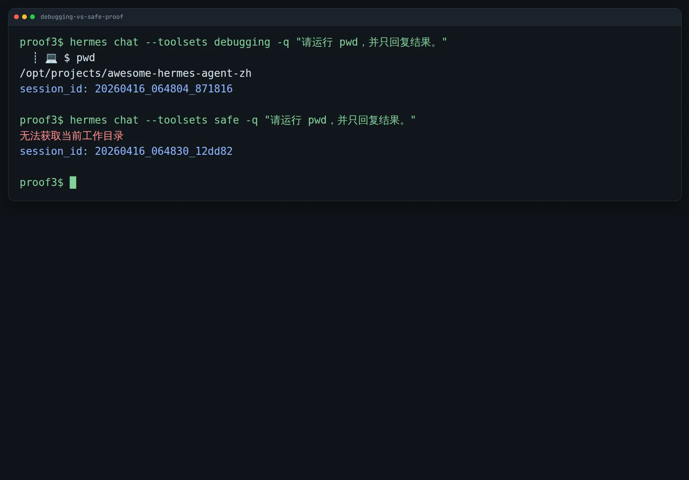

# 🧩 05-让工具更顺手

这一页只解决一件事：
把 Hermes 调到适合当前任务的工具档位，让它既能做事，又不会一上来就开太重、开太乱。



---

## 🎯 先说结论：先学会选档位，不要先背工具目录

这一页真正要解决的，不是让你把 Hermes 全部工具背下来。
而是让你先学会两件事：
- 现在这次任务，到底需要哪些能力
- 当前会话，到底已经开了哪些能力

一句话记住：
工具层最重要的不是“越多越好”，而是“这次刚好够用”。

---

## 🧰 Tools 和 Toolsets 到底是什么

官方定义很直白：
- `tool` 是一个具体能力
- `toolset` 是一组打包好的能力组合

你可以先这样理解：

<table>
  <colgroup>
    <col style="width: 18%;" />
    <col style="width: 30%;" />
    <col style="width: 28%;" />
    <col style="width: 24%;" />
  </colgroup>
  <thead>
    <tr>
      <th>东西</th>
      <th>它是什么</th>
      <th>典型例子</th>
      <th>你该怎么理解</th>
    </tr>
  </thead>
  <tbody>
    <tr>
      <td><code>tool</code></td>
      <td>一个能直接调用的具体能力</td>
      <td><code>web_search</code>、<code>read_file</code>、<code>terminal</code>、<code>vision_analyze</code></td>
      <td>“Hermes 具体能伸哪只手”</td>
    </tr>
    <tr>
      <td><code>toolset</code></td>
      <td>按场景打包好的一组能力</td>
      <td><code>web</code>、<code>file</code>、<code>terminal</code>、<code>debugging</code>、<code>safe</code>、<code>hermes-cli</code></td>
      <td>“这次任务要放出哪一组手”</td>
    </tr>
  </tbody>
</table>

再记一个关键点：
每个 tool 都属于某个 toolset；启用一个 toolset，对应那组 tools 才会一起可用。

---

## 🚫 为什么不建议一开始全开

“既然都能开，那我全部打开不就完了？”
这是最常见的误区。

第一次不建议全开，主要因为 4 件事：

1. 任务边界会变糊
2. Hermes 更容易显得“手很多、容易乱伸”
3. 风险面会变大
4. 出问题时更难判断到底是哪一层的问题

所以 toolsets 的价值，不是把全部能力堆上去。
而是让你按任务把 Hermes 调到合适档位。

---

## 🎁 你调顺这层，真正能得到什么

工具层调顺以后，你拿到的是这些实际收益：
- 查资料时，Hermes 不会显得太重
- 排障时，Hermes 该动手时就能动手
- 你更容易预判“它这次能做什么、不能做什么”
- 同样的任务，你会越来越知道该开什么档，而不是每次靠运气

一句话收口：
工具层调顺以后，Hermes 更像一个会配合场景的助手，而不是一个功能很多但不一定顺手的助手。

---

## 👀 现在先学会看：当前到底有哪些工具

第一次先别急着背全部 built-in tools。
先学会看“我这次实际能用什么”。

最常用入口有这几个：

### 在 CLI 会话里看当前工具

```text
/tools
```

### 在 CLI 会话里看有哪些 toolsets

```text
/toolsets
```

### 在终端里列出工具状态

```bash
hermes tools list
```

你现在要建立的习惯是：
每次怀疑 Hermes 为什么能做或不能做某件事，先看当前工具状态，不要先猜。



---

## 🛠️ 现在最该先会的 4 个动作

如果你现在只想学最常用、最不容易走偏的动作，就先记这 4 个。

### 1）看当前会话里有哪些工具

```text
/tools
```

### 2）看有哪些 toolsets 可以选

```text
/toolsets
```

### 3）开新会话时直接指定工具组合

```bash
hermes chat --toolsets debugging
hermes chat --toolsets safe
hermes chat --toolsets web,terminal
```

### 4）在当前会话里临时开关工具

```text
/tools disable browser
/tools enable rl
```

如果你想动的是平台层的长期默认配置，再看：

```bash
hermes tools
```

---

## ⭐ 第一次最值得先会用的 3 个官方预设

这一页不做完整 toolsets 手册。
你先把最常用的 3 个官方预设理解清楚，就够覆盖大多数日常场景。

<table>
  <colgroup>
    <col style="width: 18%;" />
    <col style="width: 27%;" />
    <col style="width: 27%;" />
    <col style="width: 28%;" />
  </colgroup>
  <thead>
    <tr>
      <th>预设</th>
      <th>适合什么时候</th>
      <th>你会得到什么</th>
      <th>第一次该怎么理解</th>
    </tr>
  </thead>
  <tbody>
    <tr>
      <td><code>hermes-cli</code></td>
      <td>你就在本机 CLI 正常使用 Hermes，想保留完整互动能力</td>
      <td>CLI 默认的整套平台能力</td>
      <td>“默认大档位，不是新手必须全背的目录”</td>
    </tr>
    <tr>
      <td><code>debugging</code></td>
      <td>你要排障、查日志、跑命令、读写文件、顺手查网页</td>
      <td>文件 + 终端 + Web 这组排障常用能力</td>
      <td>“能查、能跑、能改”</td>
    </tr>
    <tr>
      <td><code>safe</code></td>
      <td>你只想查资料、读网页、看图、做图，不想让 Hermes 动本机</td>
      <td>Web + 视觉/图像这组偏只读能力</td>
      <td>“能看、能搜，但别碰终端和文件写入”</td>
    </tr>
  </tbody>
</table>

第一次先这样记：
- `hermes-cli` = 默认 CLI 大档位
- `debugging` = 需要查、跑、改时用
- `safe` = 需要看、搜、分析但不想动本机时用

---

## ⚖️ debugging 和 safe，到底怎么选

这两个最容易混，但它们的差别不是抽象概念，而是执行边界不同。

真正的选择题是：
- 需要它“查、跑、改”，选 `debugging`
- 需要它“看、搜、分析”，选 `safe`

如果你暂时拿不准，默认先从更轻的 `safe` 开始；
确认任务确实需要执行命令或修改文件，再升到 `debugging`。

下面这张图就是实际行为差异：同一句“请运行 `pwd`”，`debugging` 真正跑出了目录，而 `safe` 不会去动本机。



---

## 🚀 现在具体怎么做

按这个顺序上手最稳：

### 第 1 步：先看当前会话工具状态
先跑：
- `/tools`
- `/toolsets`

或者在外部终端跑：
- `hermes tools list`

### 第 2 步：先按任务选轻重档位
大致这样判断：
- 只是查资料、看网页、整理分析 → `safe`
- 要排障、跑命令、读写文件 → `debugging`
- 日常完整 CLI 体验 → `hermes-cli`

### 第 3 步：开新会话时直接带上 toolsets
例如：

```bash
hermes chat --toolsets safe
hermes chat --toolsets debugging
```

### 第 4 步：会话里只做最小开关
当前任务临时需要变更时，再用：
- `/tools disable ...`
- `/tools enable ...`

不要一上来就大范围乱开乱关。

---

## 🩺 如果不顺手，先检查这 6 件事

1. 你是不是没先看当前工具状态
   - 先跑 `/tools` 或 `hermes tools list`

2. 你是不是把 tool 和 toolset 混了
   - 一个是具体能力，一个是能力组合

3. 你是不是默认全开了太多东西
   - 先收回到更轻的组合

4. 你是不是把 `safe` 当成了可执行环境
   - 它更偏只读和观察，不是拿来跑本机命令的

5. 你是不是明明需要排障，却还停在过轻的组合
   - 需要跑命令、改文件时切到 `debugging`

6. 你是不是碰到的其实是工具、技能、MCP 配置问题
   - 不是“工具理念没懂”，而是配置本身没开出来

如果你确认是工具可见性、toolsets、MCP 或技能本身的问题，直接看：
- [06-Tools Skills MCP 问题](../../05-遇到问题/06-Tools Skills MCP 问题.md)

---

## ✅ 这一页的过关标准

当下面这些状态已经成立，这一页就算通过：
- 你知道 `tool` 是具体能力，`toolset` 是能力组合
- 你知道为什么不建议一开始全开全部工具
- 你知道怎么查看当前有哪些工具和 toolsets
- 你知道怎么在开局用 `--toolsets` 选组合
- 你知道怎么在会话里临时开关工具
- 你能分清 `hermes-cli`、`debugging`、`safe` 这 3 个最值得先会用的官方预设
- 你已经能把 `debugging` 和 `safe` 当成真正的选择题，而不是两个名词

---

## ➡️ 下一步
完成后进入：
- [06-让终端更顺眼](06-让终端更顺眼.md)

如果你想先回到上一阶段入口重新确认位置：
- [03-玩出花样](01-总览.md)
