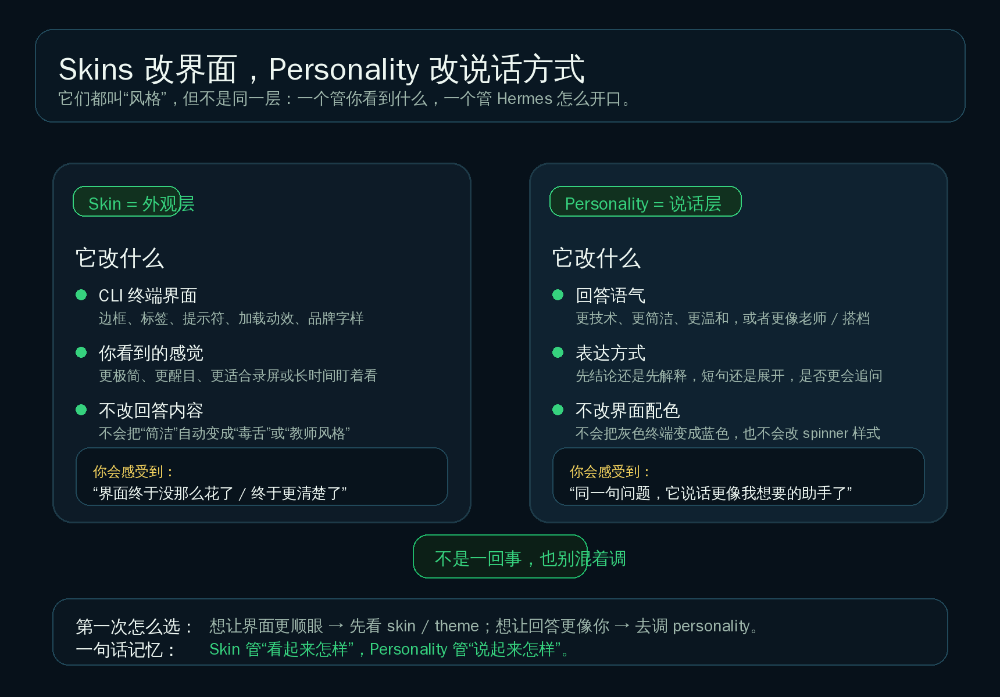
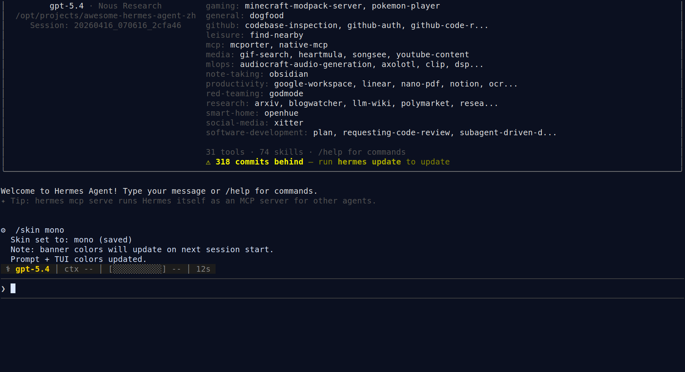

# 🎭 05-让终端更顺眼

这一页只解决一件事：
把一个已经会用的 Hermes，调成更适合你长时间使用的终端外观。但先分清：`skin` 改的是 CLI 外观，`personality` 改的是说话风格。



---

## ❓ Skin 改什么

官方把这件事说得很明确：
`skin` 控制的是 Hermes CLI 的视觉呈现。

第一次先这样理解就够了：

- 它改的是终端里“看起来怎样”
- 典型变化包括：边框、标签、提示符、品牌字样、spinner 风格这类 UI 表现
- 它不会让 Hermes 自动变得更毒舌、更温柔、更像老师

所以，如果你在意的是这些问题：

- 终端看久了有点花
- 录屏时不够克制
- 你想要更简洁、更统一、或者更容易一眼看清重点的界面

那你该看的就是 skins / themes 这一层。

这里顺手补一句“theme”怎么理解：
对普通用户来说，可以先把它理解成一套现成的外观主题。
也就是：官方已经打包好的 skin 风格，拿来切换就能用；这一页不进入 skin YAML 手册。

---

## ❓ Personality 改什么

`personality` 解决的是另一件事：
Hermes 怎么说、用什么语气说、默认更像什么样的助手。

它更接近这些变化：

- 更简洁还是更展开
- 更技术向还是更通俗
- 更像老师、搭档，还是更偏创意型
- 先给结论，还是先铺背景

所以如果你真正不满意的是：

- 它说话太绕
- 它不够直接
- 它不像你想长期合作的那个助手

那你应该去调的是 `/personality` 或长期人格层，不是 skin。

---

## 🔹 Skin vs Personality

<table>
  <colgroup>
    <col style="width: 18%;" />
    <col style="width: 26%;" />
    <col style="width: 28%;" />
    <col style="width: 28%;" />
  </colgroup>
  <thead>
    <tr>
      <th>东西</th>
      <th>它改什么</th>
      <th>你会直接感受到什么</th>
      <th>第一次该怎么记</th>
    </tr>
  </thead>
  <tbody>
    <tr>
      <td><code>skin</code></td>
      <td>CLI 外观、颜色、提示符、标签、spinner、品牌展示</td>
      <td>界面更清楚、更克制、更适合长时间盯着看</td>
      <td>“看起来怎样”</td>
    </tr>
    <tr>
      <td><code>personality</code></td>
      <td>回答语气、表达方式、默认会话风格</td>
      <td>同一句问题，Hermes 说话更像你要的助手</td>
      <td>“说起来怎样”</td>
    </tr>
  </tbody>
</table>

只记一句也够：
Skin 管界面，Personality 管说话方式；两者不是一回事。

---

## ❓ 为什么把外观放在这一层，而不是“自己造东西”

因为 skin 对大多数用户来说，还是“拿现成主题切一下”的事情，不是“自己造一套系统”。

它虽然已经进入自定义，但仍然属于比较轻的那层：

- 你是在调 Hermes 现成 CLI 的展示方式
- 你通常是在内建 skins 里切换，或把默认 skin 设成自己更喜欢的一种
- 你不需要先理解多助手、插件系统、MCP、模型路由，才能把外观调舒服

所以它适合放在“玩出花样”的收尾，而不是放进“自己造东西”。

更直白地说：
改 skin 更像是把一台已经会工作的 Hermes，调成“更顺眼、更耐看”；
不是在重新设计 Hermes 的能力结构。

---

## ❓ 为什么终端外观也值得调

很多人一开始会觉得：
“能用就行，外观有什么好折腾的？”

但当你开始把 Hermes 当长期工具用，外观其实会影响三件事：

1. 读起来累不累  
   长时间排障、读输出、盯工具调用时，太花或对比不舒服的界面，会很快让人疲劳。

2. 重点好不好抓  
   颜色、边框、标签是不是清楚，会影响你能不能一眼分清：现在是欢迎区、回复区、工具区，还是提示区。

3. 录屏、分享、演示稳不稳  
   有些 skin 更适合你自己看，有些更适合投屏、截图、做教程。

所以 skin 不是“没事找事”。
它解决的是长期使用体验，不是功能能力本身。

---

## ❓ 什么时候值得折腾 skins

不是一装好 Hermes 就要立刻改。
通常到了下面这些情况，才值得动：

- 你已经会正常使用 Hermes，只是想让日常界面更舒服
- 你经常录屏、截图、给别人演示，想要更稳定的视觉风格
- 你现在的界面让你觉得太花、太亮、或者重点不够清楚
- 你已经把人格、记忆、模型、工具这些更关键的层先理顺了

反过来，如果你现在的问题是：

- 模型还没配好
- 工具边界还没理顺
- 人格和项目规则还混着

那就先别把时间花在皮肤上。
这也是它被放在这一阶段最后一页的原因：
先把助手“能不能好好做事”调顺，再把“看起来舒不舒服”收尾。

---

## 🔹 真实切换主题怎么做

官方给了两条常用路：

### 🔹 1）当前会话里，立刻切换

CLI 里：

```text
/skin
/skin mono
/skin ares
```

你可以把它理解成：
先看当前可用 skin，再切到一个内建主题。

要记住一个关键边界：
官方文档把 `/skin` 作为“当前会话里立刻切换”的入口。
如果你想让默认主题长期固定，最稳的做法仍然是把 `display.skin` 明确写进配置。

### 🔹 2）把默认主题写进配置

`~/.hermes/config.yaml` 里：

```yaml
display:
  skin: mono
```

这条路适合“我以后默认就想这样开”。

下面这张图就是一张真实终端证据图：
在 Hermes CLI 里执行 `/skin mono` 后，界面直接返回 `Skin set to: mono (saved)`，并提示 `Prompt + TUI colors updated.`；同时也说明 banner 颜色会在下次会话启动时更新。



这张证据图也顺手告诉你一个实际细节：
有些外观变化会立刻更新，有些像 banner 颜色这种，会等下一次启动时完整刷新。

---

## ✅ 什么时候算通过

当下面这些状态已经成立，这一页就通过：

- 你知道 `skin` 改的是 Hermes CLI 外观，不是回答人格  
- 你知道 `personality` 改的是说话风格，不是终端主题  
- 你知道为什么 skins 还属于“玩出花样”，而不是“自己造东西”  
- 你知道不是一上来就要折腾 skins，而是在长期使用体验开始重要时再动  
- 你能用一次 `/skin` 或配置修改，完成真实主题切换  
- 你已经能按自己的使用场景，判断该选更简洁、还是更醒目的终端外观  

---

## ➡️ 下一步

完成后进入：
- [04-自己造东西](../04-自己造东西/01-总览.md)

如果你想先回到上一阶段入口重新确认位置：
- [03-玩出花样](01-总览.md)
