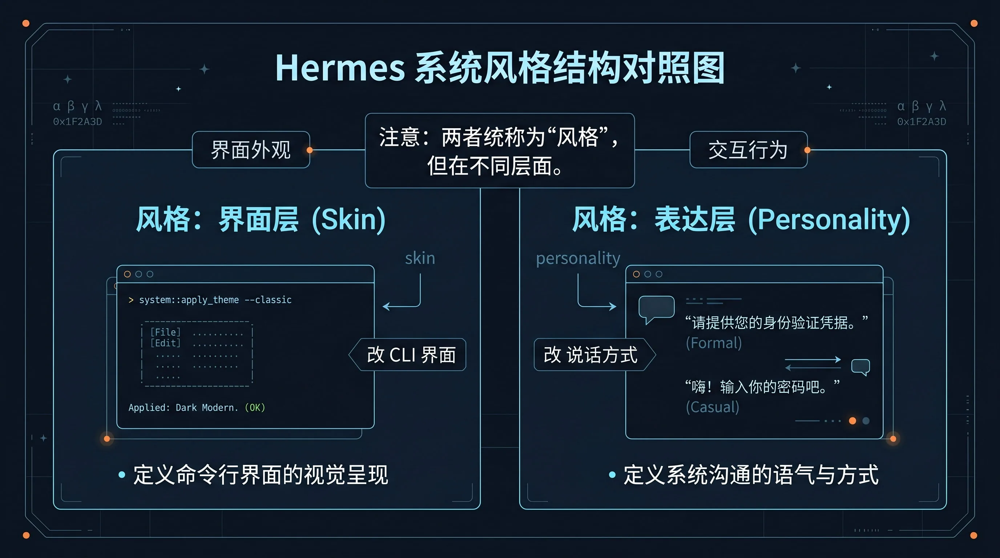
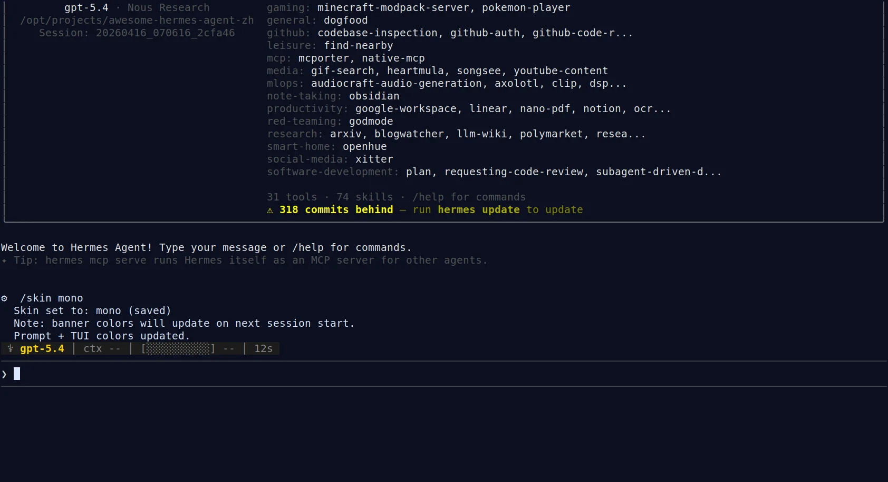

# 🎭 06-让终端更顺眼

这一页只解决一件事：
把 Hermes 的终端外观调到更适合你长期使用的状态，同时分清：`skin` 改的是界面，`personality` 改的是说话方式。



---

## 🎯 先说结论：这一页是在收尾体验，不是在改底层能力

很多人会觉得外观是小事，所以随时折腾都行。
但更准确的顺序是：
- 人格、记忆、模型、工具先理顺
- 终端外观最后收尾

因为这页解决的不是“Hermes 会不会做事”，而是：
- 你看久了累不累
- 重点好不好抓
- 录屏、截图、分享稳不稳

一句话记住：
这页改的是长期使用体验，不是能力底层。

---

## 🧭 skin 和 personality 到底分别改什么

这是这一页最重要的边界。

### skin
改的是 Hermes CLI 的视觉呈现。

你会直接感受到这些变化：
- 颜色
- 边框
- 标签
- 提示符
- spinner 风格
- 品牌字样和界面整体观感

它解决的是：
“终端看起来怎样。”

### personality
改的是 Hermes 的回答方式。

你会直接感受到这些变化：
- 更简洁还是更展开
- 更技术向还是更通俗
- 更像老师、搭档还是创意助手
- 先结论还是先铺背景

它解决的是：
“Hermes 说起来怎样。”

如果你真正不满意的是：
- 它说话太绕
- 它不够直接
- 它不像你想长期合作的那个助手

那你该回去调的是：
- [02-让 Hermes 更像你](<./02-%E8%AE%A9%20Hermes%20%E6%9B%B4%E5%83%8F%E4%BD%A0.md>)
- [/personality 所在说明](../02-开始上手/03-常用斜杠命令与会话管理.md)

---

## 📊 一张表记住：Skin vs Personality

<table>
  <colgroup>
    <col style="width: 18%;" />
    <col style="width: 26%;" />
    <col style="width: 28%;" />
    <col style="width: 28%;" />
  </colgroup>
  <thead>
    <tr>
      <th>东西</th>
      <th>它改什么</th>
      <th>你会直接感受到什么</th>
      <th>第一次该怎么记</th>
    </tr>
  </thead>
  <tbody>
    <tr>
      <td><code>skin</code></td>
      <td>CLI 外观、颜色、提示符、标签、spinner、品牌展示</td>
      <td>界面更清楚、更克制、更适合长时间盯着看</td>
      <td>“看起来怎样”</td>
    </tr>
    <tr>
      <td><code>personality</code></td>
      <td>回答语气、表达方式、默认会话风格</td>
      <td>同一句问题，Hermes 说话更像你想要的助手</td>
      <td>“说起来怎样”</td>
    </tr>
  </tbody>
</table>

只记一句也够：
Skin 管界面，Personality 管说话方式；两者不是一回事。

---

## ✨ 为什么终端外观也值得你现在调

如果你已经开始把 Hermes 当长期工具，外观真的会影响体验。
主要就是 3 件事：

1. 读起来累不累
2. 重点好不好抓
3. 录屏、截图、演示稳不稳

所以 skin 不是“没事找事”。
它是在你已经把能力层调顺之后，继续把长期使用成本降下来。

---

## 🎨 什么时候值得动 skins

通常到了下面这些情况，就值得动：
- 你已经会正常使用 Hermes，只想让界面更舒服
- 你经常录屏、截图、给别人演示
- 你现在的界面太花、太亮，或者重点不够清楚
- 你已经把人格、记忆、模型、工具这些更关键的层先理顺了

反过来，如果你现在的问题是：
- 模型还没配好
- 工具边界还没理顺
- 人格和项目规则还混着

那就先别把时间花在皮肤上。

---

## 🛠️ 现在具体怎么做

官方最常用的路有两条。

### 路线 1：当前会话里立刻切换
在 Hermes CLI 里：

```text
/skin
/skin mono
/skin ares
```

你可以这样理解：
- `/skin`：先看或进入可切换状态
- `/skin mono`：切到更简洁的外观
- `/skin ares`：切到另一套内建主题

### 路线 2：把默认主题写进配置
在：

```text
~/.hermes/config.yaml
```

写入：

```yaml
display:
  skin: mono
```

这条路适合“以后默认就想这样开”。

---

## 🔍 怎么判断自己切换成功了

最直接的成功信号有两个：

1. 当前会话里立刻看见外观变化
   - 颜色、提示符、局部 TUI 风格改变

2. Hermes 明确返回切换成功提示
   - 例如 `/skin mono` 后出现 `Skin set to: mono (saved)`

下面这张图就是一份真实证据：
在 Hermes CLI 中执行 `/skin mono` 后，终端直接返回保存成功，并提示 `Prompt + TUI colors updated.`；同时也说明 banner 颜色会在下次 session 启动时更新。



你顺手也要记住一个实际细节：
有些外观变化会立刻更新，有些像 banner 颜色这类，会在下一次启动时完整刷新。

---

## 💡 第一次怎么选更省心

如果你第一次只是想把界面调舒服，不想研究细节，直接按这个思路选：
- 想更克制、更干净、适合长时间盯着看 → 先试更简洁的 skin
- 想录屏、截图时层次更明显 → 先试更醒目的 skin
- 不确定自己喜欢哪种 → 先在当前会话临时切，满意了再写入配置

也就是说：
先试，再定默认。
不要一开始就把主题当成一场大工程。

---

## 🩺 如果效果不对，先检查这 5 件事

1. 你是不是把 skin 和 personality 混了
   - 终端外观不会改变说话风格

2. 你是不是还在试图解决能力问题
   - skin 不能修模型、工具或记忆问题

3. 你是不是只看当前会话，没有重开验证
   - 有些视觉项要下次启动才完整更新

4. 你是不是改错了配置位置
   - 默认配置通常在 `~/.hermes/config.yaml`

5. 你是不是其实遇到的是 CLI / TUI 显示问题
   - 那不是主题选择问题，而是终端或会话层问题

如果你确认不是主题审美问题，而是 CLI / TUI 行为本身异常，先看：
- [04-CLI TUI 与会话问题](../../05-遇到问题/04-CLI TUI 与会话问题.md)

---

## ✅ 这一页的过关标准

当下面这些状态已经成立，这一页就算通过：
- 你知道 `skin` 改的是 Hermes CLI 外观，不是回答人格
- 你知道 `personality` 改的是说话风格，不是终端主题
- 你知道为什么这件事属于“玩出花样”的收尾层，而不是“自己造东西”
- 你知道终端外观这一层解决的是长期使用体验，不是能力问题
- 你已经完成一次真实主题切换
- 你能按自己的使用场景判断该选更简洁还是更醒目的外观

---

---

## ➡️ 下一步
- 上一步：[05-让工具更顺手](./05-让工具更顺手.md)
- 下一步：[07-用桌面端操作 Hermes](./07-用桌面端操作 Hermes.md)
- 回到目录：[03-玩出花样](./01-总览.md)
