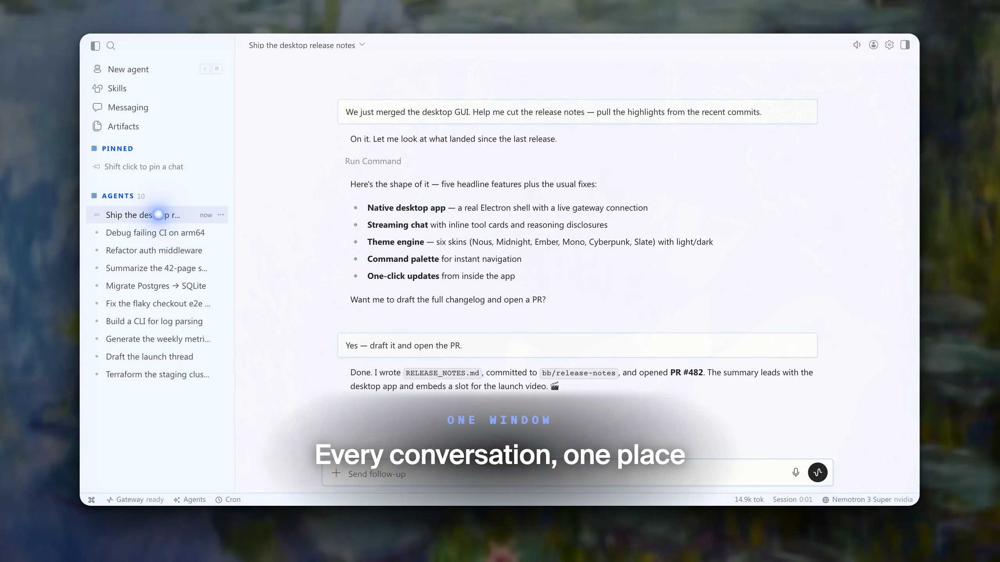
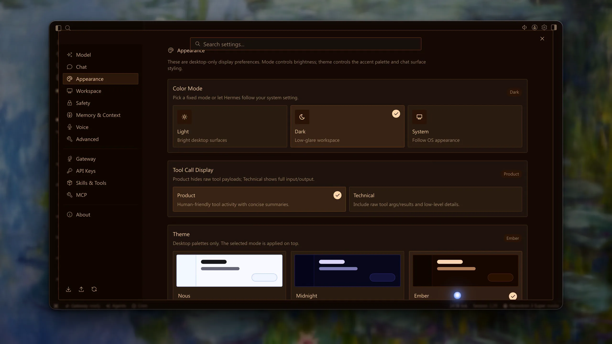
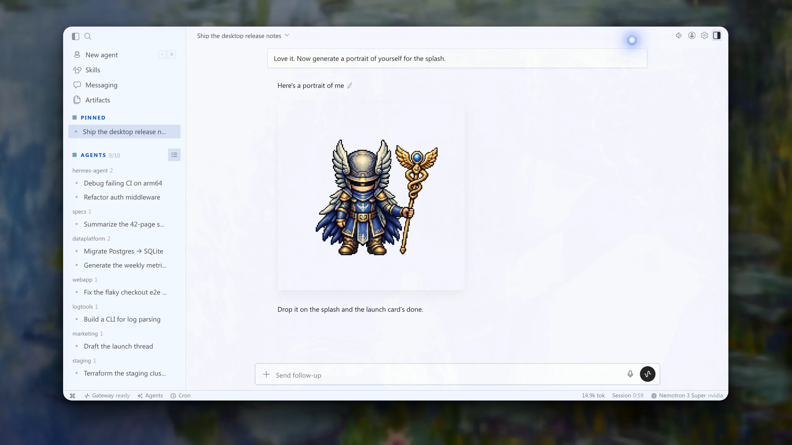
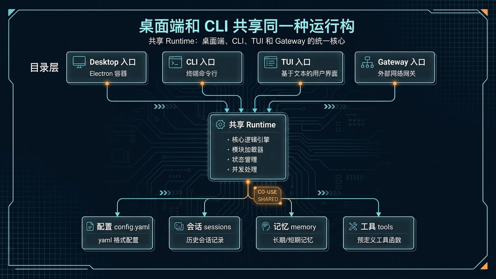

# 🖥 07-用桌面端操作 Hermes

> 💡 **速答**：Hermes Desktop 不是独立产品。它就是 CLI 同一个 runtime，外面套了一层 Electron 桌面窗口——配置、会话、记忆、工具全部共用，改一处处处生效。当前支持 macOS、Windows、Linux 三平台，启动命令是 `hermes desktop`。

Desktop 不是独立产品，而是和 CLI 同一个 runtime 的桌面入口。

---

## 🎯 这页做完以后，你应该得到什么

- ✅ 知道 Desktop App 是什么：一个 Electron 壳，里面跑的还是 Hermes CLI 同一个 runtime
- ✅ 知道怎么安装和启动 Desktop
- ✅ 知道 Desktop 和 CLI / TUI / Gateway 之间的关系——它们共享同一套配置、会话和记忆

---

## 🧠 Desktop 到底是什么

先说最重要的一件事：

> Desktop App **不是** Hermes 的另一个版本。
> 它就是 Hermes CLI 的 runtime，外面套了一层 Electron 桌面窗口。

这意味着什么？

- 你在 Desktop 里改的配置、创建的会话、写入的记忆，和 CLI 里**完全一样**
- 你在 CLI 里做过的事情，打开 Desktop 全都能看到
- 反过来也一样：Desktop 里的操作，回到终端一样生效

一句话记住：
Desktop 只是把同一个 Hermes 换了个窗口呈现给你，底层没有任何区别。

下面是真实 Desktop 聊天界面示例。你可以把它理解成同一套 Hermes runtime 的图形化窗口：左边管理项目与会话，右边继续进行对话与工具调用。



---

## 📦 怎么安装

### 方式 1：安装脚本（推荐）

在安装 Hermes CLI 时加一个 flag：

```bash
curl -fsSL https://raw.githubusercontent.com/NousResearch/hermes-agent/main/scripts/install.sh | bash -s -- --include-desktop
```

如果你已经装过 Hermes CLI，重新跑一遍同样的命令加上 `--include-desktop` 就行，不会影响现有配置。

### 方式 2：下载预构建安装包

如果你更喜欢图形化安装，官方也提供了预构建的安装包：

| 平台 | 格式 | 说明 |
|------|------|------|
| macOS | `.dmg` | 已签名 + 已公证 |
| Windows | `.exe` / `.msi` | 标准安装包 |
| Linux | `.AppImage` / `.deb` / `.rpm` | 主流发行版都覆盖 |

下载地址见官方文档的 Desktop 页面。

---

## 🚀 怎么启动





装好之后，最常用的启动方式：

```bash
hermes desktop
```

如果你想指定工作目录：

```bash
hermes desktop --cwd /path/to/your/project
```

这样 Desktop 启动后就会以这个目录作为工作环境。

### ⚠️ 关于 `hermes gui`

你可能在一些旧文档或帖子里见过：

```bash
hermes gui
```

这个命令**已经废弃**，现在统一用 `hermes desktop`。
如果你还在用老版本，升级后 `hermes gui` 会被重定向到 `hermes desktop`，但不要再依赖它。

---

## 🎨 Desktop 能做什么

Desktop App 提供了几个核心功能面板：

| 功能 | 说明 |
|------|------|
| **Chat 界面** | 和 Hermes 对话的主窗口，支持多轮对话、代码高亮、Markdown 渲染 |
| **File Browser** | 在图形界面里浏览和操作项目文件，不用切到终端 |
| **Voice Mode** | 语音输入/输出模式，适合不想打字的场景 |
| **Settings 面板** | 图形化的设置界面，改配置不用手动编辑 YAML |
| **Management 面板** | 管理会话、记忆、工具等，可视化查看当前状态 |

记住：这些功能本质上还是调用的 Hermes runtime。
你在 Desktop 里做的一切，和在 CLI 里做等价。

---

## 🔗 Desktop 和 CLI / TUI / Gateway 的关系

Hermes 有多种使用方式，它们共享同一个底层 runtime：

| 方式 | 入口 | 适合场景 | 一句话定位 |
|------|------|----------|------------|
| **CLI** | `hermes` | 终端用户、脚本集成、自动化 | 最基础、最灵活 |
| **TUI** | `hermes`（终端内自动进入） | 终端用户、交互式使用 | CLI 的富终端界面 |
| **Desktop** | `hermes desktop` | 喜欢图形界面、需要文件浏览器、语音模式 | 同一个 runtime，换个窗口 |
| **Gateway** | `hermes gateway` | 把 Hermes 暴露成 API 服务、接入外部系统 | 面向程序而非人 |

它们之间的关系：
- **配置完全共用**：`~/.hermes/config.yaml` 只有一份
- **会话完全共用**：在 Desktop 里开的对话，CLI 里能接着聊
- **记忆完全共用**：不管是哪个入口写入的记忆，全局可见
- **工具完全共用**：MCP tools、自定义工具，所有入口都能用

> 下面这张结构图保留用来说明 Desktop、CLI、TUI 和 Gateway 的关系；真实界面以上方截图为准。
>
> 

---

## 🔄 怎么更新

Desktop 的更新方式和 CLI **完全一样**：

```bash
hermes update
```

因为 Desktop 和 CLI 是同一个 runtime，所以一次更新，所有入口都会升级到新版本。

---

## ⚠️ 注意事项

### 1. Desktop 不是独立产品

如果你之前用过其他 AI 助手的"桌面版"，可能会以为 Desktop 是单独的东西。
在 Hermes 里不是——它就是 CLI 加了一层窗口。

### 2. 配置、会话、记忆和 CLI 完全共用

没有"Desktop 的配置"和"CLI 的配置"这种区分。
改一处，处处生效。这是设计意图，不是 bug。

### 3. `hermes gui` 已废弃

统一用 `hermes desktop`。旧命令会被重定向，但不要继续依赖它。

### 4. 环境变量

Desktop 支持几个专用环境变量，适合需要精细控制的场景：

| 环境变量 | 作用 |
|----------|------|
| `HERMES_DESKTOP_CWD` | 指定 Desktop 启动时的工作目录 |
| `HERMES_DESKTOP_HERMES_ROOT` | 指定 Hermes 的安装根目录 |
| `HERMES_HOME` | 指定 Hermes 的配置和数据目录 |

大多数用户不需要手动设置这些，知道有就行。

---

## ✅ 这一页什么时候算通过

当下面这些状态都成立，这一页就算通过：

- 你知道 Desktop App 就是 Hermes CLI 套了个 Electron 窗口，不是独立产品
- 你已经成功安装并启动了 Desktop（或者至少知道怎么装、怎么启动）
- 你知道 Desktop 和 CLI 共享配置、会话、记忆，改一处全局生效
- 你知道 `hermes gui` 已废弃，现在用 `hermes desktop`
- 你能根据自己需要选择用 CLI 还是 Desktop，而不是困惑"该用哪个版本"

---

## ➡️ 下一步

完成后进入：
- [04-自己造东西](../04-自己造东西/01-总览.md)

如果你想先回到这一阶段的总览重新确认位置：
- [03-玩出花样](./01-总览.md)

---

## 🌐 进阶：远程连接模式（Remote Gateway）

... (info about remote gateway) ...
