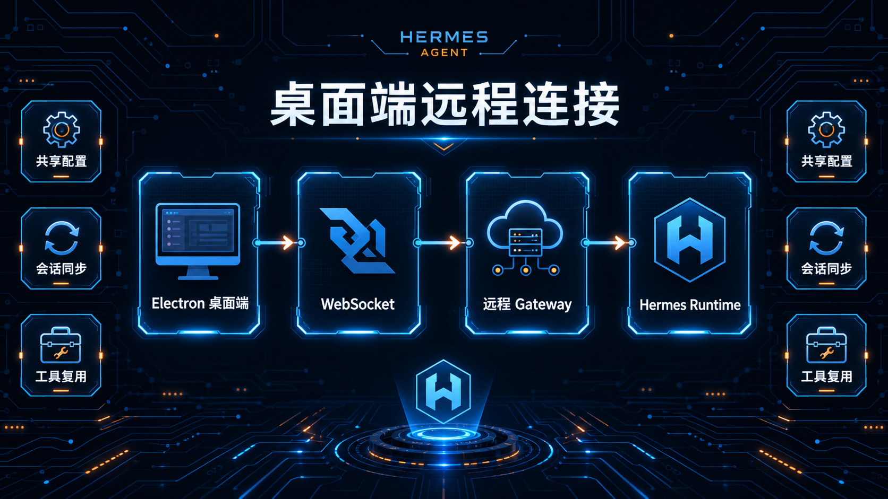

# 07-用桌面端操作 Hermes

> 💡 **速答**：Hermes Desktop 不是独立产品。它就是 CLI 同一个 runtime，外面套了一层 Electron 桌面窗口——配置、会话、记忆、工具全部共用，改一处处处生效。当前支持 macOS、Windows、Linux 三平台。

---

## 🧠 Desktop 到底是什么
Desktop App **不是** Hermes 的另一个版本，而是一个 Electron 壳，里面跑的还是 Hermes CLI 同一个 runtime。

## 🌐 进阶：远程连接模式（Remote Gateway）
你可以让本地的桌面端仅仅作为一个“遥控器”，去连接运行在远程服务器（如腾讯云）上的 Hermes Gateway。

### 1. 为什么要远程连接？
- **本地零开销**：模型计算和工具执行都在服务器完成。
- **环境一致性**：无论你在哪里打开桌面版，面对的都是同一份进度。

### 2. 如何配置
1. **服务器端准备**：运行 `hermes gateway` 并配置鉴权。
2. **桌面端连接**：点击 **"Add Remote Host"**，输入服务器地址并完成验证。

---

## ➡️ 下一步
- 上一步：[06-让终端更顺眼](./06-让终端更顺眼.md)
- 下一步：[08-教-Hermes-学习新技能-learn](./08-教-Hermes-学习新技能-learn.md)
- 回到目录：[03-玩出花样](./01-总览.md)
