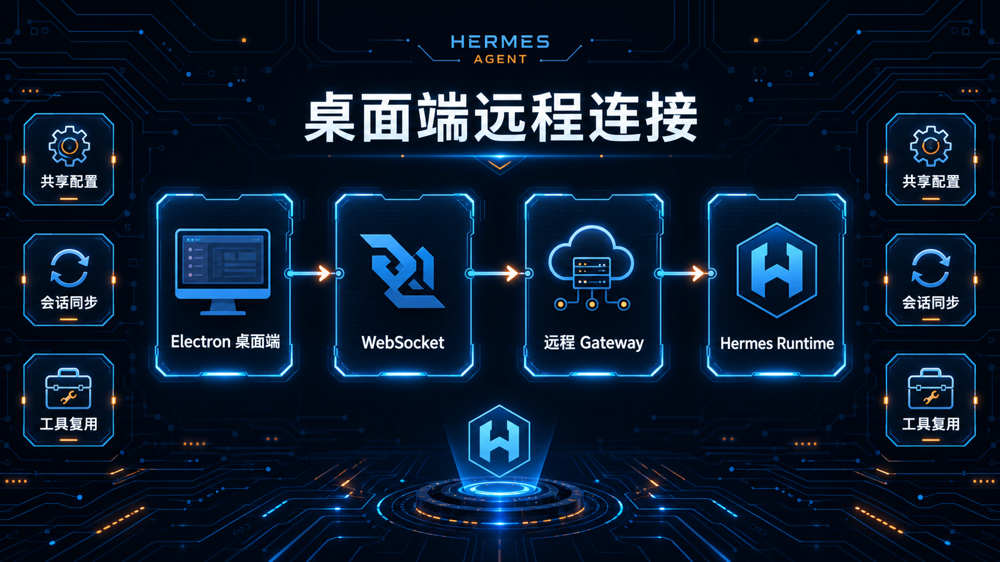

# 🖥️ 07-用桌面端操作 Hermes

本页是 Hermes 桌面 App 的安装、模型配置和连接排障教程。先按下表选择操作系统与发行渠道；浏览器中的 [Dashboard 网页控制台](/docs/china/entry/dashboard)使用另一条入口。已有终端安装可从桌面启动步骤继续；模型产品与 Key 先看[国内模型路线](/docs/china/models)，401、403、404 转到[Provider 排障](/docs/issues/provider-endpoint)。

> 从桌面安装、配模型、完成第一个文件任务开始，再做会议纪要、表格核对和资料整理。需要服务器长期运行时，最后再接远程后端。

复核日期：**2026-09-30**。本文对照官方稳定标签 **v2026.9.24（Agent v0.21.5）** 的安装说明、桌面文档与源码；该标签的 `apps/desktop/package.json` 版本为 **0.17.6**。Agent 版本和桌面包版本各自独立，下载包及远程后端要分别记录版本，不能把 Agent 0.21.5 当成桌面安装包版本。

本文提供操作与验收步骤，未实际安装桌面版、测试国内网络或调用付费 API。官网安装器和下载渠道可能比固定标签更新，遇到界面差异先核对版本。最近功能归属见[最新功能与版本边界](/docs/reference/latest-features)。

## 👀 你会得到什么

- 安装后能选择正确的模型账户，完成一次真实回复。
- 能在指定工作目录中生成文件，找到并核验结果。
- 能区分聊天当前模型、profile 默认模型和远程运行环境。
- 能按症状判断安装、模型、文件或远程连接问题。

Desktop 使用与 CLI/Gateway 相同的 Agent 核心。同一后端、同一 profile 的配置、凭据、会话、记忆与技能可以复用；连接到不同机器或切换 profile 后，应重新确认对应环境。本地显示偏好与某些模型选择会保存在当前桌面设备，不是所有状态都跨机器同步。

## 📦 1. 选对安装路线

| 系统 | 官方路线与边界 | 首次验收 |
|---|---|---|
| macOS Apple Silicon | 从[官方桌面入口](https://hermes-agent.nousresearch.com/desktop)取得对应安装包 | 能启动窗口，并完成模型配置 |
| macOS Intel | 固定标签的安装说明明确不支持 Intel Mac | 不把 Apple Silicon 安装包当作兼容方案 |
| Windows 10 / 11 | 官方桌面安装包；核对架构与下载项。终端安装也有原生 PowerShell 路线 | 窗口启动与首次回复分别验证；部分功能有平台限制 |
| Linux | 先用官方 shell 安装器，再执行 `hermes desktop`；Debian/Ubuntu 桌面构建需要 `build-essential`，其他发行版准备 `g++` 等等效工具链 | 有可用图形会话，原生模块安装完成，窗口能打开 |
| WSL2 | CLI 是支持路线；桌面运行涉及 WSLg，不能把普通 SSH shell 当图形桌面 | 核对图形环境及工具实际访问的 Windows/WSL 文件位置 |

已有 CLI 安装时，可在对应环境启动：

```bash
hermes desktop
```

Linux 未安装时，Debian/Ubuntu 示例：

```bash
sudo apt update
sudo apt install -y git curl xz-utils build-essential
curl -fsSL https://hermes-agent.nousresearch.com/install.sh | bash
# 重新打开终端，使 PATH 生效后：
hermes desktop
```

安装器管理依赖，不需要另走 `pip install hermes-agent`。安装过程中出现下载或构建错误时，保存第一条明确错误；不要把窗口暂时出现当成后台和模型都已就绪。没有图形会话的 VPS 更适合运行远程后端，让自己的电脑打开桌面窗口。

## 🤖 2. 配模型：先账户，再精确模型 ID

第一次启动按 onboarding 选择 provider 并输入 API Key 或完成对应登录。已经进入窗口时，用 **Settings → Providers** 管理账户/Key，再用 **Settings → Model** 设置默认模型。多个 profile 时检查 **Applies to**，保证修改落在预期 profile。

### 国内模型与兼容接口

MiMo 用户先读[MiMo V2.6 接入](/docs/china/models/mimo-v26)，其他厂商见[国内模型总览](/docs/china/models)；厂商页均提供桌面配置卡。

以下是 Hermes 的接入入口，不能替代厂商账户、余额和地区权限检查：

| 你准备使用什么 | 接入方法 | 继续阅读 |
|---|---|---|
| DeepSeek API | 内置 `deepseek`，对应 `DEEPSEEK_API_KEY` | [DeepSeek 按量接口](/docs/china/models/deepseek-metered-api) |
| 智谱 GLM | 内置 `zai`；Key、Coding/通用 endpoint 和权益需要匹配 | [GLM Coding Plan](/docs/china/models/glm-coding-plan) |
| Kimi / Moonshot | `kimi-coding` / `kimi-coding-cn`，按 Key 类型确认实际 endpoint | [Kimi 接入与 Key 类型](/docs/china/models/kimi-plan) |
| MiniMax | `minimax` / `minimax-cn`，区分国际和国内账户 | [MiniMax](/docs/china/models/minimax-token-plan) |
| 百炼、腾讯或已有聚合服务 | 先核对账户产品和内置 provider；需要时配置兼容 endpoint | [国内模型总览](/docs/china/models)、[自定义兼容接口](/docs/china/models/openai-compatible-endpoint) |

用兼容服务时，在 **Settings → Providers → Custom Endpoints** 填入：服务地址、该服务的 Key、精确模型 ID，以及其真实支持的 **API Mode**。Chat Completions、Responses API 和 Anthropic Messages 不是同一协议；复制厂商或代理给出的完整 base URL，不要把浏览器网页地址当 API 地址。

**Test 会发送模型请求，可能计费**。稳定标签文档说明它验证实际推理协议，不只是 `/v1/models` 能否返回列表；测试成功后仍需要用目标任务验收工具调用和流式回复。远程模式下，可达性应从运行后端的机器判断；本机能访问服务，不代表服务器能访问。

### 目录没有模型，怎么办？

稳定版已有手动模型 ID：模型选择器里查找 **Add custom model…** 或 **Custom model…**，输入服务支持的完整 ID 并选择所属 provider。手动输入不自动验证模型权限。

“自定义 endpoint 的 `/v1/models` 返回空列表时显示手填入口”的专门修复是后续主干 [PR #122920](https://github.com/NousResearch/hermes-agent/pull/122920)，不属于 v2026.9.24。若旧界面没有入口，可用该安装版本的 `hermes model` 向导配置 endpoint 和模型，保存后重新加载桌面；不要把空目录直接判断为 Key 无效。

### 聊天模型与默认模型分开验收

| 入口 | 影响范围 | 容易误会的地方 |
|---|---|---|
| 输入框旁模型选择器 | 当前聊天；设备侧选择可延续到后续聊天 | 不能仅凭当前聊天成功，推断 Cron / 子 Agent 已换模型 |
| Settings → Model | 当前所选 profile 的默认主模型 | 后台任务通常以默认模型起步，但任务 pin、委派或 auxiliary 覆盖可以改变路线 |

有例外：全新 profile 尚无默认 provider/model 时，首次模型选择会保存默认；持久化行为还受 `model.persist_switch_by_default` 影响。桌面里为某模型选择的 effort/fast 偏好不等于已给 Cron 或子 Agent 设置相同选项。需要后台任务也换模型时，明确修改 profile 默认并检查任务自身设置。

先发送最小问题：“请只回复：连接正常。”收到模型回复后检查实际 provider/model 和账户用量。窗口启动、目录出现和 Test 成功分别只能证明各自那一层。

## 📁 3. 完成第一个文件任务

准备一个独立练习目录，里面放一份自己提供的 `meeting.txt`；内容可以是无敏感信息的真实会议记录。首次任务先使用 TXT、Markdown 或 CSV；PDF、DOCX、XLSX 是否能处理取决于对应工具和依赖，不能仅靠预览就认定内容全部读取成功。

已有 CLI 时，可以明确指定初始工作目录：

```bash
hermes desktop --cwd /path/to/office-practice
```

Windows 将路径换成自己的练习目录，并给含空格的路径加引号。启动后用文件浏览器核对工作目录和 `meeting.txt`，或者将输入文件拖入聊天。远程模式的文件路径属于远端；本机文件需要有明确上传或传输过程，不会因为路径同名就自动存在。

把下面的任务发给 Hermes：

```text
读取当前练习目录的 meeting.txt，先确认你读到的文件名和主要段落。
生成 output/meeting-summary.md，包含会议结论、行动项、待确认问题。
每条结论注明原记录的段落或可定位短引文；缺少负责人、日期时写“待确认”。
保留输入文件，只写 output/。结束时列出实际输出路径和未能核实的事项。
```

在工具活动中检查是否真的读取文件、写入成功；随后在文件树或预览中打开输出，核对三条关键事实。最后从系统文件夹确认文件存在。回复说“已完成”不能替代这些验收动作。

## 🧰 4. 三个真实办公流程

### 会议记录 → 可核对的行动清单

在第一任务基础上，让 Hermes 再生成 `output/actions.csv`：列为事项、负责人、截止日、原文依据、待确认项。日期和负责人缺失时留待确认，不补编。验收时逐行对照原记录，核对是否把讨论意见错写成最终决定；发送给同事前自己审阅。

### CSV → 周报与异常清单

从自己的报表导出 `sales.csv`，先核对日期、金额、地区等字段和编码，然后发送：

```text
先读取 sales.csv 的列名、总行数和日期范围，说明金额口径、空值和重复记录。
按我确认的统计口径汇总周报，输出 output/weekly-report.md 和 output/exceptions.csv。
所有汇总保留计算过程或可复算公式；缺列或币种不一致时先停在问题清单，不猜测。
不修改原 CSV。结束时报告处理行数、排除行数、总额和输出路径。
```

验收：处理行数与排除行数能对回总行数；抽查汇总组的金额；用表格软件独立复算总额。生成文字报告不会证明计算正确。

### 多份资料 → 有来源的知识摘要

把需要整理的 TXT/Markdown 资料放入 `input/`，让 Hermes 先列出可读取文件，再生成 `output/index.md` 和主题摘要。每条事实标明来源文件及段落；冲突观点并列，不用常识填平。验收时抽查至少三条引用，打开原文件确认；未读取的格式和文件单列。

常用办公流程可继续看[办公效率与知识整理](/docs/solutions/office)。这里的提示词是操作模板，结果和指标应来自你实际提供的文件，不是本页已经跑出的样例成绩。

## 🖱️ 5. 日常操作与复用

- 用不同会话处理不同目标，检查当前 profile 和工作目录；不要把多项无关办公任务长期塞进同一会话。
- 用文件树、预览与工具活动查看结果；简单模式可能隐藏面板，可在布局设置切换或显示所需面板。
- 长任务保留会话，转到下一阶段前整理摘要与输出路径。切换模型可能重置模型相关的提示缓存，应计入成本。
- 成功完成且人工验收后，再用 [`/learn`](/docs/start/personalize/learn)沉淀流程；技能仍需要所依赖的工具和模型权限。
- 配定时任务前检查 profile 默认模型、任务 pin 和投递目标；电脑睡眠或后端停止可能影响执行。长期运行参考 [VPS 自托管](/docs/start/practical/vps-self-hosting)。

## 🌐 6. 进阶：桌面连接远程后端



> 本机继续负责桌面显示与输入，工具和文件任务在所连后端执行；云端模型推理依然由模型 provider 执行。远程模式不会让本机零开销，也不自动复制本地文件。

### 服务器端：桌面服务与消息服务分别配置

官方桌面连接的是 **`hermes serve` HTTP/WebSocket 后端**，默认端口 **9119**。`hermes gateway run` 负责 Telegram/飞书等消息平台；只有消息 Gateway 就绪，不能证明桌面已可连接。

先在远端完成模型配置。以下路线使用已建立的 VPN / 可信私网，选择远端实际 VPN 地址，不将用户名密码后端直接暴露到公网。

在远端当前数据目录的 `.env` 中编辑以下变量；把占位值换成自己的凭据，已有配置不重复追加：

```dotenv
HERMES_DASHBOARD_BASIC_AUTH_USERNAME=替换为登录用户名
HERMES_DASHBOARD_BASIC_AUTH_PASSWORD=替换为独立强密码
HERMES_DASHBOARD_BASIC_AUTH_SECRET=替换为一次生成并长期保存的随机签名密钥
```

签名密钥可在远端使用 `openssl rand -base64 32` 生成，然后保存实际生成值；不要把命令文本当成密钥。稳定签名密钥可避免重启后会话全失效。限制 `.env` 读取权限（Linux 可用 `chmod 600 ~/.hermes/.env`），然后启动：

```bash
# 把占位地址替换成远端机器的实际 VPN / 可信私网地址
hermes serve --host <远端VPN地址> --port 9119
```

从已接入同一 VPN 的电脑检查 `http://<远端VPN地址>:9119/api/status`：非回环绑定下鉴权应启用，并列出 `basic` provider。服务需要持续运行，后续再按实际部署环境设置进程管理。消息平台另行运行 Gateway，避免重复进程使用同一 Bot Token。公网连接需采用官方 OAuth/网络保护方案，详见固定标签桌面文档。

### 桌面端：登录并确认执行位置

1. 打开 **Settings → Gateways → Connection mode → Remote gateway**，填写远端 URL；旧版设置页面名称可能不同。
2. **Sign in** 输入远端配置的用户名密码；OAuth 后端按其显示的登录入口完成认证。
3. **Save and reconnect**，再确认连接目标及远端 profile。不要把同名 profile 当成同一台机器。
4. 发一条只读任务，让 Hermes报告当前工作目录并列出一个已知远端文件，核对与服务器一致；再读写远端练习目录验证产物。

`HERMES_DESKTOP_REMOTE_URL` 可覆盖桌面里的 URL 配置；界面改了地址却还连旧机器时检查它。远端产物通过后端预览/下载，本机练习目录中的文件不会直接出现在远端。

## 🩺 7. 按症状排障

| 症状 | 先检查 | 验收动作 |
|---|---|---|
| 安装包打不开或架构不符 | 包渠道、OS/架构，macOS 是否 Apple Silicon | 正确渠道的窗口能启动 |
| Linux 原生模块构建失败 | `g++` / `build-essential`、第一条构建错误、网络 | 安装完成后 `hermes desktop` 能打开图形窗口 |
| 窗口打开但无法回复 | provider、精确模型、Key、余额、所选 profile | 最小问答与账户用量一致 |
| 模型列表为空 | 服务是否支持目录发现、手动 ID 入口、版本差异 | 用真实 ID 完成实际回复 |
| Test 通过但工具任务失败 | 模型工具能力、toolset、文件权限和格式依赖 | 固定小任务有可打开产物 |
| 文件找不到 | 本机/远端、工作目录、是否真正传输了附件 | 在执行机器上确认真实文件 |
| 远程拒绝连接或超时 | `serve` 是否运行、VPN、绑定地址、防火墙 | 本机能到达 `/api/status` |
| 401 或没有登录按钮 | 用户名密码、进程是否加载 `.env`、`auth_providers` | 完成登录后能读远端练习文件 |
| 每次后端重启都退出登录 | 签名密钥是否稳定、是否重复配置 | 重启后验证重新连接与会话状态 |
| 看不到 Local Models | 安装渠道与版本，稳定标签/main 文档是否混用 | 按对应渠道官方说明核验入口 |

### 本地模型的渠道边界

稳定标签文档已描述 **Settings → Providers → Local Models**，但这不证明每个下载包都开放该界面。2026-09-30 复核的主干文档另有明确限制：**canary 构建启用，其他桌面构建需要 `--local` 启动标志**。不要据此反推 v2026.9.24 的安装方式，也不要把下载大模型作为首次上手必需步骤；准备使用时核对自己渠道、硬件和官方对应版本说明。

## 🔌 8. Connectors 与插件：从安装到撤销的完整链

本节依据稳定 v2026.9.21 / v2026.9.24 的发布说明及插件文档。新界面的 **Connectors** 替代旧 MCP 标签；较旧安装包的标签名称可能不同。安装包、Agent 后端与远程 profile 分别核对，不因菜单出现就认为服务已连通。

### 先用局部文件夹完成只读 Connector 任务

准备一个单独测试文件夹，其中只放 `sample.txt`（写入两行自己已知的内容）。目录里不放密钥、工作资料或整个 Home。按[外部系统接入实战](/docs/start/build/mcp-and-plugins)配置 filesystem MCP，限制为这个文件夹；它提供的文件工具可能包含写入能力，目录限制不等于只读权限。

1. 在实际执行任务的 gateway/profile 中安装 server 依赖并保存 MCP 配置，再打开桌面的 Connectors 核对该 server。配置文件位于后端；远程连接不能把本机文件路径当成服务器路径。
2. 需要连接或授权的条目先执行界面提供的 **Connect / Connect now**。插件安装完成只是代码已安装；服务进程、网络连接或 OAuth 同意仍须分别完成。没有外部账号的本地 filesystem 不需要假造 OAuth 步骤。
3. 回到聊天，明确要求：“只读取测试目录中的 sample.txt，给出两行原文和一段摘要，不创建或修改文件。”核对实际调用的是目标 MCP 工具、读取路径和输出内容，不能只看自然语言说“已读取”。
4. 完成后检查文件内容/时间及外部状态，确认没有额外写操作。模型请求可能收费；MCP 命令会安装依赖并运行本地程序，执行前阅读来源和权限。

### 一个真实插件例子：Blender Lab（进阶，可选）

这是官方插件目录中的 **Blender**：固定条目要求 Blender 5.1+、独立 MCP add-on、Git 与 uv，首次启动还会下载 Python 依赖。它的工具可用用户权限执行 Blender Python，因此不适合作为首次模型连通测试。未具备这些依赖时停在准备阶段，不反复点击连接。

1. 先读目录条目的版本、来源与权限说明，备份自己的 Blender 文件；仅打开一个空测试场景。按插件 README 安装 add-on 和 server 依赖。
2. 在目录安装 Blender 插件。记录插件版本/固定提交，再在 Connectors 使用 **Connect now** 连接它提供的 MCP server；确认 Blender 与 add-on 实际在线，不能用工具发现成功代替场景就绪。
3. 回到当前聊天，检查插件工具和 skill 已生效。v0.21.5 支持安装后向已打开聊天提供工具/技能，但模型选择、权限、依赖失败仍可能阻止调用；必要时按错误检查而非不断重装。
4. 明确授权一个测试动作：“仅在当前空场景创建一个立方体，命名为 Hermes_Test，不删除现有对象，不保存到工作文件。”观察目标工具调用和 Blender 中的对象；不要扩展到下载资产、渲染收费服务或操作已有项目。
5. 验收后撤销测试对象或关闭不保存，断开 Connector。禁用/卸载插件、停止 server 与撤销外部凭据是三项不同操作；按插件及平台界面分别处理，再检查工具不再可用。

[稳定 Blender 条目与权限披露](https://github.com/NousResearch/hermes-agent/blob/v2026.9.24/plugin-catalog/blender.yaml)、[插件 README](https://github.com/NousResearch/hermes-plugin-blender)。本文未安装或执行这个例子，依赖和界面以实际版本为准。

### 授权、撤销与主机后端

对云 Connector，只给完成任务所需的账户/资源范围，先用无敏感内容的测试资源。Disconnect 仅表示当前连接断开，可能不撤销外部平台长期授权；完成后到外部平台撤销 token/OAuth，核对当前 profile 凭据和工具状态。插件执行权限与 MCP 工具过滤也要分别检查，见[安全加固](/docs/start/practical/security-hardening)。

桌面、host 多 profile 与 Gateway 有各自运行入口。先确认管理进程和当前后端，再按其 profile 的 Stop/Start/Restart 控制；不要为解决插件不出现重复启动另一个 backend。稳定发布的 host multiplexer 与 `gateway.standalone` 是运行配置选项，不是所有用户都应改成独立 Gateway。

| 状态/错误 | 先确认 | 成功证据 |
|---|---|---|
| Installed，但未连接 | 是否还需 Connect now、依赖、账号同意 | server 连接状态和实际工具调用 |
| Connected，但工具没有 | gateway/profile、权限、工具过滤与当前聊天 | 工具列表和指定测试任务 |
| 本机可用、远端失败 | 依赖/路径/Key 是否在远端后端 | 远端同一 profile 完成小任务 |
| 401 / 权限不足 | scope、资源范围、凭据有效期 | 对授权测试资源的读取 |
| 撤销后还可用 | 外部授权、后台 server、缓存会话 | 外部授权失效且工具不可再调用 |

本节验收分为依赖准备、安装、连接、当前会话调用、外部结果、撤销六步；没有完成的步骤如实记为未验证。

## ✅ 过关标准

- 已记录 OS/架构、桌面包版本、Agent 后端版本与渠道。
- 首次回复来自实际配置的模型，账户用量可核对。
- 至少完成一个办公文件任务，产物能打开，事实/数字/引用经过人工抽查。
- 能说清当前 profile、工作目录与模型影响范围；远程用户还验证了鉴权、执行机器和文件位置。

## 📖 官方依据

- [稳定发布 v0.21.5 / v2026.9.24](https://github.com/NousResearch/hermes-agent/releases/tag/v2026.9.24)、[桌面包版本 0.17.6](https://github.com/NousResearch/hermes-agent/blob/v2026.9.24/apps/desktop/package.json)。
- [固定标签安装说明](https://github.com/NousResearch/hermes-agent/blob/v2026.9.24/website/docs/getting-started/installation.md)、[平台支持](https://github.com/NousResearch/hermes-agent/blob/v2026.9.24/website/docs/getting-started/platform-support.md)。
- [固定标签桌面说明](https://github.com/NousResearch/hermes-agent/blob/v2026.9.24/website/docs/user-guide/desktop.md)：模型选择、文件、预览、远程连接与鉴权。
- [固定标签 Provider 配置](https://github.com/NousResearch/hermes-agent/blob/v2026.9.24/website/docs/integrations/providers.md)。
- [固定标签本地模型说明](https://github.com/NousResearch/hermes-agent/blob/v2026.9.24/website/docs/user-guide/local-models.md)、[主干本地模型渠道说明（复核快照）](https://github.com/NousResearch/hermes-agent/blob/9f2ba1b74de16a9f0aad12a688b33f2b74844608/website/docs/user-guide/local-models.md)。

## ➡️ 下一步

- 上一步：[06-让终端更顺眼](./06-让终端更顺眼.md)
- 下一步：[08-教 Hermes 学习新技能](./08-教-Hermes-学习新技能-learn.md)
- 回到：[03-玩出花样](./01-总览.md)
- 查近期变化：[最新功能与版本边界](/docs/reference/latest-features)
