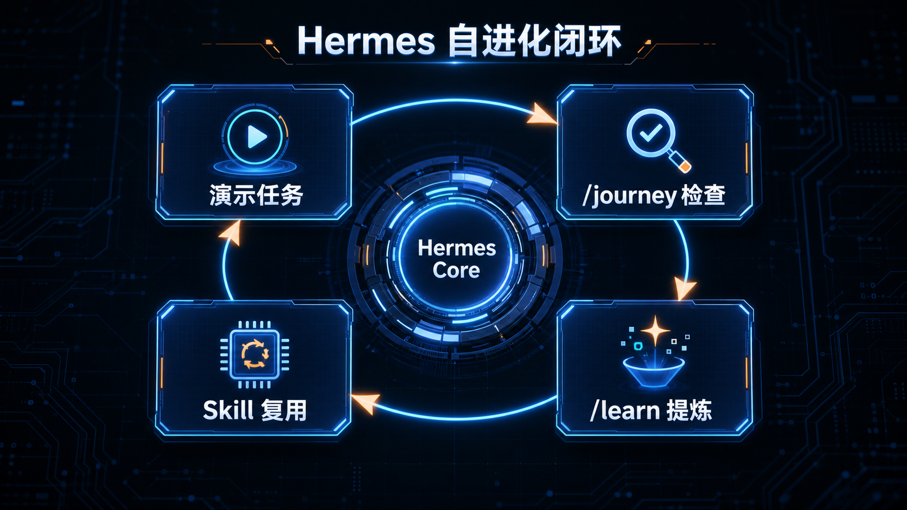

# 08-教 Hermes 学习新技能（/learn）

> 💡 **速答**：`/learn` 是 v0.18.0 引入的自进化能力。当你手把手带 Agent 完成一次复杂任务后，输入 `/learn`，它会自动总结成功的操作路径并保存为永久的 **Skill**。

---

## 🧠 核心原理：演示即编程
教 Agent 学习不再需要写代码：
1. **引导**：你带领 Agent 完成一次复杂的流程。
2. **提炼**：任务成功后输入 `/learn`。
3. **固化**：确认 Agent 生成的 Skill 描述。

---

## ➡️ 下一步
- 上一步：[07-用桌面端操作 Hermes](./07-用桌面端操作 Hermes.md)
- 下一步：[09-多模型合奏（Mixture-of-Agents）](./09-多模型合奏（Mixture-of-Agents）.md)
- 回到目录：[03-玩出花样](./01-总览.md)
