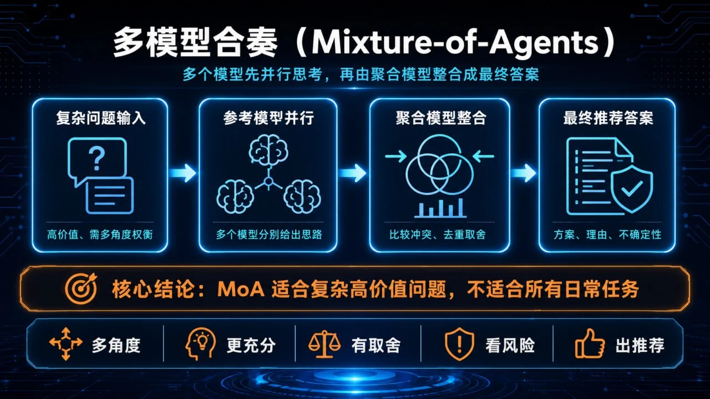

# 09-多模型合奏（Mixture-of-Agents）

> 💡 **速答**：Mixture-of-Agents，简称 MoA，是把多个模型的回答组合起来，再交给一个聚合模型做判断和整合。它适合高价值、复杂、需要多角度权衡的问题，不适合所有日常小任务。



---

## 适合谁

- 已经配置多个模型，想让它们协同工作的人。
- 经常处理复杂架构设计、疑难 Bug、长文分析或策略判断的人。
- 愿意用更高 Token 成本换更稳答案的人。
- 想理解 Hermes 多模型能力边界的人。

---

## 先说边界

MoA 不是“免费变聪明”。它的本质是用更多模型调用换更充分的思考。

如果你只是问：

```text
帮我把这句话翻译成英文。
```

不需要 MoA。

如果你问：

```text
这个系统该用单体、微服务还是事件驱动？请结合成本、团队能力、未来扩展和上线风险分析。
```

这类问题就适合 MoA。

---

## MoA 的工作方式

一个典型 MoA 流程分为三层：

1. **问题输入**：用户提出一个复杂问题。
2. **参考模型并行回答**：多个 reference models 分别给出思路。
3. **聚合模型整合**：aggregator 阅读所有参考答案，合并优点，指出冲突，给出最终答案。

你可以把它理解成一次专家会审：

- DeepSeek 负责推理和性价比。
- Claude 负责长上下文和结构化表达。
- GPT 负责通用知识和代码推断。
- Aggregator 负责取舍、去重和最终表述。

---

## 为什么 MoA 有时更好

单模型回答容易有三个问题：

- 只沿着一个思路走到底。
- 错误自信，不知道自己漏了什么。
- 对边界条件考虑不足。

MoA 的价值在于让多个模型先独立思考，再让聚合模型比较：

- 哪些结论一致。
- 哪些结论冲突。
- 哪些证据更可靠。
- 哪些方案更适合当前场景。

这不是保证永远正确，而是提升复杂问题的覆盖面。

---

## 推荐场景

### 场景 1：架构设计

例如：

```text
我们要做一个企业内部 Agent 平台，应该如何设计权限、审计、任务队列和插件体系？
```

MoA 可以让不同模型分别从安全、工程、产品和运维角度提出方案。

### 场景 2：复杂 Bug 诊断

例如：

```text
为什么 dispatch 任务显示 completed，但真实文件没有变化？请从数据库、worker、git 和验收流程分析。
```

多个模型可能分别发现不同层的问题。

### 场景 3：高价值文档或决策

例如：

```text
请帮我审查这份上线方案，指出商业风险、技术风险、用户体验风险和回滚策略。
```

这种任务值得多花 Token。

---

## 不推荐场景

- 简单翻译。
- 简短总结。
- 明确的单步命令。
- 低价值闲聊。
- 已经有标准答案的问题。

这些任务用普通模型更快、更便宜。

---

## 配置思路

不同 Hermes 版本和网关配置方式可能不同，但 MoA 的核心概念通常包含两类角色：

```yaml
models:
  super-thinker:
    provider: moa
    aggregator: anthropic/claude-sonnet-4
    references:
      - deepseek/deepseek-chat
      - openai/gpt-4o
      - google/gemini-pro
```

含义是：

- `super-thinker` 是你给这套组合起的名字。
- `references` 是先独立回答的模型。
- `aggregator` 是最后整合答案的模型。

如果你的实际配置语法不同，以当前 Hermes 版本文档和 `config.yaml` 示例为准。这里重点是理解角色关系。

---

## 使用方式

配置好后，可以在需要时切换到组合模型：

```text
/model super-thinker
```

然后提问：

```text
请比较三种技术路线，并给出最终推荐：
1. 直接扩展现有系统
2. 新建独立服务
3. 引入工作流引擎

请从交付周期、长期维护、团队能力、失败回滚四个角度分析。
```

一个好的 MoA 输出通常会包含：

- 多个候选方案。
- 每个方案的优缺点。
- 冲突点和取舍依据。
- 最终推荐。
- 不确定性和需要补充的信息。

---

## 成本提醒

MoA 会同时消耗多个模型的 Token。

如果你配置了：

```text
3 个参考模型 + 1 个聚合模型
```

一次提问就可能接近 4 次模型调用，甚至更多。复杂长上下文任务会更贵。

建议策略：

1. 默认不用 MoA。
2. 只有复杂问题才打开。
3. 先用普通模型整理问题，再用 MoA 做最终判断。
4. 对成本敏感时减少 reference models 数量。

---

## 如何验证 MoA 是否值得

你可以用同一个问题做 A/B 测试：

1. 普通模型回答一次。
2. MoA 回答一次。
3. 对比是否多出了真实有价值的信息。

重点看：

- 有没有发现普通模型没提到的风险。
- 有没有更清楚的取舍理由。
- 有没有指出前提条件。
- 有没有减少明显幻觉。

如果没有明显提升，就不值得用 MoA。

---

## 常见坑

### 坑 1：参考模型太多

模型越多不一定越好。太多参考答案会让聚合模型处理噪声，成本也会变高。

### 坑 2：所有模型能力太相似

如果 reference models 都是同一类模型，观点差异可能不大。更好的组合是让它们能力互补。

### 坑 3：聚合模型太弱

Aggregator 要读懂并整合多个答案。它通常应该比参考模型更稳定，至少要有强结构化能力。

### 坑 4：问题本身太模糊

MoA 不能替你定义目标。问题越模糊，多个模型越可能发散。

---

## 一个好的 MoA 提问模板

```text
请用多模型合奏方式分析这个问题：

背景：
- 我们当前的系统是……
- 团队规模是……
- 约束是……

候选方案：
1. ……
2. ……
3. ……

请分别从以下角度评估：
- 用户价值
- 交付周期
- 技术风险
- 运维成本
- 回滚难度

最后给出推荐方案，并说明不推荐其他方案的原因。
```

---

## 验收清单

- [ ] 我知道 MoA 适合复杂高价值问题。
- [ ] 我知道 reference models 和 aggregator 的区别。
- [ ] 我知道 MoA 会增加 Token 成本。
- [ ] 我会先用普通模型判断是否需要 MoA。
- [ ] 我会用 A/B 对比确认 MoA 是否真的提升答案质量。

---

## ➡️ 下一步

- 上一步：[08-教 Hermes 学习新技能（/learn）](./08-教-Hermes-学习新技能-learn.md)
- 下一阶段：[04-自己造东西](../04-自己造东西/01-总览.md)
- 回到目录：[03-玩出花样](./01-总览.md)
