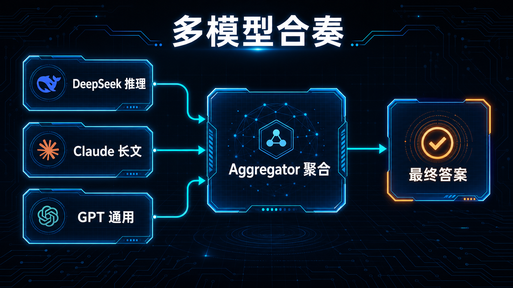

# 09-多模型合奏（Mixture-of-Agents）

> 💡 **速答**：Mixture-of-Agents (MoA) 让一组“参考模型”先生成答案，再由“聚合模型”提炼最终方案。这种“专家组”模式能显著提升复杂逻辑的准确度。



---

## 🛠️ 配置实战
在 `config.yaml` 中定义一个 `super-thinker` 模型：
```yaml
models:
  super-thinker:
    provider: moa
    aggregator: anthropic/claude-3-5-sonnet
    references:
      - deepseek/deepseek-chat
      - openai/gpt-4o
```

---

## ➡️ 下一步
- 上一步：[08-教-Hermes-学习新技能-learn](./08-教-Hermes-学习新技能-learn.md)
- 下一阶段：[04-自己造东西](../04-自己造东西/01-总览.md)
- 回到目录：[03-玩出花样](./01-总览.md)
