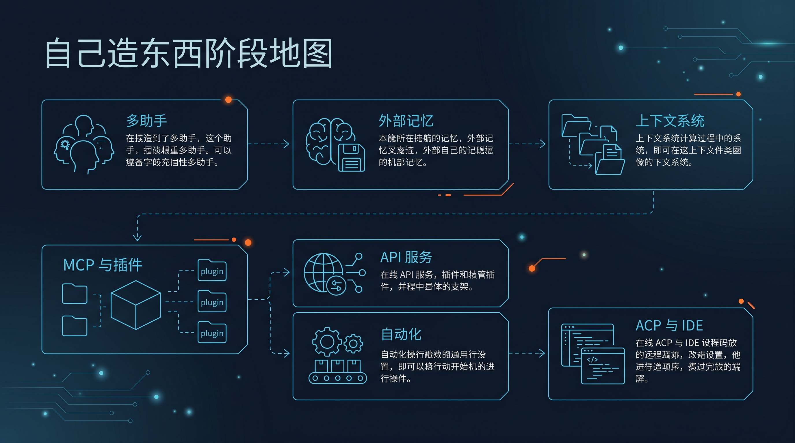

# 🛠️ 04-自己造东西

如果你已经不满足于“把一个助手用顺”，这一阶段只做一件事：
把你的 Hermes 使用方式，从“一个助手”推进到“开始搭一套系统”。

从这里开始，你会第一次碰到02-多个助手一起工作、03-接入外部记忆系统、04-上下文系统、05-把 Hermes 接进外部系统、06-把 Hermes 暴露成后端服务、07-让 Hermes 自己自动跑、08-放进编辑器里用。
但这一页只讲阶段路径、边界、进入条件和顺序，不抢写后面子页细节。

---

## ✅ 你现在适不适合进入这一阶段

符合下面 4 条，就可以继续：

- 你已经完成过 [03-玩出花样](../03-玩出花样/01-总览.md)
- 你已经知道怎么稳定使用一个 Hermes 助手
- 你已经能分清人格、记忆、工具、模型这些基础层次
- 你现在想解决的是“怎么搭能力系统”，不是“怎么把单助手再细调一点”

如果你还没到这个状态，先回到：
- [03-玩出花样](../03-玩出花样/01-总览.md)

---

## 🎯 这一阶段会帮你拿到什么

走完这一阶段，你会完成一个关键切换：
从“我在用一个助手”，变成“我在搭一套能长期工作的 Hermes 系统”。

你会逐步开始拿到这些能力：

1. 不同助手分不同职责，而不是所有事都塞给同一个助手  
2. 记忆开始从本地偏好，进入外部记忆系统  
3. 上下文开始有固定结构，不再每次临时拼材料  
4. Hermes 可以接进外部工具、服务和工作流  
5. Hermes 可以被当成接口、自动任务或 IDE 内能力来用  

一句话说完：
这一阶段不是“再学几个功能”，而是开始理解 Hermes 的系统化用法。

---

## 🧭 这 7 个方向排成一条线

<table>
  <thead>
    <tr>
      <th>顺序</th>
      <th>方向</th>
      <th>这一页先帮你看懂什么</th>
    </tr>
  </thead>
  <tbody>
    <tr>
      <td>1</td>
      <td><a href="./02-多个助手一起工作.md">02-多个助手一起工作</a></td>
      <td>先把“多个助手怎么分工”立起来，完成从单助手到多助手的切换。</td>
    </tr>
    <tr>
      <td>2</td>
      <td><a href="./03-接入外部记忆系统/01-总览.md">03-接入外部记忆系统</a></td>
      <td>弄清楚长期记忆放在哪里，以及怎么接入更正式的记忆系统。</td>
    </tr>
    <tr>
      <td>3</td>
      <td><a href="./04-上下文系统/01-总览.md">04-上下文系统</a></td>
      <td>把长期规则、上下文文件和临时引用分层，减少反复解释背景的成本。</td>
    </tr>
    <tr>
      <td>4</td>
      <td><a href="./05-把 Hermes 接进外部系统.md">05-把 Hermes 接进外部系统</a></td>
      <td>让 Hermes 接入外部工具和系统，不只停留在聊天窗口里。</td>
    </tr>
    <tr>
      <td>5</td>
      <td><a href="./06-把 Hermes 暴露成后端服务.md">06-把 Hermes 暴露成后端服务</a></td>
      <td>把 Hermes 暴露成服务接口，方便其它应用调用。</td>
    </tr>
    <tr>
      <td>6</td>
      <td><a href="./07-让 Hermes 自己自动跑.md">07-让 Hermes 自己自动跑</a></td>
      <td>让 Hermes 按时间和规则自动跑起来，进入持续执行。</td>
    </tr>
    <tr>
      <td>7</td>
      <td><a href="./08-放进编辑器里用.md">08-放进编辑器里用</a></td>
      <td>把这套能力带进编辑器和开发环境，让 Hermes 成为工作台的一部分。</td>
    </tr>
  </tbody>
</table>

说明：下面这些下一页都已经落仓，所以这里直接给真实跳转，不再保留路径占位。

---

## 🚦 默认顺序怎么走

<table>
  <thead>
    <tr>
      <th>顺序</th>
      <th>默认推进方式</th>
      <th>为什么这样排</th>
    </tr>
  </thead>
  <tbody>
    <tr>
      <td>1</td>
      <td>先看多助手，把“一个助手”拆成“多个职责”</td>
      <td>先立分工，后谈扩展。</td>
    </tr>
    <tr>
      <td>2</td>
      <td>再看外部记忆，决定系统级记忆放在哪里</td>
      <td>先确认记忆落点，再考虑长期协作。</td>
    </tr>
    <tr>
      <td>3</td>
      <td>再看上下文系统，整理规则、材料和引用入口</td>
      <td>先把上下文结构化，减少反复解释背景。</td>
    </tr>
    <tr>
      <td>4</td>
      <td>再进入 MCP / 插件，把 Hermes 接到外部工具</td>
      <td>先打通外部能力，再扩展工作流。</td>
    </tr>
    <tr>
      <td>5</td>
      <td>再考虑 API 服务，让能力对外可调用</td>
      <td>需要被别的应用用到时再服务化。</td>
    </tr>
    <tr>
      <td>6</td>
      <td>再做自动化，让系统自己跑起来</td>
      <td>先能稳定接入，再进入持续执行。</td>
    </tr>
    <tr>
      <td>7</td>
      <td>最后再把能力带进 ACP / IDE</td>
      <td>最后把能力嵌入到日常工作台。</td>
    </tr>
  </tbody>
</table>

这个顺序的重点不是绝对技术依赖。
而是先把系统边界立住，再做接入、服务化和自动化。

---

## 🧩 这一阶段先不解决什么

这一阶段入口页先不展开这些深坑：

- 每一种外部记忆提供方的安装细节
- 上下文文件和上下文引用的完整语法
- 每个 MCP 服务器或插件的接法差异
- API 服务的部署架构、鉴权和生产运维
- 自动化任务的复杂编排
- IDE 集成里的编辑器细节差异

这些都放到后续子页分别讲。
这一页先只帮你把系统阶段的边界看清楚，不把路走散。

---

## 🌱 什么时候算这一阶段真的开始了

不是你看完这页就算开始。
真正开始，至少要出现下面这个变化：

- 你已经明确不再只依赖一个助手处理所有事情
- 你已经准备接受“助手分工、记忆外接、上下文分层、系统接入”这套思路
- 你已经愿意按阶段顺序搭，而不是看到哪个新功能就先跳哪个

更直白一点：
当你开始把 Hermes 当成“系统能力底座”，而不只是“一个聊天助手”，这一阶段才算真正开始。

---

## ➡️ 下一步

完成后进入：
- [02-多个助手一起工作](02-多个助手一起工作.md)

如果你想先回到上一阶段入口重新确认位置：
- [03-玩出花样](../03-玩出花样/01-总览.md)
