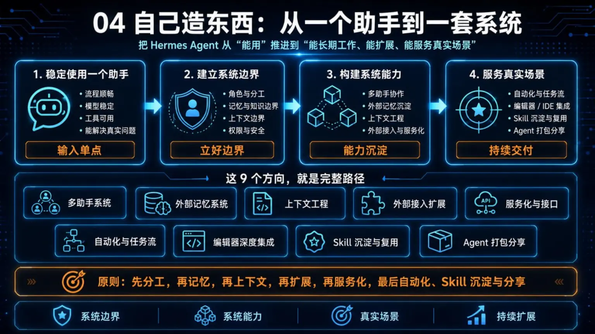

# 🛠️ 04-自己造东西

> **一句话结论**：这一阶段不是"再学几个功能"，而是把你的 Hermes 使用方式，从"一个助手"推进到"开始搭一套系统"。

**适合谁**：已经稳定使用一个 Hermes 助手、清楚人格/记忆/工具/模型的区别，想进入多助手和系统能力的用户。
**不适合谁**：还在基础使用阶段、还没有形成稳定使用习惯的用户——先回 [03-玩出花样](../03-玩出花样/01-总览.md)。
**最短路径**：先看 [02-多个助手一起工作](./02-多个助手一起工作.md)，再按需选 → [外部记忆](./03-接入外部记忆系统/01-总览.md) → [上下文系统](./04-上下文系统/01-总览.md) → [外部系统接入](./05-%E6%8A%8A%20Hermes%20%E6%8E%A5%E8%BF%9B%E5%A4%96%E9%83%A8%E7%B3%BB%E7%BB%9F.md) → [服务化](./06-%E6%8A%8A%20Hermes%20%E6%9A%B4%E9%9C%B2%E6%88%90%E5%90%8E%E7%AB%AF%E6%9C%8D%E5%8A%A1.md) → [自动化](./07-%E8%AE%A9%20Hermes%20%E8%87%AA%E5%B7%B1%E8%87%AA%E5%8A%A8%E8%B7%91.md) → [编辑器集成](./08-放进编辑器里用.md) → [Skill 沉淀](./09-将重复工作流沉淀为-Skill.md) → [Agent 打包分享](./10-把一整套%20Agent%20打包分享.md)。
**关键限制**：必须先完成 [03-玩出花样](../03-玩出花样/01-总览.md)，否则多助手、外部记忆、上下文这些系统层概念会接不住。
**下一步**：[多个助手一起工作](./02-多个助手一起工作.md)；已经想直接落一个真实场景 → [05-实战应用](../05-实战应用/01-总览.md)

从这里开始，你会第一次碰到[多个助手](./02-多个助手一起工作.md)、[外部记忆](./03-接入外部记忆系统/01-总览.md)、[上下文系统](./04-上下文系统/01-总览.md)、[外部接入](<./05-%E6%8A%8A%20Hermes%20%E6%8E%A5%E8%BF%9B%E5%A4%96%E9%83%A8%E7%B3%BB%E7%BB%9F.md>)、[服务化](<./06-%E6%8A%8A%20Hermes%20%E6%9A%B4%E9%9C%B2%E6%88%90%E5%90%8E%E7%AB%AF%E6%9C%8D%E5%8A%A1.md>)、[自动化](<./07-%E8%AE%A9%20Hermes%20%E8%87%AA%E5%B7%B1%E8%87%AA%E5%8A%A8%E8%B7%91.md>)、[编辑器集成](./08-放进编辑器里用.md)、[Skill 沉淀](./09-将重复工作流沉淀为-Skill.md)和[Agent 打包分享](./10-把一整套%20Agent%20打包分享.md)。
但这一页只讲阶段路径、边界、进入条件和顺序，不抢写后面子页细节。

---

## ✅ 你现在适不适合进入这一阶段

符合下面 4 条，就可以继续：
- 你已经完成过 [03-玩出花样](../03-玩出花样/01-总览.md)
- 你已经知道怎么稳定使用一个 Hermes 助手
- 你已经能分清[人格](<../03-%E7%8E%A9%E5%87%BA%E8%8A%B1%E6%A0%B7/02-%E8%AE%A9%20Hermes%20%E6%9B%B4%E5%83%8F%E4%BD%A0.md>)、[记忆](<../03-%E7%8E%A9%E5%87%BA%E8%8A%B1%E6%A0%B7/03-%E8%AE%A9%20Hermes%20%E8%AE%B0%E4%BD%8F%E4%BD%A0.md>)、[工具](../03-玩出花样/05-让工具更顺手.md)、[模型](<../03-%E7%8E%A9%E5%87%BA%E8%8A%B1%E6%A0%B7/04-%E8%87%AA%E5%AE%9A%E4%B9%89%20AI%20%E5%A4%A7%E6%A8%A1%E5%9E%8B.md>)这些基础层次
- 你现在想解决的是“怎么搭能力系统”，不是“怎么把单助手再细调一点”

如果你还没到这个状态，先回到：
- [03-玩出花样](../03-玩出花样/01-总览.md)

---

## 🎯 这一阶段会帮你拿到什么

走完这一阶段，你会完成一个关键切换：
- 从“我在用一个助手”，变成“我在搭一套能长期工作的 Hermes 系统”

你会逐步开始拿到这些能力：
1. [不同助手](./02-多个助手一起工作.md)分不同职责，而不是所有事都塞给同一个助手
2. [记忆](./03-接入外部记忆系统/01-总览.md)开始从本地偏好，进入外部记忆系统
3. [上下文](./04-上下文系统/01-总览.md)开始有固定结构，不再每次临时拼材料
4. Hermes 可以接进[外部工具与工作流](<./05-%E6%8A%8A%20Hermes%20%E6%8E%A5%E8%BF%9B%E5%A4%96%E9%83%A8%E7%B3%BB%E7%BB%9F.md>)
5. Hermes 可以被当成[接口](<./06-%E6%8A%8A%20Hermes%20%E6%9A%B4%E9%9C%B2%E6%88%90%E5%90%8E%E7%AB%AF%E6%9C%8D%E5%8A%A1.md>)、[自动任务](<./07-%E8%AE%A9%20Hermes%20%E8%87%AA%E5%B7%B1%E8%87%AA%E5%8A%A8%E8%B7%91.md>)或 [IDE 内能力](./08-放进编辑器里用.md)来用
6. 重复工作流可以沉淀成 [Skill](./09-将重复工作流沉淀为-Skill.md)，以后不用每次重新教一遍
7. 一整套 Agent 可以被[打包分享](./10-把一整套%20Agent%20打包分享.md)，让团队或社区复用同一套能力

---

## 🧭 这 9 个方向就是完整路径

| 顺序 | 方向 | 这一页先帮你看懂什么 | 你什么时候先看它 |
|---|---|---|---|
| 1 | [02-多个助手一起工作](./02-多个助手一起工作.md) | 先把“多个助手怎么分工”立起来 | 当你发现一个助手开始扛太多事 |
| 2 | [03-接入外部记忆系统](./03-接入外部记忆系统/01-总览.md) | 弄清楚长期记忆放在哪里，以及怎么接入更正式的记忆系统 | 当你已经意识到本地记忆不够用 |
| 3 | [04-上下文系统](./04-上下文系统/01-总览.md) | 把长期规则、上下文文件和临时引用分层 | 当你发现背景材料总在重复解释 |
| 4 | [05-把 Hermes 接进外部系统](<./05-%E6%8A%8A%20Hermes%20%E6%8E%A5%E8%BF%9B%E5%A4%96%E9%83%A8%E7%B3%BB%E7%BB%9F.md>) | 让 Hermes 接入外部工具和系统 | 当你开始想调浏览器、数据库、内部 API |
| 5 | [06-把 Hermes 暴露成后端服务](<./06-%E6%8A%8A%20Hermes%20%E6%9A%B4%E9%9C%B2%E6%88%90%E5%90%8E%E7%AB%AF%E6%9C%8D%E5%8A%A1.md>) | 把 Hermes 暴露成服务接口 | 当你想让前端、客户端或应用直接来调用 Hermes |
| 6 | [07-让 Hermes 自己自动跑](<./07-%E8%AE%A9%20Hermes%20%E8%87%AA%E5%B7%B1%E8%87%AA%E5%8A%A8%E8%B7%91.md>) | 让 Hermes 按时间和规则自动跑起来 | 当你已经有重复任务，不想再手动触发 |
| 7 | [08-放进编辑器里用](./08-放进编辑器里用.md) | 把这套能力带进编辑器和开发环境 | 当你主要在开发环境里工作 |
| 8 | [09-将重复工作流沉淀为 Skill](./09-将重复工作流沉淀为-Skill.md) | 把稳定工作流沉淀成可复用 Skill | 当你已经反复执行同一类任务 |
| 9 | [10-把一整套 Agent 打包分享](./10-把一整套%20Agent%20打包分享.md) | 把 Profile、Skills、规则和说明打包给团队复用 | 当你想把整套 Agent 交给别人使用 |

---

## 🚦 如果你现在只想快速选一条系统路线

直接按当前目标走：
- 我现在最大的问题是“一个助手扛太多事” → [02-多个助手一起工作](./02-多个助手一起工作.md)
- 我已经知道要做长期记忆，但拿不准先走哪条 provider 路线 → [03-接入外部记忆系统](./03-接入外部记忆系统/01-总览.md)
- 我现在真正卡在“长期规则 / 临时材料 / 文件引用”这层 → [04-上下文系统](./04-上下文系统/01-总览.md)
- 我想先让 Hermes 去调用外部工具、数据库、浏览器或内部 API → [05-把 Hermes 接进外部系统](<./05-%E6%8A%8A%20Hermes%20%E6%8E%A5%E8%BF%9B%E5%A4%96%E9%83%A8%E7%B3%BB%E7%BB%9F.md>)
- 我想让前端、客户端或自己的应用把 Hermes 当后端来接 → [06-把 Hermes 暴露成后端服务](<./06-%E6%8A%8A%20Hermes%20%E6%9A%B4%E9%9C%B2%E6%88%90%E5%90%8E%E7%AB%AF%E6%9C%8D%E5%8A%A1.md>)
- 我已经有重复任务，想按时间自动跑 → [07-让 Hermes 自己自动跑](<./07-%E8%AE%A9%20Hermes%20%E8%87%AA%E5%B7%B1%E8%87%AA%E5%8A%A8%E8%B7%91.md>)
- 我主要在开发环境里工作，想让 Hermes 直接进入编辑器 → [08-放进编辑器里用.md](./08-放进编辑器里用.md)
- 我已经有稳定重复流程，想沉淀成可复用能力 → [09-将重复工作流沉淀为 Skill](./09-将重复工作流沉淀为-Skill.md)
- 我想把一整套 Agent 交给团队或社区复用 → [10-把一整套 Agent 打包分享](./10-把一整套%20Agent%20打包分享.md)

如果你现在其实还没把“一个助手”真正调顺，先回到 [03-玩出花样](../03-玩出花样/01-总览.md)，不要提前跳到系统层。

---

## 🗺 默认顺序怎么走

这个阶段最稳的顺序不是“哪个看起来酷先看哪个”，而是：
1. 先把助手分工立起来
2. 再决定长期记忆放哪里
3. 再把上下文材料组织起来
4. 再把 Hermes 接进外部系统
5. 再考虑服务化
6. 再考虑自动化
7. 再把能力带进 IDE / 编辑器
8. 再把重复流程沉淀成 Skill
9. 最后把一整套 Agent 打包分享出去
10. 如果你已经选好真实场景，再进入 [05-实战应用](../05-实战应用/01-总览.md) 跑通一篇

这个顺序的重点不是绝对技术依赖，而是：
- 先把系统边界立住，再做[接入](<./05-%E6%8A%8A%20Hermes%20%E6%8E%A5%E8%BF%9B%E5%A4%96%E9%83%A8%E7%B3%BB%E7%BB%9F.md>)、[服务化](<./06-%E6%8A%8A%20Hermes%20%E6%9A%B4%E9%9C%B2%E6%88%90%E5%90%8E%E7%AB%AF%E6%9C%8D%E5%8A%A1.md>)和[自动化](<./07-%E8%AE%A9%20Hermes%20%E8%87%AA%E5%B7%B1%E8%87%AA%E5%8A%A8%E8%B7%91.md>)

---

## 🧩 这一阶段先不解决什么

这一阶段入口页先不展开这些深坑：
- 每一种外部记忆提供方的安装细节（到 [03-接入外部记忆系统](./03-接入外部记忆系统/01-总览.md) 再展开）
- [上下文文件](./04-上下文系统/02-上下文文件.md) 和 [上下文引用](./04-上下文系统/03-上下文引用.md) 的完整语法
- 每个 MCP 服务器或插件的接法差异（到 [05-把 Hermes 接进外部系统](<./05-%E6%8A%8A%20Hermes%20%E6%8E%A5%E8%BF%9B%E5%A4%96%E9%83%A8%E7%B3%BB%E7%BB%9F.md>) 再收口）
- [API 服务](<./06-%E6%8A%8A%20Hermes%20%E6%9A%B4%E9%9C%B2%E6%88%90%E5%90%8E%E7%AB%AF%E6%9C%8D%E5%8A%A1.md>) 的部署架构、鉴权和生产运维
- [自动化任务](<./07-%E8%AE%A9%20Hermes%20%E8%87%AA%E5%B7%B1%E8%87%AA%E5%8A%A8%E8%B7%91.md>) 的复杂编排
- [IDE 集成](./08-放进编辑器里用.md)里的编辑器细节差异
- [Skill 沉淀](./09-将重复工作流沉淀为-Skill.md)里的具体模板和脚本组织方式
- [Agent 打包分享](./10-把一整套%20Agent%20打包分享.md)里的 Profile 分发、版本管理和团队交付细节

这些都放到后续子页分别讲。
这一页先只帮你把系统阶段的边界看清楚，不把路走散。

---

## ✅ 这一页什么时候算通过

当下面这些问题你已经能答出来，这一页就通过：
- 我为什么不能再把所有事情都塞给一个助手？
- 我下一步应该先补“多助手、记忆、上下文、外部接入、Skill、打包分享”里的哪一层？
- 为什么这个阶段的默认顺序不是乱跳，而是先立系统边界、再做扩展、复用和交付？

---

## ➡️ 下一步
完成后进入：
- [02-多个助手一起工作](<./02-多个助手一起工作.md>)

如果你想先回到上一阶段入口重新确认位置：
- [03-玩出花样](<../03-玩出花样/01-总览.md>)

如果你已经搭好系统边界，想直接选一个场景动手：
- [05-实战应用](../05-实战应用/01-总览.md)

