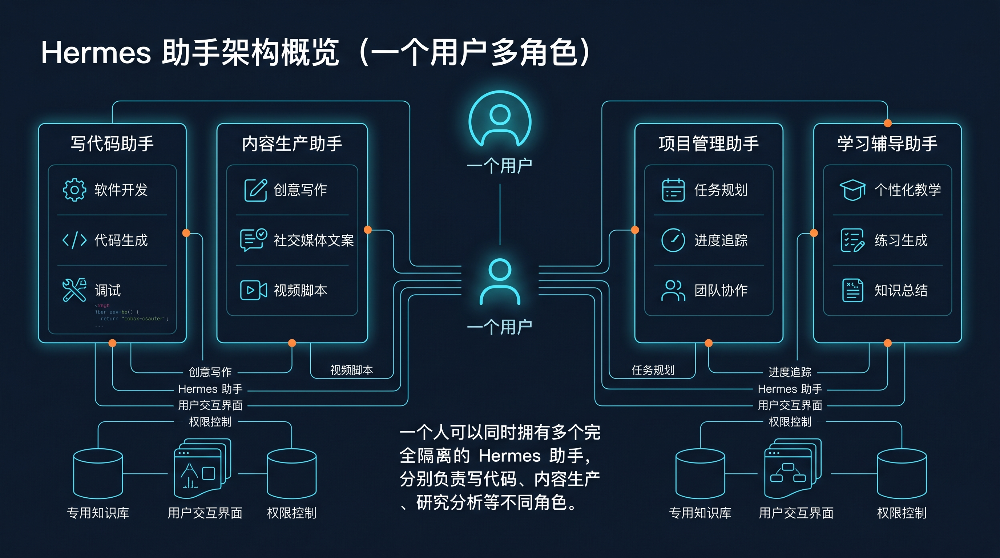

# 👥 02-多个助手一起工作

这一页只解决一件事：
当一个 Hermes 已经开始同时扛写代码、做研究、写内容、跑运营时，怎么把它拆成多个职责清楚、彼此隔离的助手。



---

## 先判断：这是不是你现在最该做的一步

出现下面任意一种情况，就该认真看这一页：

- 你已经开始说“这个助手更像开发助手，那个更像内容助手”
- 同一个助手里既有工程约束，又有文案口吻，还混着研究习惯
- 你发现长期记忆、会话历史、工具权限开始互相污染
- 你准备做自动化、外部记忆、外部接入，但还没有明确由谁负责

如果你现在还只是刚把一个 Hermes 用顺，一个助手通常够用；但一旦进入长期使用，按职责拆助手几乎是必经步骤。

---

## 这一页的核心判断

Profile 不是“同一个助手换个名字”。

Profile 是一套完全隔离的 Hermes 环境。它有自己独立的：

- `config.yaml`
- `.env`
- `SOUL.md`
- memories
- sessions
- skills
- cron jobs
- state database
- gateway 配置

这意味着你创建的不是“第二个聊天窗口”，而是“第二个独立助手”。

---

## 为什么要拆：能力边界会立刻变清楚

把多个职责继续塞进一个助手，最容易出问题的不是界面，而是边界：

- 开发助手需要偏执行、偏终端、偏工程判断
- 内容助手需要偏表达、偏编辑、偏审稿
- 研究助手需要偏检索、偏归纳、偏分析

如果都堆在一起，常见后果是：

- `SOUL.md` 越写越拧巴
- 记忆里同时混入不同岗位的长期事实
- 会话历史越来越脏，复盘困难
- 工具、自动化、消息入口都不知道该服务谁

拆开以后，你得到的不是“更多助手”，而是“更可维护的系统结构”。

---

## 你现在最常用的 4 种创建方式

先掌握最常用的 4 种就够了。

### 1. 从零创建一个新助手

```bash
hermes profile create mybot
```

适合：

- 新职责
- 新人格
- 不想继承旧历史

成功后你得到的是一套空白、独立的助手环境。

### 2. 复制当前助手的核心配置

```bash
hermes profile create writer --clone
```

适合：

- 想继承模型和 API 密钥
- 想保留一部分配置基础
- 但仍然要独立历史和独立记忆

这是最常见的“从成熟助手分裂出新角色”的方式。

### 3. 连整套状态一起复制

```bash
hermes profile create backup --clone-all
```

适合：

- 做备份
- fork 一个已经跑成熟的助手
- 想把当前状态完整复制出去

如果你的目标是“新职责”，通常优先用 `--clone`，不要默认上来就 `--clone-all`。

### 4. 从指定助手复制，而不是从当前助手复制

```bash
hermes profile create work --clone --clone-from coder
```

适合：

- 你当前不在要复制的 profile 里
- 你想从某个成熟助手继续衍生出近似角色

---

## 创建完以后怎么进入和切换

### 方式 1：直接用 profile 别名

如果你创建了 `coder`，常见用法是：

```bash
coder chat
coder setup
coder gateway start
coder doctor
```

### 方式 2：在命令里显式指定 profile

```bash
hermes -p coder chat
hermes --profile=coder doctor
hermes chat -p coder -q "hello"
```

### 方式 3：切换默认 profile

```bash
hermes profile use coder
hermes chat
hermes tools
hermes profile use default
```

如果你每天会长期使用某个助手，这种方式最省心。

---

## 最推荐的拆分方式：先按职责拆，不要先按情绪拆

最稳的第一批角色通常是：

- 开发助手：只负责代码、命令、排错、改动验证
- 内容助手：只负责写作、润色、翻译、选题
- 研究助手：只负责检索、整理、分析、对比

不建议一开始就拆成“很聪明的我”“很严格的我”“很有创意的我”这类抽象人格。

因为真正长期稳定的拆法，通常来自职责边界，而不是口味标签。

---

## 现在就能做的最小动作

如果你已经意识到一个助手扛太多事，按下面顺序做：

### 第 1 步：先选一个最容易混的职责

例如：

- 代码开发
- 内容写作
- 行业研究

### 第 2 步：给它单独创建一个 profile

```bash
hermes profile create coder --clone
```

### 第 3 步：立刻用新助手做一件真实任务

例如：

```bash
hermes -p coder chat
```

然后直接交给它一个开发任务，而不是继续在旧助手里混着用。

### 第 4 步：确认你已经开始分工，而不是只是多了个名字

你要看到的不是“创建命令成功”，而是：

- 这个新助手开始承接独立职责
- 你知道以后什么事应该交给它
- 旧助手不再继续无限扩张

---

## 成功信号

下面这些信号出现，说明你已经拆对了：

- 你能明确说出每个助手分别负责什么
- 新助手能独立进入、独立配置、独立工作
- 你不会再纠结“这件事到底该不该继续塞给原来的助手”
- 你开始能想象后面的记忆、自动化、外部接入分别挂在哪个助手上

---

## 如果没拆顺，先查这 4 件事

### 1. 你拆的是职责，还是只是换了名字

如果两个助手仍然什么都做，只是叫法不同，那不算拆分成功。

### 2. 你是不是复制了太多旧状态

如果新助手一上来就把旧助手的全部历史也带进来，很容易继续混。

### 3. 你有没有给新助手一个真实场景

没有真实任务，新助手就只会停留在“已创建”。

### 4. 你是不是拆得太细了

第一次通常只需要 2 到 3 个助手，不要一口气拆 8 个角色。

---

## 什么时候算通过

当你已经满足下面这些判断，这一页就算通过：

- 我知道 Profile 是完全隔离的 Hermes 环境
- 我知道为什么长期使用后必须按职责拆助手
- 我知道最常用的 4 种创建方式分别适合什么场景
- 我已经能为自己的第二个助手找到明确职责
- 我知道下一步该继续看记忆系统，而不是继续把所有事塞回一个助手

---

## ➡️ 下一步
完成后进入：
- [03-接入外部记忆系统](<./03-接入外部记忆系统/01-总览.md>)
如果你想先回到上一阶段入口重新确认位置：
- [04-自己造东西](<./01-总览.md>)
