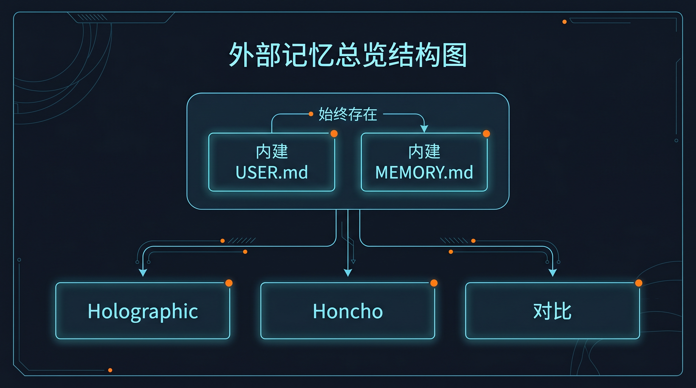

# 🧠 03-接入外部记忆系统

这一页只解决一件事：
帮你先判断自己是不是已经到了“该上外部记忆”的阶段，以及下一步该走 Holographic、Honcho，还是先不要接。

---

## 先把边界钉死：外部记忆不是替代内建记忆

不管你后面接不接 provider，这两层都一直存在：

- `USER.md`：用户偏好、协作习惯
- `MEMORY.md`：环境、项目、稳定事实

外部记忆 provider 是叠加层，不是替代层。

所以正确理解不是：
“我换掉了 Hermes 原来的记忆。”

而是：
“我保留内建记忆，再在上面接一个更正式的长期记忆系统。”

另外还有一条必须先知道：

- 同一时刻只能启用 1 个外部 provider

不是 Holographic 和 Honcho 一起开，也不是先都装上再慢慢选。

---

## 什么情况下先别接外部记忆

下面这些情况，通常继续只用内建记忆就够：

- 你现在主要还是单助手使用
- 你只是想让 Hermes 记住你的偏好和项目背景
- `USER.md` 和 `MEMORY.md` 还没真正稳定用起来
- 你现在的问题是角色混乱、工具没配好、模型没调顺，而不是记忆系统不够

这时最该做的不是上 provider，而是先把：

- `USER.md` 写清楚
- `MEMORY.md` 写清楚
- 助手职责先拆清楚

---

## 什么情况下值得开始看外部记忆

当你出现下面这些需求，外部记忆才开始真正有价值：

- 你已经有多个助手或多个 profile
- 你想让长期认知不只停留在本地两份 markdown 文件里
- 你开始关心跨会话召回、共享工作区、系统化沉淀
- 你需要的是“长期记忆结构”，不是“多记几条偏好”

一句话判断：
当你觉得 `USER.md` 和 `MEMORY.md` 仍然必要，但已经不够承接你的长期使用方式时，就该看外部记忆了。

---

## 接上以后，能力会发生什么变化

这一层真正改变的是系统能力，不是多了个配置项：

1. 长期记忆开始从本地文件走向正式系统
2. 多 profile / 多助手协作更容易组织
3. 你可以开始设计“什么该长期沉淀、怎么召回、怎么共享”
4. 后面做上下文系统、外部接入、自动化时，沉淀更容易复用

所以这一步的意义不是“更高级”，而是“开始把 Hermes 当成长期系统来用”。

---

## 三条路径分别解决什么

### 1. Holographic：先把第一条外部记忆路线接通

更适合：

- 第一次接外部 provider
- 单助手或单工作流优先
- 想先用最短路径跑通
- 希望先本地落地

入口页：
- [02-Holographic记忆](./02-Holographic记忆.md)

### 2. Honcho：进入多助手 / 多 profile 的共享记忆结构

更适合：

- 已经在认真做多个助手分工
- 需要 workspace、peer、共享用户认知
- 目标是多助手长期协作，而不是单助手扩展

入口页：
- [03-Honcho记忆](./03-Honcho记忆.md)

### 3. 外部记忆对比：先做判断，再决定装谁

更适合：

- 你还拿不准路线
- 你不想先花环境成本再回头改方向
- 你需要先做选型题

入口页：
- [04-外部记忆对比](./04-外部记忆对比.md)

---

## 默认怎么选

如果你不想纠结，先按这个规则走：

- 我只是第一次接外部记忆 → 先看 [Holographic](./02-Holographic记忆.md)
- 我已经明确在搭多助手系统 → 先看 [Honcho](./03-Honcho记忆.md)
- 我现在根本没判断清楚 → 先看 [04-外部记忆对比](./04-外部记忆对比.md)

---

## 这一步算成功，不是看“装了没”，而是看“问题对没对”

这页的成功信号不是已经执行了安装命令。

而是你已经能明确回答：

- 我现在到底需不需要外部记忆
- 我要解决的是单助手外部记忆，还是多助手共享记忆
- 我下一页应该去哪一条路线
- 我不会再误以为接了 provider 就能替代 `USER.md` / `MEMORY.md`

---

## 如果你现在拿不准，先查这 4 件事

### 1. 你是不是还没把内建记忆用起来

如果 `USER.md` / `MEMORY.md` 都还没写清楚，先不要急着上 provider。

### 2. 你的问题是不是其实在助手分工

如果多个职责还混在一个助手里，先回去看：
- [02-多个助手一起工作](../02-多个助手一起工作.md)

### 3. 你是不是把“更高级”当成“更适合”

外部记忆不是越早越好，也不是越复杂越好。

### 4. 你是不是还没决定自己要单助手路线还是多助手路线

如果这个问题还没想清楚，先看：
- [04-外部记忆对比](./04-外部记忆对比.md)

---

## 什么时候算通过

当你已经满足下面这些判断，这一页就算通过：

- 我知道外部记忆是叠加层，不是替代层
- 我知道 `USER.md` 和 `MEMORY.md` 不会消失
- 我知道同一时刻只能启用 1 个外部 provider
- 我知道自己现在是否真的需要外部记忆
- 我知道 Holographic、Honcho、对比页各自适合什么情况

---

## ➡️ 下一步
完成后进入：
- [02-Holographic记忆](./02-Holographic记忆.md)
如果你想先回到上一阶段入口重新确认位置：
- [04-自己造东西](../01-总览.md)
