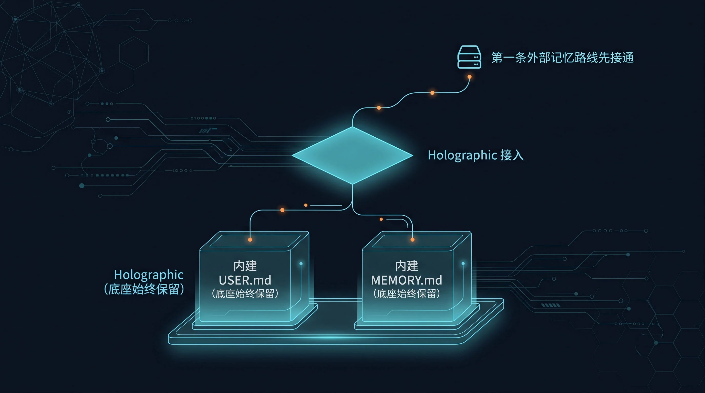

# 🪞 02-Holographic记忆

这一页只解决一件事：
把第一条最容易落地的外部记忆路线接通，并且知道接通后该看哪些信号验收。



---

## 🔎 搜索收录速答

Holographic 记忆适合想把 Hermes 的长期记忆从本地文件扩展到外部记忆服务的用户。最短路径是先跑通 `hermes memory setup`，确认 provider 指向 `holographic`，再用一次真实任务验证记忆写入和读取。还不确定要不要外部记忆时，先看[记忆基础](/docs/start/personalize/memory-basics)和[记忆 provider 对比](/docs/start/build/memory-providers/compare)。


## 🎯 先判断：Holographic 是不是你现在该走的路线

下面这些情况，通常优先走 Holographic：

- 你第一次接外部 memory provider
- 你想先跑通一条最短、最稳的路线
- 你当前还是单助手或单工作流为主
- 你希望先本地落地，不想先搭复杂服务
- 你要先搞懂“外部 provider 叠加在内建记忆之上”到底是什么感觉

如果你真正要解决的是多助手共享工作区、peer 身份和共享用户认知，这一页不是主线，先去看：
- [03-Honcho记忆](./03-Honcho记忆.md)

---

## 🧭 先把关系讲清楚

接上 Holographic 之后：

- `USER.md` 继续负责用户偏好
- `MEMORY.md` 继续负责环境、项目、稳定事实
- Holographic 额外提供外部事实存储与检索能力

它不是替代内建记忆，而是在上面再加一层。

另外别忘了：

- 同一时刻只能启用 1 个外部 provider

---

## ✨ 这一步为什么值得现在做

对当前阶段来说，Holographic 的价值不是“最强”。

而是：

1. 它最适合第一次接外部记忆
2. 它能让你先建立正确的系统心智
3. 它通常是最低理解成本的一条外部路线
4. 跑通后，你再看 Honcho 或选型对比会更有参照

---

## ⚡ 最短接入路径

下面按最小闭环做，不要一上来研究所有参数。

### 第 1 步：确认你现在就是要接第一条外部记忆路线

动手前先确认两件事：

- 你知道 `USER.md` / `MEMORY.md` 不会消失
- 你要解决的是“先接通 provider”，不是“先搭多助手共享结构”

### 第 2 步：运行 setup，选择 `holographic`

在终端输入：

```bash
hermes memory setup
```

看到 provider 选择列表后，输入或选中：

```text
holographic
```

如果你不走交互，也可以直接执行：

```bash
hermes config set memory.provider holographic
```

### 第 3 步：确认配置已经写对位置

重点看 `config.yaml` 里有没有这两层：

```yaml
memory:
  provider: holographic
plugins:
  hermes-memory-store:
```

你这一步不需要把所有字段都背下来，只要确认：

- provider 已经切到 `holographic`
- 插件配置确实落在 `plugins.hermes-memory-store`

### 第 4 步：检查本地数据库是否落地

默认数据库路径是：

```text
$HERMES_HOME/memory_store.db
```

如果你用了默认路径，确认这个文件已经出现。

---

## 🔍 成功信号：看到这 4 个就够了

### 1. 状态里已经显示 provider 是 `holographic`

执行：

```bash
hermes memory status
```

成功时，你要看到当前外部 provider 指向 `holographic`。

### 2. 配置里已经写对

重点检查：

- `memory.provider: holographic`
- `plugins.hermes-memory-store` 已存在

### 3. 本地 SQLite 已经落地

重点看：

```text
$HERMES_HOME/memory_store.db
```

### 4. 你的理解已经没有跑偏

你已经不会再把 Holographic 误解成：

- 替代 `USER.md` / `MEMORY.md`
- 多助手共享工作区的主路线
- 必须先做复杂选型才能开始

---

## 🩺 第一次失败时，先查这 4 件事

### 1. provider 有没有真的切过去

先跑：

```bash
hermes memory status
```

如果状态里不是 `holographic`，说明切换还没生效。

### 2. 配置是不是写错层级了

检查 `config.yaml`，重点确认：

- `memory.provider` 是否正确
- `plugins.hermes-memory-store` 是否存在

### 3. 你是不是还在拿它解决多助手问题

如果你的真实问题是多个助手共享长期认知，换成 Holographic 也不会直接解决。

### 4. 你是不是还没把内建记忆用顺

如果 `USER.md` / `MEMORY.md` 本身就没整理好，接了外部 provider 也只会把混乱往外扩。

---

## ✅ 什么时候算通过

当你已经满足下面这些判断，这一页就算通过：

- 我知道 Holographic 是 `holographic` 这个外部 provider
- 我知道它叠加在 `USER.md` / `MEMORY.md` 之上
- 我知道最短接法是 `hermes memory setup` 选择 `holographic`，或直接设置 provider
- 我知道该用 `hermes memory status`、`config.yaml`、`memory_store.db` 验收
- 我知道它适合第一条外部记忆路线，不适合拿来代替多助手结构设计

---

## ➡️ 下一步
完成后进入：
- [03-Honcho记忆](<./03-Honcho记忆.md>)

如果你想先回到上一阶段入口重新确认位置：
- [03-接入外部记忆系统](<./01-总览.md>)
