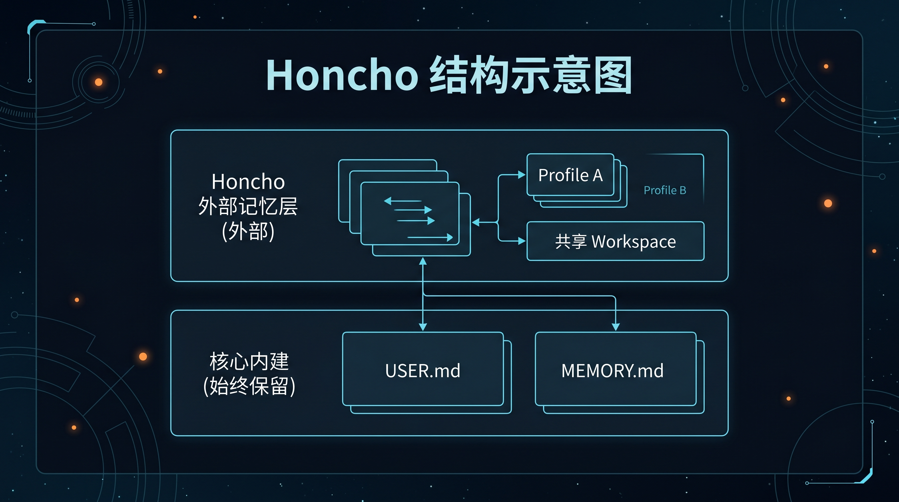

# 🧠 03-Honcho记忆

这一页只解决一件事：
把 Honcho 按“能启动、能接入、能验证”的顺序跑起来，先把外部记忆真正接通，再谈多 profile 协作。



---

## 🧭 先记住：这一页讲的不是“再接一个数据库”，而是“进入多助手记忆结构”

Honcho 最容易被低估的地方，是很多人第一次会把它理解成：

“哦，就是另一种外部记忆存储。”

但这页要先把这个理解拉正：

Honcho 更适合解决的，不只是“记住更多”，而是“多个助手怎样围绕同一个用户和工作区长期协作”。

所以它和 Holographic 的区别，不是简单的“谁更强”，而是：

你现在到底是在给一个助手加一层外部记忆，还是已经在搭多助手长期系统。

---

## ❓ 你要先知道 Honcho 是什么

Honcho 不是“再加一个数据库”。
它是 Hermes 的 AI-native 外部记忆后端，负责把对话后的结论、用户画像、语义检索和多代理分层记忆接起来。

和内建记忆的关系只有一句话：

- `USER.md` / `MEMORY.md` 继续保留
- Honcho 作为外部 provider 叠加在上面
- 同一时刻只启用 1 个外部 provider

Honcho 适合的重点是：

- 多 profile / 多助手长期协作
- 跨会话上下文
- user-agent alignment
- peer card、semantic search、conclusion 这类更系统的记忆能力

---

## 🧭 先判断：你是不是应该走 Honcho

如果你符合下面任意一条，才值得继续往下走：

- 你已经在认真使用 [02-多个助手一起工作](../02-多个助手一起工作.md)
- 你要解决的不是“单助手记不记得住”，而是“多个助手怎么共享同一个用户认知”
- 你希望每个 profile 有自己的 AI peer，但又能共享同一个 workspace
- 你需要 Honcho 的四个工具：`honcho_profile`、`honcho_search`、`honcho_context`、`honcho_conclude`
- 你已经明确自己要的是外部记忆闭环，而不是只看一眼选型页

如果你只是想先跑通第一条最短外部记忆路线，去看 [Holographic](./02-Holographic记忆.md)。
如果你还在比较路线，先看 [外部记忆对比](./04-外部记忆对比.md)。
如果你现在更卡在“多个助手怎么先拆开”，那就回到[02-多个助手一起工作](../02-多个助手一起工作.md)先把角色结构立稳。

---

## 🎯 走 Honcho 这条路，你真正会得到什么

这一页最值得你现在记住的，不是服务名，而是收益：

1. 多个 profile 可以围绕同一个 workspace 逐步形成共享认知
2. 不同助手可以保留各自身份，而不是被硬塞进一个人格里
3. 你开始拥有比本地 markdown 记忆更系统的 user / peer / workspace 分层
4. 后面的多助手协作和长期系统化使用，会更容易稳定下来

一句话说透：

Honcho 的价值，不是“记得更多”，而是“让多个助手开始按系统结构记得更合理”。

---

## 📌 最短接入顺序

不要一上来研究所有参数。按下面 4 步走就够了。

### 第 1 步：先把 Honcho 服务端跑起来

Honcho 官方支持本地自托管；最顺手的方式是 Docker。

官方本地搭建的核心要求是：

- PostgreSQL
- pgvector
- Honcho 服务端
- 一个可用的 LLM provider

如果你走 Docker，本页先按最短路径记住这件事：

- 先把 Honcho 服务和数据库拉起来
- 再让 Hermes 指向这个 Honcho 实例

### 第 2 步：把 Hermes 的 memory provider 切到 Honcho

执行：

```bash
hermes memory setup
```

在 provider 列表里选：

```text
honcho
```

如果你要手动切换，也可以直接设：

```bash
hermes config set memory.provider honcho
```

如果你用的是本地 Honcho 实例，Hermes 这边的 base URL 通常指向：

```text
http://localhost:8000
```

### 第 3 步：把 1536 维度写死

这一步是关键。
如果你这条链路走的是 OpenAI-compatible / OneAPI 风格的 embedding 路由，先把向量维度固定成 1536，不要做动态猜测。

你要记住的不是抽象兼容性，而是这条硬规则：

```env
VECTOR_STORE_DIMENSIONS=1536
```

### 第 4 步：确认配置落点正确

最稳妥的检查顺序是：

1. 先看 Hermes 当前 memory provider
2. 再看 Honcho 配置文件是否存在
3. 最后确认本地服务是否能连上

---

## 🔹 接完后怎么验证

这一页的通过标准，不是“我觉得应该好了”，而是“状态真的显示好了”。

先跑：

```bash
hermes memory status
```

再跑：

```bash
hermes honcho status
```

你要看到的是：

- 当前 provider 已经是 `honcho`
- 没有 `not installed` / `connection failed` / `No Honcho config found` 这类错误
- 配置里能看到当前的 base URL、peer / workspace / config 路径
- Honcho 命令不再是空壳，而是能返回当前连接状态

如果你是多 profile 场景，再补一条：

```bash
hermes honcho peer
```

它用来检查或更新 peer 名称，确认每个 profile 不是混成同一个身份。

---

## 🔎 如果你要的是多 profile 结构，这样看才对

Honcho 的真正价值不是“记住更多”，而是“记得更分层”。

你应该把它理解成：

- workspace 是共享场域
- user representation 是共享用户认知
- AI peer 是每个 profile 自己的身份

所以多 profile 下，正确姿势是：

- 共享同一套 user 侧长期认知
- 每个 profile 保留自己的 peer
- 不同角色之间不要互相污染观察结果

---

## 🚫 哪些情况不该先走它

下面这些情况，通常不建议把 Honcho 当第一步：

- 你连内建 [持久记忆](<../../03-玩出花样/03-让 Hermes 记住你.md>) 都还没用顺
- 你当前其实还是单助手使用，只是想先把外部记忆接通
- 你真正缺的是第一条最容易跑通的外部路线，而不是多助手结构
- 你还没有明确 workspace / peer / 多 profile 这些结构需求
- 你只是因为 Honcho 看起来更系统，就想直接跳过去

这种时候，更合理的入口通常是 Holographic 或外部记忆对比。

---

## ✅ 什么时候算过关

当你能明确回答下面这些问题，这一页才算过关：

- 我知道 Honcho 是外部记忆后端，不是简单数据库
- 我知道它和 Holographic 的核心差别，在于它更适合多助手 / 多 profile / workspace 结构
- 我知道内建 `USER.md` / `MEMORY.md` 仍然保留
- 我知道同一时刻只能启用 1 个外部 provider
- 我知道 OneAPI / OpenAI-compatible 这条链路要把向量维度固定成 1536
- 我知道走 Honcho 这条路以后，我真正会得到什么
- 我知道该用 `hermes memory status` 和 `hermes honcho status` 去验收，而不是靠感觉

---

## ➡️ 下一步

完成后进入：
- [04-外部记忆对比](04-外部记忆对比.md)

如果你想先回到上一阶段入口重新确认位置：
- [03-接入外部记忆系统](01-总览.md)
