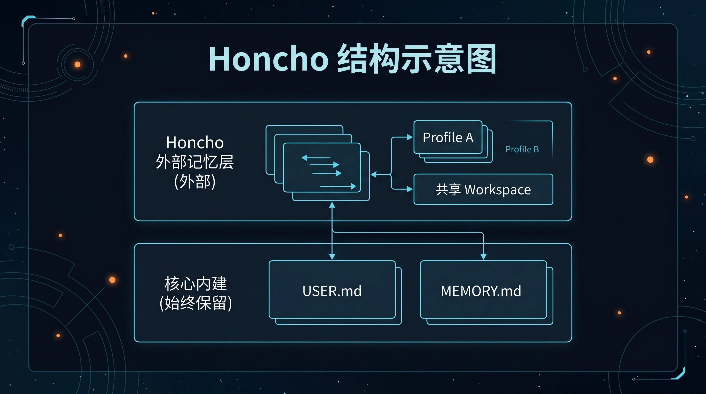

# 🧠 03-Honcho记忆

这一页只解决一件事：
把 Honcho 按“先跑起来、再接进去、最后验证”的顺序接通，并建立多助手共享记忆的正确心智。



---

## 🎯 先判断：Honcho 是不是你现在真正要的能力

下面这些情况，通常才值得上 Honcho：

- 你已经在认真使用多个助手或多个 profile
- 你要解决的是“多个助手怎么共享同一个用户认知”
- 你需要 workspace、peer、共享上下文这类结构
- 你希望长期记忆是分层的，而不是全塞进一个助手里

如果你只是第一次接外部 provider，想先跑通一条最短路径，先去看：
- [02-Holographic记忆](./02-Holographic记忆.md)

---

## 🧭 先把系统边界讲清楚

Honcho 不是“再加一个数据库”。

它更像一个面向多助手协作的外部记忆后端，重点在：

- workspace
- user representation
- AI peer
- semantic search
- conclusion / context 类能力

同时仍然保留：

- `USER.md`
- `MEMORY.md`

所以正确理解是：
内建记忆继续在，Honcho 叠加在上面，把多助手长期协作的记忆结构补出来。

同样别忘记：

- 同一时刻只能启用 1 个外部 provider

---

## ✨ 为什么这一步现在重要

对多助手系统来说，真正缺的往往不是“多记一点”，而是“记得更合理”。

Honcho 带来的核心变化是：

1. 多个 profile 可以围绕同一个 workspace 协作
2. 每个助手保留自己的 peer 身份
3. 用户认知和助手身份不再混成一团
4. 记忆开始变成结构化系统，而不只是存储层

所以它解决的是系统组织问题，不只是容量问题。

---

## ⚡ 最短接入顺序

按下面 4 步走，先把链路打通。

### 第 1 步：先把 Honcho 服务端跑起来

最常见的本地路线是 Docker。

你至少需要把这些组件拉起来：

- PostgreSQL
- pgvector
- Honcho 服务端
- 一个可用的 LLM provider

先做到“服务已经在本地或目标环境里可访问”，再去改 Hermes 配置。

### 第 2 步：把 Hermes 的 memory provider 切到 `honcho`

在终端输入：

```bash
hermes memory setup
```

在 provider 列表里选：

```text
honcho
```

如果你要手动切换，也可以执行：

```bash
hermes config set memory.provider honcho
```

如果你用的是本地实例，常见 base URL 会指向：

```text
http://localhost:8000
```

### 第 3 步：如果你的链路是 OpenAI-compatible / OneAPI，先把维度固定成 1536

在环境变量里写：

```env
VECTOR_STORE_DIMENSIONS=1536
```

这一步不要靠自动猜。
如果维度不一致，后面最容易出现连接正常、写入异常或检索异常。

### 第 4 步：检查 Hermes 和 Honcho 两边都已经能互相看到

先验证 provider 已切换，再验证 Honcho 服务本身连通。

---

## 🔍 成功信号：至少看这 4 个

### 1. Hermes 这边已经显示 provider 是 `honcho`

执行：

```bash
hermes memory status
```

### 2. Honcho 状态能正常返回

执行：

```bash
hermes honcho status
```

你要避免看到：

- `not installed`
- `connection failed`
- `No Honcho config found`

### 3. 多 profile 下，每个助手都有自己的 peer

如果你是多 profile 使用，再执行：

```bash
hermes honcho peer
```

你要确认不同 profile 不是被混成同一个身份。

### 4. 你已经理解它的结构意义

你已经知道：

- workspace 是共享场域
- user 认知是共享层
- AI peer 是每个助手自己的身份层

---

## 🩺 第一次失败时，先查这 5 件事

### 1. Honcho 服务端到底有没有跑起来

先检查容器或服务本身，不要一上来只盯 Hermes。

### 2. provider 有没有真的切到 `honcho`

执行：

```bash
hermes memory status
```

### 3. base URL 对不对

本地常见地址是：

```text
http://localhost:8000
```

### 4. 维度是不是已经固定成 1536

如果你走的是兼容 OpenAI 的 embedding 路由，这一步非常关键。

### 5. 你是不是拿 Honcho 去解决单助手的最短接入问题

如果你只是想先验证外部 provider 能工作，Honcho 可能不是最低阻力路线。

---

## ✅ 什么时候算通过

当你已经满足下面这些判断，这一页就算通过：

- 我知道 Honcho 不只是存储层，而是多助手记忆结构的一部分
- 我知道它比 Holographic 更适合多 profile / workspace 场景
- 我知道 `USER.md` / `MEMORY.md` 仍然保留
- 我知道最短接法是：先跑服务端，再切 provider，再固定维度，再验状态
- 我知道该用 `hermes memory status`、`hermes honcho status`、`hermes honcho peer` 做验收

---

## ➡️ 下一步
完成后进入：
- [04-外部记忆对比](<./04-外部记忆对比.md>)

如果你想先回到上一阶段入口重新确认位置：
- [03-接入外部记忆系统](<./01-总览.md>)
