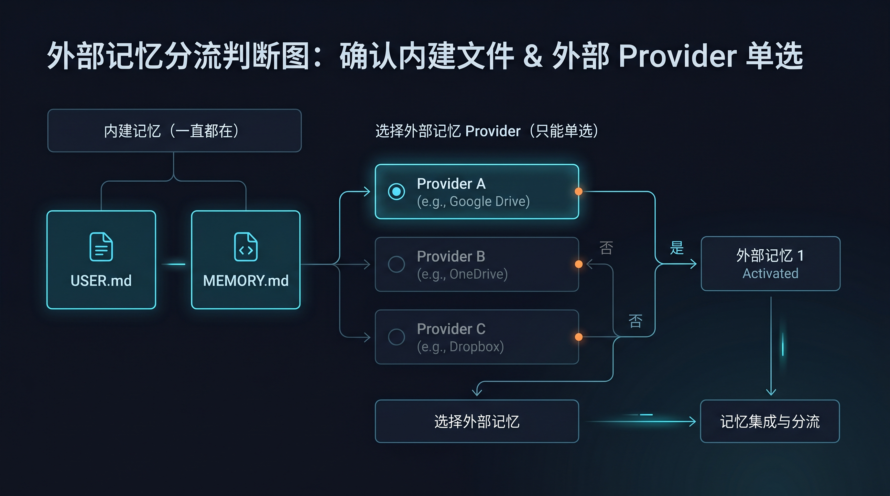

# ⚖️ 04-外部记忆对比

这一页只解决一件事：
帮你做分流判断：现在该先走 Holographic、先走 Honcho，还是先继续只用内建记忆。

---

## 🎯 这页不比“谁更强”，只比“谁更对题”

很多人会带着这个问题进来：
“到底哪个更高级？”

但当前阶段真正该问的是：
“我现在缺的是哪一种记忆路线？”

因为 provider 选错，后面整套理解都会偏掉。

---

## 📌 先固定两个前提

不管你怎么选，这两条都不变：

- `USER.md` / `MEMORY.md` 始终存在
- 同一时刻只能启用 1 个外部 provider

所以这页的任务不是帮你“都装上”。
而是帮你“先做对选择”。

---

## 📊 一眼判断表

| 你现在的真实需求 | 更适合 Holographic | 更适合 Honcho | 更适合先不要装 |
| --- | --- | --- | --- |
| 先跑通第一条外部记忆路线 | 是 | 否 | 否 |
| 单助手 / 单工作流优先 | 是 | 否 | 也可能是 |
| 多助手 / 多 profile / workspace | 否 | 是 | 否 |
| 想先验证 provider 能不能工作 | 是 | 否 | 否 |
| 想解决共享用户认知与 peer 身份 | 否 | 是 | 否 |
| `USER.md` / `MEMORY.md` 还没稳定使用 | 否 | 否 | 是 |
| 问题其实在角色混乱或基础层没跑顺 | 否 | 否 | 是 |

---

## 🧠 什么情况先走 Holographic

你更像下面这些情况时，优先 Holographic：

- 我第一次接外部记忆
- 我想先跑通一条能成功的路线
- 我现在主要还是单助手使用
- 我想先本地落地，理解成本越低越好

它更像：

- 第一条外部记忆路线
- 本地 fact store
- 单助手扩展入口

对应页面：
- [02-Holographic记忆](./02-Holographic记忆.md)

---

## 🤝 什么情况先走 Honcho

你更像下面这些情况时，优先 Honcho：

- 我已经在搭多个助手
- 我需要 workspace 和 peer 结构
- 我真正要解决的是共享长期认知
- 我不想把所有长期记忆硬塞到一个助手里

它更像：

- 多助手系统的记忆后端
- user / workspace / peer 分层结构
- 长期协作的组织方式

对应页面：
- [03-Honcho记忆](./03-Honcho记忆.md)

---

## 🚫 什么情况先不要装

下面这些情况，先停在内建记忆通常更对：

- `USER.md` / `MEMORY.md` 还没稳定使用
- 你现在的问题其实在模型、工具、流程、职责边界
- 你只有轻量记忆需求
- 你还没判断清楚自己到底是在做单助手扩展，还是多助手系统
- 你只是因为“看起来高级”才想先装一个

这时更合理的动作通常是先回去补基础：

- [02-多个助手一起工作](../02-多个助手一起工作.md)
- [03-玩出花样 / 03-让 Hermes 记住你](<../../03-%E7%8E%A9%E5%87%BA%E8%8A%B1%E6%A0%B7/03-%E8%AE%A9%20Hermes%20%E8%AE%B0%E4%BD%8F%E4%BD%A0.md>)
- [03-接入外部记忆系统总览](./01-总览.md)

---

## 🕳️ 这页真正帮你避免的坑

1. 把单助手问题误判成多助手问题
2. 把“先跑通一条路线”误判成“先搭完整系统”
3. 需求还没定型就先装 provider，结果只是增加复杂度

所以这页的价值不是省下一次安装，而是避免走错方向。

---

## ✅ 什么时候算通过

当你已经满足下面这些判断，这一页就算通过：

- 我知道外部 provider 不是替代内建记忆
- 我知道 Holographic 更适合第一条外部记忆路线
- 我知道 Honcho 更适合多助手 / workspace 结构
- 我知道哪些情况其实应该先不要装
- 我知道自己下一步该去哪个页面，而不是继续纠结“谁更高级”

---

## ➡️ 下一步
完成后进入：
- [04-上下文系统](<../04-上下文系统/01-总览.md>)

如果你想先回到上一阶段入口重新确认位置：
- [03-接入外部记忆系统](<./01-总览.md>)
