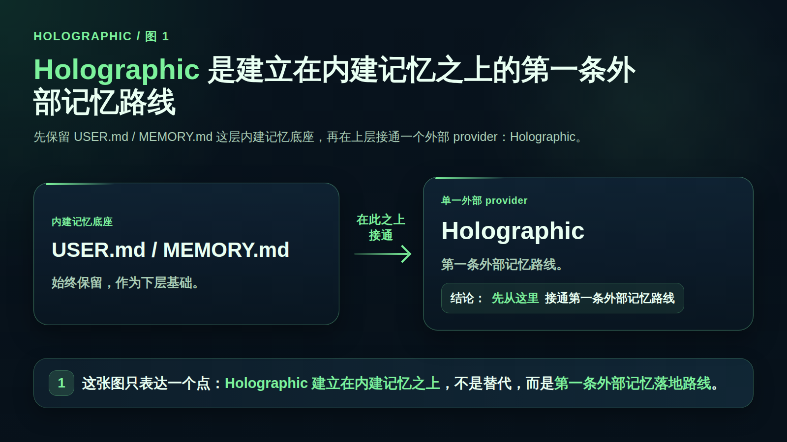
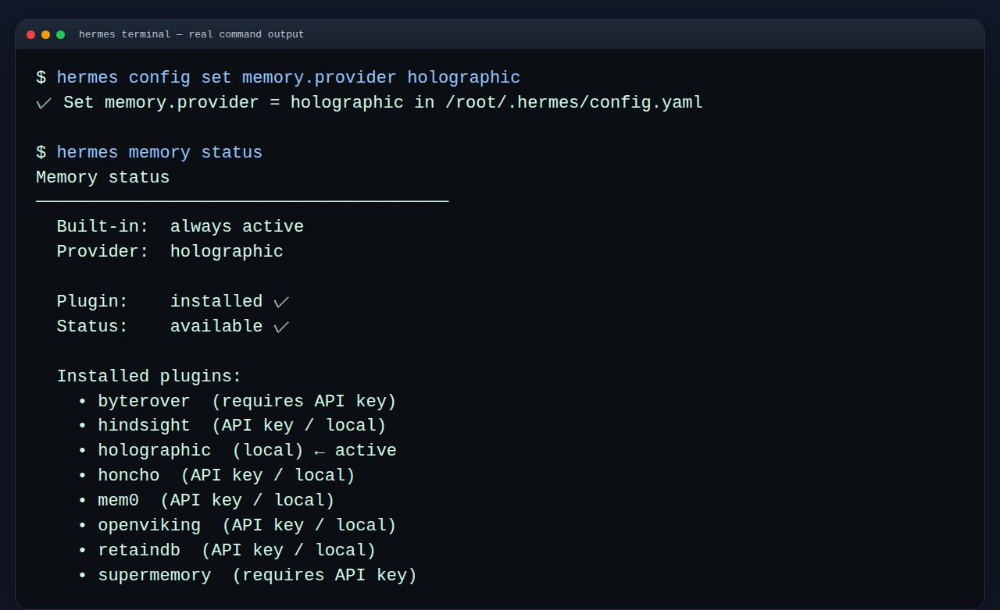

# 🪞 Holographic记忆

这一页只解决一件事：
当你已经理解内建记忆的边界、又想先接通第一条最容易落地的外部记忆路线时，怎样用最短路径把 Holographic 跑起来。



---

## ❓ 什么时候更适合先走 Holographic

如果你现在更像下面这种情况，通常就该先走 Holographic：

- 你第一次接外部 memory provider，想先跑通一条最短路径
- 你当前主要还是单助手、单工作流，而不是多助手协同建模
- 你希望外部记忆先落在本地，不想一开始就引入云端服务或额外账号体系
- 你想先验证“外部 provider 叠加在内建记忆之上”到底会怎么工作
- 你接受先用本地 SQLite fact store，把外部长期记忆能力接起来

一句话判断：
如果你要的不是复杂选型，而是“先把第一条外部记忆路线跑通”，Holographic 就是最自然的起点。

---

## ❓ 它和内建记忆是什么关系

这里先只记住 2 个边界：

- 内建 `USER.md` / `MEMORY.md` 一直都在
- 外部 provider 是 additive 叠加层，不是替代层

所以接上 Holographic 之后，不是把原来的记忆删掉，而是变成：

- `USER.md` 继续承接你的用户偏好与协作习惯
- `MEMORY.md` 继续承接环境、项目与稳定经验事实
- Holographic 再额外提供一层外部事实存储与检索能力

还有一个边界也别忘：

- 同一时刻只能激活 1 个外部 provider

也就是说，Holographic 适合你先把“外部记忆”本身接通，而不是同时和别的 provider 并开做混合方案。

如果你对内建记忆还不够熟，先回看：[让 Hermes 记住你：持久记忆只看 USER.md 和 MEMORY.md](../../03-玩出花样/03-持久记忆.md)

---

## ❓ 它更像什么

Holographic 更像：

- 一个本地可落地的外部事实库
- 第一条最容易跑通的外部记忆路线
- 在内建记忆之上，再加一层 SQLite fact store

官方文档与代码路径里，Holographic 可直接确认的几个点是：

- provider 名就是 `holographic`
- 可通过 `hermes memory setup` 选择 `holographic`
- 或直接设置 `hermes config set memory.provider holographic`
- 配置放在 `config.yaml` 的 `plugins.hermes-memory-store`
- 默认数据库路径是 `$HERMES_HOME/memory_store.db`
- 不需要额外硬依赖；SQLite 一直可用，NumPy 只是可选项

从能力感觉上，它不是“只多一个文件”，而是把记忆落进本地 fact store，并带来搜索 / 事实检索相关能力。代码与文档里还能看到 `fact_store`、`fact_feedback`，以及 `probe` / `reason` / `contradict` 这类更偏事实处理的能力名称。

---

## 📌 最小接入路径

如果你的目标只是先跑通，不要一上来研究全部参数。先按这 4 步走就够了。

### 🔹 1）先确认你是在接“外部记忆的第一条路线”

在动手前，先确认两件事：

- 你已经知道内建 `USER.md` / `MEMORY.md` 不会消失
- 你现在要的是“先跑通外部 provider”，不是“先做多助手记忆设计”

如果你其实还在单助手基础层阶段，这一步通常就说明可以继续。

### 🔹 2）执行 setup，直接选择 Holographic

最短入口：

```bash
hermes memory setup
```

然后在交互选择里选：

```text
holographic
```

如果你不走交互入口，也可以直接设：

```bash
hermes config set memory.provider holographic
```

### 🔹 3）确认配置确实写到了正确位置

Holographic 的配置位于：

```yaml
plugins:
  hermes-memory-store:
```

你这一步不用把所有参数都背下来，只要知道：

- 它不是写进内建 `USER.md` / `MEMORY.md` 的开关里
- 它是作为外部 memory provider，写在 `plugins.hermes-memory-store` 这一层
- 默认数据库文件会落到 `$HERMES_HOME/memory_store.db`

### 🔹 4）启用后，去看“外部记忆是不是已经真的接上”

接完后先不要急着研究高级能力，先检查最基本的三个结果：

- 当前激活的外部 provider 已经是 `holographic`
- Holographic 相关配置已经出现在 `config.yaml`
- 本地数据库文件已经按默认路径或你的自定义路径落地

只要这三件事成立，就说明你已经把第一条外部记忆路线接上了。

---

## ✅ 成功标准

这页只看“是否接通”，不看“是否把玩法都吃透”。

最稳的成功信号，通常是下面这些：

### ✅ 成功信号 1：状态层面已经显示 Holographic 在生效

优先看：

```bash
hermes memory status
```

如果状态里显示当前外部 provider 是 `holographic`，这是第一层成功信号。

这张是真实状态截图，验收时看它：



### ✅ 成功信号 2：配置层面已经写对位置

你能在 `config.yaml` 里看到：

- `memory.provider` 已经指向 `holographic`
- `plugins.hermes-memory-store` 这层已经存在对应配置

这说明 Hermes 知道该把外部记忆交给 Holographic，而不是别的 provider。

### ✅ 成功信号 3：本地 SQLite 落地已经出现

如果默认路径没有改，重点看：

```text
$HERMES_HOME/memory_store.db
```

这说明外部记忆的本地存储层已经真正落下来了。

### ✅ 成功信号 4：你已经能把它理解成“内建记忆之上的外部事实层”

也就是你已经不会再把它误解成：

- 替代 `USER.md` / `MEMORY.md`
- 一个专门给多助手共享工作区设计的系统
- 必须先做复杂选型才能开始

如果你已经知道它是“先把本地外部记忆接起来”的路线，这一页目标就达到了。

---

## 🔹 哪些情况不该先走它

下面这些情况，通常不建议把 Holographic 当第一步：

- 你连内建 [持久记忆](../../03-玩出花样/03-持久记忆.md) 还没用顺
- 你当前真正需要的是多助手 / 多 profile 共享与建模，而不是先接一个本地外部 fact store
- 你现在的问题其实是助手角色混乱，更应该先看 [多个助手一起工作（Profiles）](../02-多个助手一起工作（Profiles）.md)
- 你还没确认自己为什么需要外部 provider，只是想先装一个看起来更高级的东西
- 你已经明确要走 Honcho记忆 或外部记忆对比 的选型方向

简单说：
Holographic 适合“先跑通第一条外部记忆路线”，不适合拿来替代对多助手结构、选型判断或基础记忆边界的理解。

---

## ✅ 什么时候算通过

当你已经能明确回答下面 5 个问题，这一页就算通过：

- 我知道 Holographic 是 `holographic` 这个外部 provider
- 我知道它叠加在内建 `USER.md` / `MEMORY.md` 之上，而不是替代它们
- 我知道它是第一条最容易跑通的外部记忆落地路线，更像本地 SQLite fact store
- 我知道最短接入方式是 `hermes memory setup` 选 `holographic`，或直接 `hermes config set memory.provider holographic`
- 我知道接完后该检查 `hermes memory status`、`config.yaml` 和 `$HERMES_HOME/memory_store.db`

---

## ➡️ 下一步

完成后进入：
- [03-Honcho记忆](03-Honcho记忆.md)

如果你想先回到上一阶段入口重新确认位置：
- [接入外部记忆系统（Memory Providers）](01-总览.md)
