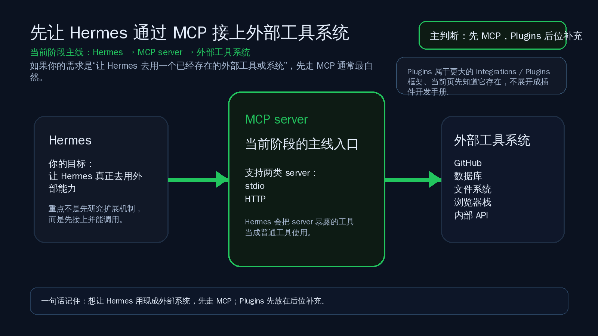

# MCP / Plugins：先把 Hermes 接到外部工具系统

这一页只讲一个判断：
如果你现在的目标是“让 Hermes 用上一个已经存在的外部工具或系统”，MCP 通常是当前阶段更自然的第一选择；Plugins 先知道它在更大的 Integrations / Plugins 框架里存在就够了。



---

## 什么情况下你值得先走 MCP

当你遇到下面这些情况时，通常就值得先走 MCP：

- 你想让 Hermes 直接调用一个已经存在的外部工具服务器
- 你要接的是 GitHub、数据库、文件系统、浏览器栈、内部 API 这类外部系统
- 你更关心“先接上并用起来”，而不是先做一套 Hermes 内部扩展机制
- 你希望 Hermes 把这些外部能力当成普通工具来用，而不是自己记一堆特殊接法

把它说得更直白一点：
如果你脑子里的需求是“我想让 Hermes 去用某个现成系统”，先看 MCP，通常比先研究 Plugins 更顺路。

---

## 为什么当前阶段先 MCP，后 Plugins

这一页不是要否定 Plugins。
Plugins 确实存在于 Hermes 更大的 Integrations / Plugins 框架里。

但在当前阶段，先后顺序应该这样理解：

- MCP 是主线：它负责把 Hermes 接到外部工具服务器
- Plugins 是后位补充：它在更大的集成体系里有位置，但不是你“先把外部系统接进来”时最自然的第一步

官方对 MCP 的定位很直接：
Hermes 可以连接外部 MCP server，并把这些 server 暴露出来的工具注册进自己的正常工具系统里。

这意味着当前阶段先抓住一个核心心智就够了：

1. 你要接的是外部工具系统
2. MCP 就是这条主线入口
3. 接进来以后，Hermes 会像用普通工具一样去用它们
4. Plugins 先知道它存在，但这一页不展开成插件开发手册

所以“先 MCP，后 Plugins”的重点，不是说 Plugins 不重要。
而是说对大多数刚进入系统接入阶段的人，MCP 更像默认入口。

---

## MCP 最短接入路径

你现在只需要记住最短的 4 步。

### 第 1 步：装上 MCP 支持

官方快速起步的第一步是先给 Hermes 安装 MCP 支持：

```bash
cd ~/.hermes/hermes-agent
uv pip install -e ".[mcp]"
```

### 第 2 步：在 `~/.hermes/config.yaml` 里写 `mcp_servers`

MCP 配置写在：

```text
~/.hermes/config.yaml
```

入口字段是：

```yaml
mcp_servers:
```

最小示意可以先记成这样：

```yaml
mcp_servers:
  filesystem:
    command: "npx"
    args: ["-y", "@modelcontextprotocol/server-filesystem", "/home/user/projects"]
```

这一类是 stdio server：
Hermes 本地拉起子进程，通过 stdin / stdout 通信。

如果你接的是远端 HTTP MCP server，则写法会变成：

```yaml
mcp_servers:
  company_api:
    url: "https://mcp.example.com/mcp"
    headers:
      Authorization: "Bearer ***"
```

这一页你只要先记住：
MCP 支持两类 server——stdio 和 HTTP。

### 第 3 步：启动 Hermes

配置好以后，启动 Hermes 即可，例如：

```bash
hermes chat
```

### 第 4 步：直接给一个会触发外部工具的任务

例如让 Hermes 去列文件、查 GitHub、读数据库、访问内部 API。
关键不是你手动背工具名。
关键是 Hermes 会把 MCP server 暴露出来的工具当成普通工具使用。

---

## 配一个 server 后，成功信号看什么

这一页最重要的是会判断“到底算不算接上了”。

你可以看 3 个成功信号：

### 1）Hermes 能真的完成一件依赖外部系统的事

最强的成功信号，不是看到配置文件没报错。
而是你给它一个明确任务后，它真的能通过外部系统返回结果。

例如：

- 能列出目标目录文件
- 能查询 GitHub issue / PR
- 能从数据库或内部 API 拿到结果

如果它已经能完成这类动作，说明接入不是“写上了”，而是“用起来了”。

### 2）MCP 工具被当成普通工具注册进来

官方说明里，Hermes 会把 MCP tools 注册进自己的正常工具系统。
这也是为什么使用时你的心智应该是：
“这是 Hermes 新拿到的一组工具”，而不是“这是完全另一套平行机制”。

### 3）你可能会看到带前缀的工具名，但通常不用手记

官方给出的注册命名模式是：

```text
mcp_<server>_<tool>
```

例如某个 server 里的工具会变成类似：

```text
mcp_filesystem_read_file
```

但实操上，你通常不需要手动记住这些前缀名。
Hermes 看到这些工具后，会像平常一样在推理过程中决定是否调用它们。

一句话总结：
成功信号不是“我会不会背前缀”，而是“我配的 server 已经被 Hermes 当工具用起来了”。

---

## 哪些情况先不在这一页展开

为了保证当前页只解决“先理解主线并最短接入”，这几个方向先不展开：

- MCP 完整规范全文
- 每个 server 的详细配置差异
- Plugins 的开发手册或完整生命周期
- 工具过滤、安全限制、超时等完整参数百科
- 如何把 Hermes 自己暴露成 MCP server 给别的客户端使用
- API Server 的服务化暴露、鉴权、部署和运维

这一页的边界很明确：
只帮你先看懂“什么时候值得先走 MCP”，以及“怎么用最短路径先接上一个 server”。

---

## 什么时候算通过

当前页学完，至少要满足下面这些判断，才算通过：

- 你已经知道当前阶段的主线是 MCP，不是先钻进 Plugins 细节
- 你已经能说清 MCP 更适合“让 Hermes 用现成外部工具系统”这类需求
- 你已经知道 MCP 支持 stdio 和 HTTP 两类 server
- 你已经知道最短接入路径是：装 MCP 支持 → 写 `mcp_servers` → 启动 Hermes → 给出一个真实任务验证
- 你已经知道成功信号应看“是否真的能用外部工具完成任务”，而不是只盯着配置文件

如果一句话判断：
你已经把“外部系统接入”先统一收敛到 MCP 这条主线上，这页就算过了。

---

## 👉 下一步去哪

如果你想先回上一层确认位置：

- [04-自己造东西](../总览.md)
- [上下文系统](./04-上下文系统/01-总览.md)
- [01-从这开始](../总览.md)

当前页通过后，下一步路径是：
[04-自己造东西/API服务](./05-API服务.md)

这条路径已经在仓库里落地，直接点下一页即可.

---

## 官方依据

- [MCP（官方）](https://hermes-agent.nousresearch.com/docs/user-guide/features/mcp)
- [Integrations（官方）](https://hermes-agent.nousresearch.com/docs/integrations/)
- [Features Overview（官方）](https://hermes-agent.nousresearch.com/docs/user-guide/features/overview)
