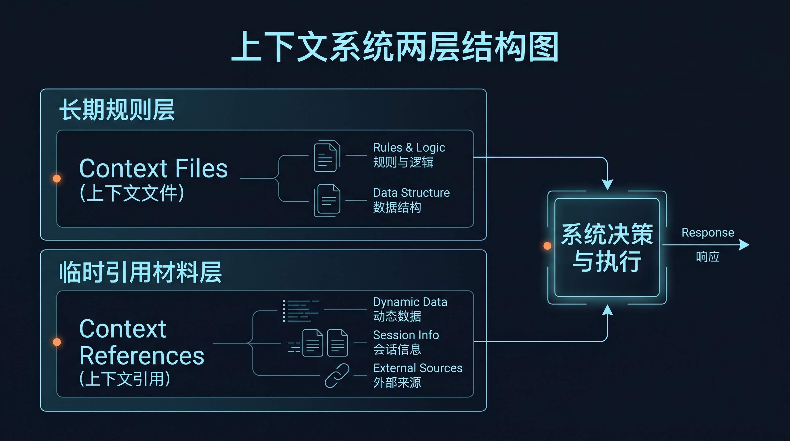

# 🧩 04-上下文系统

这一页只解决一件事：
帮你把 Hermes 的上下文分成两层来理解和使用：长期规则层，与当前任务临时材料层。

---

## 🎯 先记住：上下文系统不是“多喂一点材料”

这一页最重要的理解只有一句话：

- 长期会反复成立的，单独固定下来
- 只服务这次任务的，按需临时带进来

上下文系统解决的不是数量问题，而是分层问题。

---

## ✨ 为什么一到长期使用就会需要它

当你开始长期用 Hermes，很快会遇到这 3 个问题：

- 同样的规则每轮都要重讲
- 当前任务材料每次都要重新贴
- 长期规则和临时材料混在一起，越用越乱

上下文系统就是为了解决这三个问题而存在。

---

## 🧭 两层分别解决什么

### 长期规则层：Context Files

这一层适合放：

- 项目约定
- 目录边界
- 编码风格
- 长期安全要求
- 团队协作规则

关键词是：
以后很多轮都还成立。

### 临时材料层：Context References

这一层适合放：

- 当前要看的文件
- 某个目录
- 一次 diff
- 最近几次提交
- 临时网页资料

关键词是：
只服务当前任务。

---

## 🚫 为什么不能混写

如果把长期规则写成临时引用：

- 每次都得重新带
- 会话一换就容易丢
- Hermes 很难长期稳定

如果把临时材料写进长期规则：

- 规则文件会越来越脏
- 一次性内容会污染长期层
- 真正重要的约束会被淹没

所以最简单的判断方法是：

- 下周、下个月、大多数同类任务还成立的 → 长期规则层
- 这次任务看完就算了的 → 临时材料层

---

## 📌 这一步为什么重要

上下文系统带来的不是一个语法点，而是工作方式变化：

1. 规则终于能长期稳定生效
2. 当前任务材料可以精准带入
3. 多轮协作不再每次从头讲背景
4. 后面做外部接入、自动化、多助手时，边界更容易扩展

所以这一步是在帮你把“聊天式使用”推进成“系统化使用”。

---

## 🛣️ 这两条下游路线怎么分

### 我现在最需要把项目长期规则固定下来

先看：
- [02-上下文文件](./02-上下文文件.md)

### 我现在最需要把这次任务的材料带准确

先看：
- [03-上下文引用](./03-上下文引用.md)

默认顺序建议：
先理解长期规则层，再理解临时材料层。

---

## 🔍 成功信号

这一页通过，不是因为你已经记住了所有语法。
而是因为你已经能明确判断：

- 什么该长期固定
- 什么该临时引用
- 为什么这两层不能继续混在一起
- 后面遇到一个新材料时，应该放哪一层

---

## 🩺 如果现在还分不清，先查这 3 件事

### 1. 这条信息以后还会不会反复成立

会反复成立，就优先考虑长期规则层。

### 2. 这条信息是不是只为当前任务服务

如果是，就优先考虑临时材料层。

### 3. 你现在卡的是“项目规则”还是“任务材料”

卡项目规则 → 去看 context files。
卡任务材料 → 去看 context references。

---

## ✅ 什么时候算通过

当你已经满足下面这些判断，这一页就算通过：

- 我知道上下文系统的核心是分层，不是堆料
- 我知道长期规则层和临时材料层各自解决什么
- 我知道为什么它们不能混写
- 我知道自己下一步该先看 context files 还是 context references

---

## ➡️ 下一步
完成后进入：
- [02-上下文文件](<./02-上下文文件.md>)

如果你想先回到上一阶段入口重新确认位置：
- [04-自己造东西](<../01-总览.md>)
