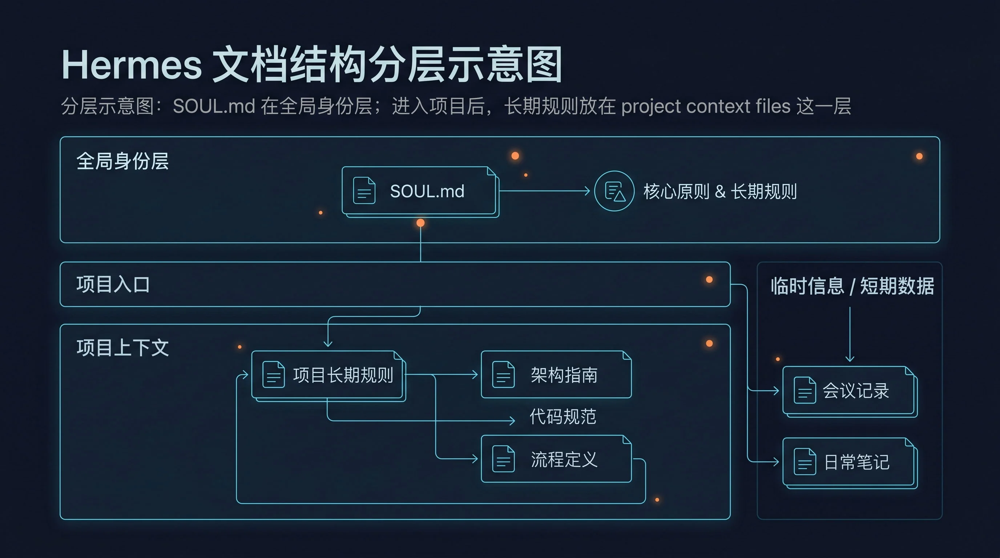

# 📄 02-上下文文件

这一页只解决一件事：
教你把那些“以后很多轮都成立的项目规则”固定到 context files 里，让 Hermes 不用每次都重新听一遍。



---

## 🎯 先记住：这页讲的是长期规则，不是临时任务材料

如果你现在脑子里想的是这些内容：

- 项目架构说明
- 目录职责边界
- 编码风格
- 测试约定
- 哪些文件不要碰

那就属于这一层。

如果你想的是“这次要看哪个文件、哪段 diff、哪篇网页”，那不是这一页，去看：
- [03-上下文引用](./03-上下文引用.md)

---

## ✨ 它解决的真实问题是什么

长期在同一个项目里用 Hermes，最常见的问题不是不会做事，而是规则总在丢：

- 每轮都要重复解释项目约定
- 会话一换，规则就断档
- 目录边界和改动边界容易漂
- 团队约束很难长期保持一致

context files 的作用，就是把这些长期规则固定下来。

---

## 📂 哪些文件属于这一层

官方支持的 project context files 包括：

- `.hermes.md` 或 `HERMES.md`
- `AGENTS.md`
- `CLAUDE.md`
- `.cursorrules`
- `.cursor/rules/*.mdc`

对大多数中文用户，最推荐直接用：

- `AGENTS.md`

原因很简单：

- 名字最直观
- 团队协作里最容易看懂
- 作为主项目规则文件最清楚

---

## 🧭 优先级怎么理解

Hermes 在一个会话里，不会把所有主规则文件都一起叠满。

主优先级可以这样记：

1. `.hermes.md` / `HERMES.md`
2. `AGENTS.md`
3. `CLAUDE.md`
4. `.cursorrules`

对用户最重要的结论是：

- 同一个项目里，通常只维护一种主规则文件

不要同时养多套“主项目规则”，那样只会让规则冲突。

---

## 🚫 `SOUL.md` 为什么不属于这一层

`SOUL.md` 很重要，但它管的是：

- 助手长期身份
- 语气风格
- 默认行为倾向

而 context files 管的是：

- 进入这个项目后要遵守的项目规则

一句话区分：

- `SOUL.md` 管“这个助手平时像谁”
- context files 管“这个项目里该怎么做事”

---

## ⚡ 现在就能做的最小动作

### 第 1 步：选定一个主规则文件

默认建议直接选：

```text
AGENTS.md
```

### 第 2 步：把长期规则写进去

优先写这些高频且稳定的内容：

- 项目结构说明
- 目录职责边界
- 代码风格
- 测试与验证要求
- 改动禁区
- 提交前必须做的检查

### 第 3 步：把一次性内容删掉

不要把这些塞进去：

- 这次任务要看的文件
- 临时 bug 背景
- 某次 diff
- 一次网页摘录
- 很快就会过期的说明

### 第 4 步：用一件真实任务验证它是否真的生效

给 Hermes 一个项目内任务，观察它是否自动遵守你写下的长期规则，而不是每次还要你手动提醒。

---

## 🔍 Success signal：怎样算写对了

看到下面这些信号，就说明你基本用对了：

- 同一项目里不用每轮重讲规则
- Hermes 更少越界改动
- 它会更稳定地遵守目录和测试约束
- 长期规则文件越来越像项目说明书，而不是临时笔记堆

---

## 🩺 第一次失败时，先查这 4 件事

### 1. 你是不是同时维护了多套主规则文件

如果有多个主入口，先收敛成一套。

### 2. 你是不是把临时材料写进了长期规则

如果 AGENTS.md 越来越像聊天记录，说明放错层了。

### 3. 规则是不是写得太抽象

“尽量写好代码”这种句子约束力很弱，尽量改成可执行规则。

### 4. 你是不是把 `SOUL.md` 和项目规则混写了

人格和项目规则最好分开维护。

---

## ✅ 什么时候算通过

当你已经满足下面这些判断，这一页就算通过：

- 我知道 context files 负责长期项目规则
- 我知道 `AGENTS.md` 是最推荐的主入口
- 我知道 `SOUL.md` 不属于这一层
- 我知道哪些内容应该写进去，哪些不该写进去
- 我知道怎么用一个真实任务验证长期规则是否生效

---

## ➡️ 下一步
完成后进入：
- [03-上下文引用](<./03-上下文引用.md>)

继续完善上下文系统：
- [接入外部记忆系统](/docs/start/build/memory-providers)
- [按职责拆分多个助手 Profile](/docs/start/build/profiles)

如果你想先回到上一阶段入口重新确认位置：
- [04-上下文系统](<./01-总览.md>)
