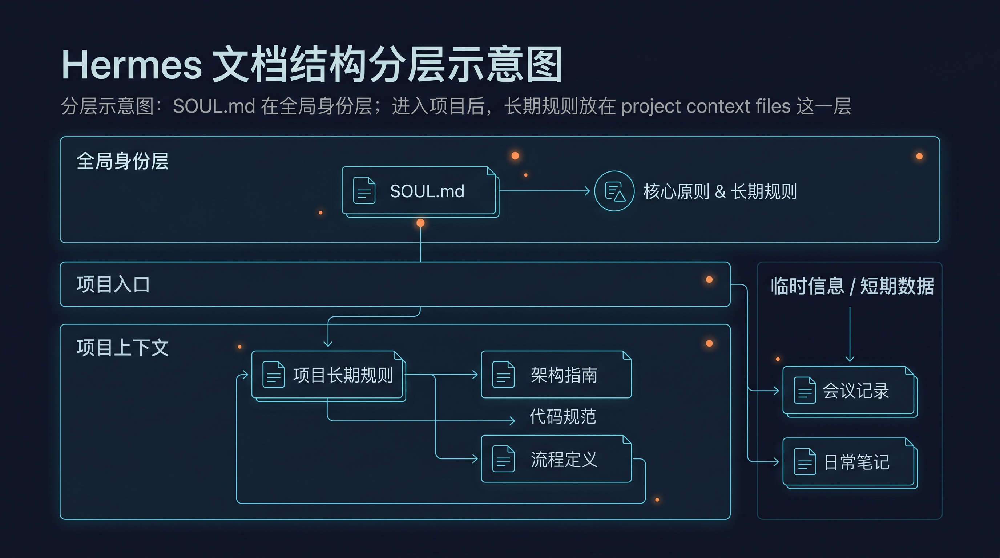

# 📄 02-上下文文件

这一页只讲一件事：
context files 是 Hermes 的长期规则层。它负责让项目约定长期生效，不用你每轮重讲。



---

## ❓ context files 解决什么问题

如果你长期在一个项目里用 Hermes，最容易乱的是这几件事：

- 项目规则总要重复说
- 目录约定总要重复解释
- 代码风格和执行边界容易漂
- 会话一换，项目规则就像断档

context files 就是为这个问题准备的。

你可以把它理解成：
这是“进了这个项目后，Hermes 长期要守的规矩”。

它解决的不是“这次任务要看哪些材料”。
它解决的是“以后很多轮都成立的项目规则，放哪里最稳”。

---

## 🔹 哪些文件属于这一层

官方支持的 project context files 有这些：

- `.hermes.md` 或 `HERMES.md`
- `AGENTS.md`
- `CLAUDE.md`
- `.cursorrules`
- `.cursor/rules/*.mdc`

先记一个实用结论：

- 真正参与 project context 优先级竞争的主类型，是 `.hermes.md` / `HERMES.md`、`AGENTS.md`、`CLAUDE.md`、`.cursorrules`
- `.cursor/rules/*.mdc` 属于 Cursor 规则模块，只有在更高优先级 project context 不存在时，才会由 Cursor 规则这一支接管
- 对大多数中文用户，最推荐直接用 `AGENTS.md`

为什么最推荐 `AGENTS.md`：

- 它是官方定义的主项目 context file
- 它名字直接表达“这是给 agent 的项目规则”
- 团队协作时也最容易一眼看懂

---

## 🔹 优先级怎么理解

Hermes 在一个会话里，只会加载一种 project context 类型。
不是几种一起叠满。
而是“先匹配到谁，就由谁接管这一层”。

优先级顺序是：

1. `.hermes.md` / `HERMES.md`
2. `AGENTS.md`
3. `CLAUDE.md`
4. `.cursorrules`

可以直接这样理解：

<table>
  <colgroup>
    <col style="width: 28%;" />
    <col style="width: 22%;" />
    <col style="width: 50%;" />
  </colgroup>
  <thead>
    <tr>
      <th>文件类型</th>
      <th>优先级</th>
      <th>你该怎么理解</th>
    </tr>
  </thead>
  <tbody>
    <tr>
      <td><code>.hermes.md</code> / <code>HERMES.md</code></td>
      <td>最高</td>
      <td>如果项目已经明确用 Hermes 自己的规则文件，就优先听它</td>
    </tr>
    <tr>
      <td><code>AGENTS.md</code></td>
      <td>第二</td>
      <td>最推荐的主项目规则文件。大多数项目直接写它就够了</td>
    </tr>
    <tr>
      <td><code>CLAUDE.md</code></td>
      <td>第三</td>
      <td>兼容已有 Claude Code 项目规则。适合迁移，不是中文新手首选</td>
    </tr>
    <tr>
      <td><code>.cursorrules</code></td>
      <td>第四</td>
      <td>当前面几种都没有时，才由 Cursor 规则接管</td>
    </tr>
    <tr>
      <td><code>.cursor/rules/*.mdc</code></td>
      <td>跟随 Cursor 规则分支</td>
      <td>它不是更高的一层。只有更高优先级不存在时，这一支才有机会生效</td>
    </tr>
  </tbody>
</table>

最重要的一句：
不要在同一个项目里同时维护多套“主项目规则文件”。
你写得越多，不代表越清楚。
通常只选一种就够了。

---

## ❓ SOUL.md 为什么不是这一层

`SOUL.md` 很重要。
但它不属于 project context files。

原因很简单：
它解决的不是“这个项目怎么做事”。
它解决的是“这个 Hermes 平时像谁、怎么说话、默认怎么行动”。

所以它属于全局身份层，不属于项目长期规则层。

你可以这样分：

- `SOUL.md`：这个 Hermes 的长期身份、语气、默认行为底色
- `AGENTS.md` 等 project context files：进入这个项目后，要遵守什么项目规则

位置也不同：

- `SOUL.md` 来自 `HERMES_HOME/SOUL.md`
- project context files 来自当前项目目录体系

如果你想继续补这块背景，可以回看：
- [02-让 Hermes 更像你](../../03-玩出花样/02-让 Hermes 更像你.md)

---

## ❓ progressive discovery 对你意味着什么

这点很关键。
Hermes 不是只在启动那一刻读一次项目规则，然后永远不变。

当它继续读取子目录里的文件时，会逐步发现相关子目录 context file，并在需要时注入。
这叫 progressive subdirectory discovery。

对用户最实用的理解是：

- 仓库根目录可以写全局项目规则
- 某个子目录可以再补这个局部范围自己的规则
- Hermes 只有在真的读到那个子目录时，才会把那层规则带进来

例如：

```text
my-project/
├─ AGENTS.md
├─ frontend/
│  ├─ AGENTS.md
│  └─ src/...
└─ backend/
   ├─ AGENTS.md
   └─ app/...
```

这意味着：

- 刚进入项目时，先吃到根目录 `AGENTS.md`
- 当 Hermes 开始读取 `frontend/` 下的文件，会再发现 `frontend/AGENTS.md`
- 当 Hermes 开始读取 `backend/` 下的文件，会再发现 `backend/AGENTS.md`

所以你会看到一种很自然的效果：
越深入具体目录，规则越具体。

这不是规则冲突越来越多。
而是 Hermes 在按你当前真正进入的工作范围，逐步拿到更细的局部约束。

---

## ❓ 什么该写进长期规则层

适合写进 context files 的，通常有这些：

- 项目架构说明
- 目录职责边界
- 编码风格
- 测试约定
- 提交前必须做的检查
- 哪些文件能改，哪些文件不要碰
- 团队长期约定
- 长期有效的安全边界

判断方法很简单：
如果这条要求下周、下个月、大多数同类任务里还成立，它就适合写这里。

---

## ❓ 什么不该写进长期规则层

下面这些，不适合写进 context files：

- 这一次任务临时要看的文件
- 某次修 bug 的临时背景
- 某个网页摘录
- 一次性的 diff
- 只服务当前会话的说明
- 会很快过期的材料

一句话区分：

- 长期会反复成立的，放 context files
- 只服务这次任务的，不放这里

这一页先只把长期规则层讲清。
不展开 `@` 引用，不展开临时材料层。

---

## ✅ 什么时候算通过

当你已经能直接回答下面这些问题，这一页就通过：

- 你知道 context files 解决的是“项目长期规则放哪里”
- 你知道支持哪些 project context files
- 你知道一轮会话里只会加载一种 project context 类型
- 你知道 `AGENTS.md` 是主项目 context file
- 你知道 `SOUL.md` 属于全局身份层，不属于 project context files
- 你知道进入子目录后，Hermes 会按需逐步发现更多局部规则
- 你知道哪些内容该写进长期规则层，哪些不该写

---

## ➡️ 下一步

完成后进入：
- [03-上下文引用](03-上下文引用.md)

如果你想先回到上一阶段入口重新确认位置：
- [04-上下文系统](01-总览.md)
