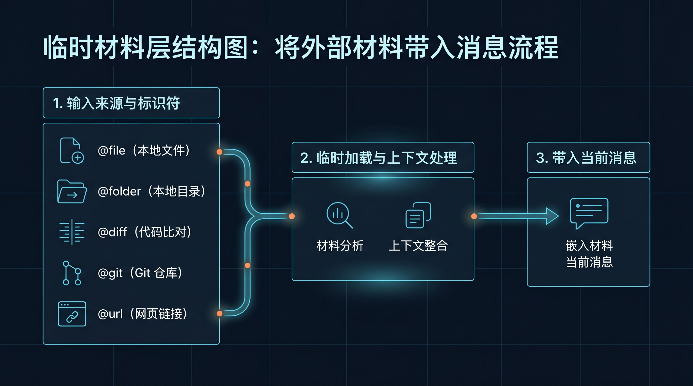

# 🔗 03-上下文引用

这一页只解决一件事：
教你用 `@` 引用，把当前任务真正需要看的文件、目录、diff、提交记录或网页，临时带进这一次消息里。



---

## 先记住：这页讲的是“这次要看什么”

`@` 引用解决的问题是：

- 这次任务要看哪个文件
- 这次 review 要看哪个 diff
- 这次排查要看哪几次提交
- 这次分析要参考哪篇网页

它不负责长期项目规则。
长期规则请放到：
- [02-上下文文件](./02-上下文文件.md)

---

## 它为什么重要

很多任务失败，不是因为规则不够，而是因为带错了材料。

例如：

- 你想让 Hermes 改一个文件，却没明确给它文件
- 你想 review 当前改动，却只给了模糊描述
- 你想让它总结外部文档，却没把网页带进来

context references 的作用，就是让“这次任务该看什么”变得准确。

---

## 最常用的 6 类引用

### 1. `@file:path`

适合：

- 让 Hermes 直接看某个文件
- 改动前先理解原文

示例输入：

```text
请先阅读 @file:src/app.py ，再告诉我这个入口函数在做什么。
```

### 2. `@file:path:10-25`

适合：

- 只看一小段
- 精准聚焦报错附近几行

示例输入：

```text
解释一下 @file:src/app.py:10-25 这里为什么会报空指针。
```

### 3. `@folder:path`

适合：

- 先认识一个目录结构
- 还不知道入口文件在哪

示例输入：

```text
先看 @folder:src/services ，告诉我这里的模块是怎么分层的。
```

### 4. `@diff`

适合：

- review 当前未提交改动
- 检查有没有越界、漏测、风格问题

示例输入：

```text
基于 @diff 做一次代码 review，只指出高风险问题。
```

### 5. `@staged`

适合：

- 只看已经暂存、准备提交的改动

示例输入：

```text
基于 @staged 帮我检查这次准备提交的改动是否缺测试。
```

### 6. `@git:N` 和 `@url:https://...`

适合：

- `@git:N`：回看最近 N 次提交
- `@url`：带一篇网页资料进来

示例输入：

```text
先看 @git:5 ，总结这个分支最近五次提交在做什么。
```

```text
阅读 @url:https://example.com/spec ，对照当前实现找出不一致之处。
```

---

## 现在怎么选最合适的引用

直接按这个判断就够了：

- 已经知道具体文件 → `@file`
- 只看几行 → `@file:path:10-25`
- 先看目录结构 → `@folder`
- review 当前改动 → `@diff`
- 只看暂存改动 → `@staged`
- 回看最近提交 → `@git:N`
- 带外部资料 → `@url`

原则只有一个：
只带这次任务最小够用的材料，不要把整个仓库都塞进去。

---

## 为什么 CLI 是主入口

在 CLI 里输入 `@`，通常会有补全和展开支持。

这意味着：

- 你更容易发现可用引用类型
- 发送前就能确认引用目标
- 这是官方设计里最自然的入口

如果你主要靠命令行工作，这一套会非常顺手。

---

## 为什么消息平台里不要默认指望 `@` 自动展开

在 Telegram、Discord 这类消息平台里，`@file`、`@diff`、`@url` 往往不会像 CLI 一样被自动展开。

所以在消息平台里的正确心智是：

- CLI 才是 `@` 引用主入口
- 消息平台更多依赖工具调用去读文件、查目录、取网页

---

## 成功信号

你用对 context references 时，通常会出现这些结果：

- 讨论范围明显更准
- 不需要手贴大段原文
- Hermes 更容易直接进入任务
- 长期规则和临时材料不会再混在一起

---

## 第一次失败时，先查这 4 件事

### 1. 你是不是带了太多材料

如果整个仓库一起塞进去，反而会模糊焦点。

### 2. 你是不是该用 `@diff` 却手贴了 patch

review 当前改动时，优先直接引用 diff。

### 3. 你是不是把长期规则也放进 `@` 里了

长期规则应该进 context files，不该每轮临时带。

### 4. 你是不是在消息平台里期待自动展开

如果入口不是 CLI，记得回到工具能力的心智。

---

## 什么时候算通过

当你已经满足下面这些判断，这一页就算通过：

- 我知道 `@` 引用负责当前任务材料，不负责长期规则
- 我知道最常用的 6 类引用分别适合什么场景
- 我知道怎么用最小够用的材料缩小任务范围
- 我知道 CLI 是主入口，消息平台不要默认期待自动展开

---

## ➡️ 下一步
完成后进入：
- [05-把 Hermes 接进外部系统](<../05-%E6%8A%8A%20Hermes%20%E6%8E%A5%E8%BF%9B%E5%A4%96%E9%83%A8%E7%B3%BB%E7%BB%9F.md>)
如果你想先回到上一阶段入口重新确认位置：
- [04-上下文系统](./01-总览.md)
