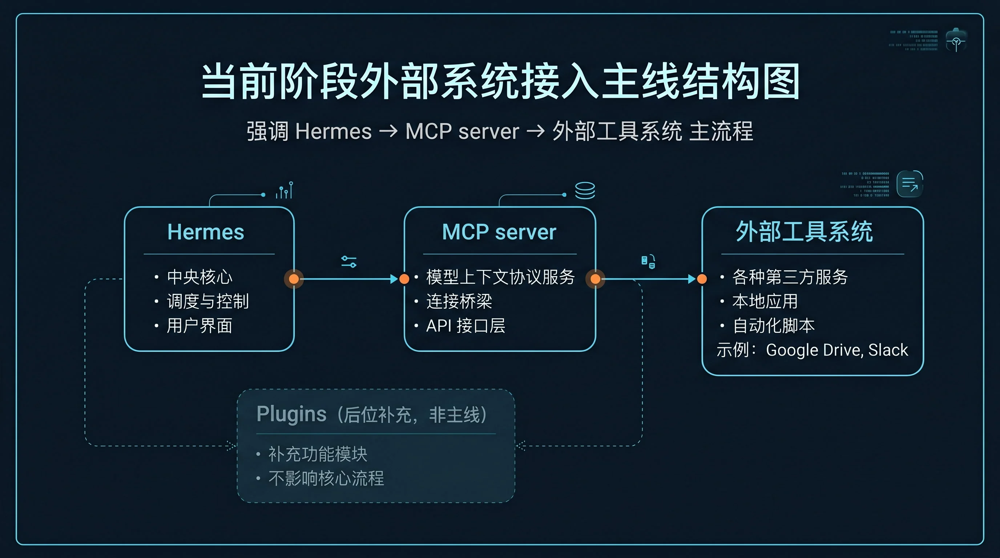

# 🔌 05-把 Hermes 接进外部系统

这一页只解决一件事：
已有 MCP server 可手动接入；桌面已有可信目录插件时，也可从 Connectors 安装并连接。两条路线都要完成真实调用与撤销验收。



> **一句话结论**：让 Hermes 通过 MCP 调用你已有的外部工具或系统，跑通第一条接入主线。

**适合谁**：想让 Hermes 调用 GitHub、数据库、内部 API 等已有外部工具或系统的用户。
**不适合谁**：只在 CLI 里聊天、不需要接外部系统的用户。
**最短路径**：确认外部系统可用 → 选择或部署 MCP server → 在 `config.yaml` 的 `mcp_servers` 中注册 → 重启 Hermes 验证工具出现。
**关键限制**：需要先有一个可用的外部系统和对应的 MCP server（社区或自建）；手动接外部协议服务可用 MCP；桌面目录插件可提供 MCP server、工具和 skill，按目标选择。
**下一步**：继续阅读下方 [先判断：你是不是在做"外部系统接入"](#-先判断你是不是在做外部系统接入) 章节。

---

## 🎯 先判断：你是不是在做“外部系统接入”

下面这些情况，通常就该先看 MCP：

- 你想让 Hermes 调 GitHub、数据库、文件系统、浏览器、内部 API
- 你接的是一个已经存在的工具服务器
- 你更关心“先接上能用”，不是“先写 Hermes 内部扩展”
- 你希望这些能力以后像普通工具一样被调用

一句话：
如果你的需求是“让 Hermes 去用一个现成系统”，先看 MCP，通常最顺。

---

## ✨ 这一步为什么重要

把 Hermes 接进外部系统，能力会发生实质变化：

1. Hermes 不再只局限在聊天窗口内部
2. 它开始能直接调用外部工具和服务
3. 后面的服务化、自动化、编辑器工作流才真正有现实基础

所以这一步的意义不是多了个名词，而是 Hermes 开始真的接触外部世界。

---

## 🧭 手动 MCP 与现成插件怎么选

这不是说 Plugins 不重要。

而是从用户视角，当前阶段更自然的主线是：

- 你要接外部工具系统
- 可以先比较现成 Connector/plugin 与手动 MCP，不把插件一律放到后位
- 接进来后，Hermes 会把这些能力当普通工具来用

所以这一页不展开插件开发手册，只先帮你把“怎么接上一个外部系统”走通。

---

## ⚡ 最短接入路径

### 第 1 步：安装 MCP 支持

在终端执行：

```bash
cd ~/.hermes/hermes-agent
uv pip install -e ".[mcp]"
```

成功后，这台 Hermes 才具备 MCP 相关能力。

### 第 2 步：在 `~/.hermes/config.yaml` 里写 `mcp_servers`

配置入口是：

```yaml
mcp_servers:
```

如果你接的是本地 stdio server，最小示例可以写成：

```yaml
mcp_servers:
  filesystem:
    command: "npx"
    args: ["-y", "@modelcontextprotocol/server-filesystem", "/home/user/projects"]
```

如果你接的是远端 HTTP server，最小示例可以写成：

```yaml
mcp_servers:
  company_api:
    url: "https://mcp.example.com/mcp"
    headers:
      Authorization: "Bearer ***"
```

你这一步只要先分清两类：

- stdio server
- HTTP server

### 第 3 步：启动 Hermes

执行：

```bash
hermes chat
```

或者进入你平时使用的入口，只要能正常启动即可。

### 第 4 步：立刻交给它一个依赖外部系统的真实任务

例如：

- 列某个目录文件
- 查 GitHub issue / PR
- 访问某个内部 API
- 查询某个数据库结果

只有真实任务成功，才算真正接上。

---

## 🔍 成功信号

### 1. Hermes 真能通过外部系统完成一件事

这是最强成功信号。
不是“配置没报错”，而是“任务真的做成了”。

### 2. MCP 工具已经像普通工具一样被 Hermes 使用

你的心智应该变成：
Hermes 新获得了一组工具，而不是多了一套平行宇宙机制。

### 3. 你已经知道现在该继续扩哪一侧

跑通后，你会更清楚自己接下来要走：

- 更深的系统接入
- 服务化暴露
- 自动化编排

---

## 🩺 第一次失败时，先查这 5 件事

### 1. MCP extra 有没有装上

回看安装命令是否成功执行。

### 2. `mcp_servers` 是不是写在正确配置文件里

重点检查：

```text
~/.hermes/config.yaml
```

### 3. 你配置的是 stdio 还是 HTTP

两类 server 的写法不同，别混写。

### 4. 外部 server 自己能不能工作

不要只盯 Hermes，也要确认目标 server 本身是可启动、可访问的。

### 5. 你有没有用一个真实任务验收

如果没有真实任务，只看配置很难判断到底接没接上。

---

## ✅ 什么时候算通过

当你已经满足下面这些判断，这一页就算通过：

- 我知道当前阶段外部系统接入的主线是 MCP
- 我知道 MCP 更适合“让 Hermes 去用现成外部系统”
- 我知道最短接法是：安装支持、写 `mcp_servers`、启动 Hermes、做真实任务验证
- 我知道成功标准不是配置存在，而是任务真的能通过外部系统完成

---

## 🖥️ 文件 Connector 的最小实战

以下是常见 filesystem MCP 的手动配置示例，需本机/后端有 Node.js 和 npm；首次启动会下载并执行依赖，请先检查官方 server 来源与可访问目录。把占位绝对路径替换成**后端机器**上的独立测试目录，目录只放已知内容的 `sample.txt`。

```yaml
mcp_servers:
  test-files:
    command: npx
    args:
      - -y
      - '@modelcontextprotocol/server-filesystem'
      - '/absolute/path/to/hermes-connector-test'
```

Windows 按自己的运行环境填写绝对路径；启动命令解析失败时检查 Node/npm 和 npx 路径，不复制 Linux 路径。不要把整个用户目录开放给 server。filesystem 具有文件写入工具，限制目录不是只读沙箱；在测试中只要求读取，进一步权限限制要按 server 支持的方式配置。

随后按[桌面 Connector 实战](/docs/start/personalize/desktop-app)完成连接、当前会话读取、原文比对与撤销。若选择目录插件，先核对固定来源/依赖，再分别安装、Connect now 和授权；不同时注册同一个 server 的手动配置和插件实例。

停止使用时禁用该 MCP 配置或断开连接，停止自己启动的 server，重新核对工具列表；云端账号还要单独撤销外部授权。教程示例未执行，不能据此声称文件读取已成功。

[官方 filesystem server](https://github.com/modelcontextprotocol/servers/tree/main/src/filesystem)、[Hermes 稳定插件说明](https://github.com/NousResearch/hermes-agent/blob/v2026.9.24/website/docs/user-guide/features/plugins.md)。

## ➡️ 下一步
完成后进入：
- [06-把 Hermes 暴露成后端服务](<./06-把%20Hermes%20暴露成后端服务.md>)

接通外部系统后，还可以继续：
- [让 Hermes 自动运行](/docs/start/build/automation)

如果你想先回到上一阶段入口重新确认位置：
- [04-自己造东西](<./01-总览.md>)
