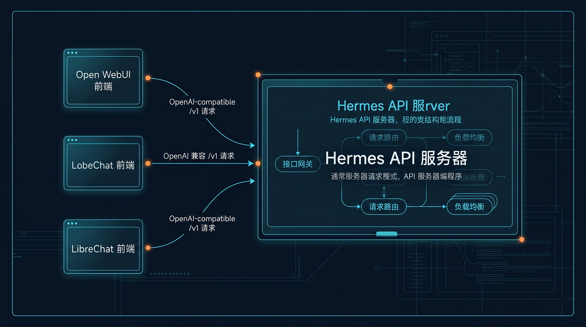

# 🌐 06-把 Hermes 暴露成后端服务

这一页只解决一个问题：
当你不想再只把 Hermes 用在 CLI 或单个聊天窗口里，而是想让它被前端、客户端或你自己的应用通过 HTTP 调用时，API Server 就是这一层入口。



---

## 🧭 先记住：这一页讲的是“服务化暴露”，不是“再开一个聊天入口”

很多人第一次看到 API Server，会下意识理解成：

“哦，就是把聊天界面换个地方开。”

但这不是这一页真正要解决的事情。

这页真正要讲的是：

当你希望“别的前端、客户端、应用程序”也能把 Hermes 当成后端能力来用时，你该怎么把 Hermes 暴露成一个可接入的 HTTP 服务。

一句话说透：

CLI 是你自己直接用 Hermes；API Server 是让别的界面和程序也能用 Hermes。

---

## ❓ 什么情况下值得先走 API Server

当你遇到下面这些需求时，通常就值得先走 API Server：

- 你已经不满足于只在命令行里和 Hermes 聊
- 你想把 Hermes 接到一个现成的聊天前端里
- 你想让团队成员通过统一界面来用 Hermes，而不是每个人都先学一遍 CLI
- 你想让自己的前端、内部工具或轻应用把 Hermes 当后端服务来调用
- 你需要的是“一个可接入的 HTTP 能力入口”，而不只是“我自己开一个聊天窗口”

把它说得更直白一点：
如果你的目标开始变成“让别的界面或程序也能用到 Hermes”，这一页就该看了。

---

## ❓ 它和单纯 CLI / 单个聊天窗口有什么不同

CLI 或单个聊天窗口，重点是“你本人直接在某个入口里使用 Hermes”。

API Server 的重点则是：
“让 Hermes 变成一个能被外部前端或客户端接入的后端服务”。

两者的差别可以这样理解：

<table>
  <colgroup>
    <col style="width: 26%;" />
    <col style="width: 37%;" />
    <col style="width: 37%;" />
  </colgroup>
  <thead>
    <tr>
      <th>使用方式</th>
      <th>你主要在做什么</th>
      <th>更适合什么场景</th>
    </tr>
  </thead>
  <tbody>
    <tr>
      <td>CLI / 单个聊天窗口</td>
      <td>你自己直接和 Hermes 交互</td>
      <td>个人使用、调试、快速试验、单入口工作</td>
    </tr>
    <tr>
      <td>API Server</td>
      <td>把 Hermes 暴露成 OpenAI-compatible HTTP API，让别的前端或程序来接它</td>
      <td>接 Open WebUI、LobeChat、LibreChat、NextChat、ChatBox，或你自己的前端 / 应用</td>
    </tr>
  </tbody>
</table>

所以这一页真正要你建立的心智不是“又多了一个聊天入口”。
而是：
Hermes 可以站在后面，前面换成你想要的界面。

---

## 🎯 把它暴露成后端服务以后，你真正会得到什么

这页最该让你现在看见的，不是端点名称，而是收益：

1. Hermes 不再局限在一个 CLI 窗口里
2. 你可以把更熟悉的前端界面接到 Hermes 后面
3. 团队使用门槛会下降，因为不是每个人都要先学 CLI
4. 你自己的系统或工具，也开始可以把 Hermes 当成“一个后端能力”来调用
5. 后面的自动化、工作流编排、产品化接入，会更容易继续往前走

一句话说透：

API Server 这一步，代表 Hermes 开始从“一个人自己用的助手”变成“可被别的系统调用的能力”。

---

## ❓ 它到底是什么：OpenAI-compatible HTTP API

官方给出的核心定位很明确：
Hermes 可以运行一个 OpenAI-compatible HTTP API server。

这意味着：

- 暴露出来的是 OpenAI-compatible 的 `/v1` 风格接口
- 多数会说 OpenAI 格式的前端，都可以把 Hermes 当后端来接
- 典型例子包括 Open WebUI、LobeChat、LibreChat、NextChat、ChatBox 等
- 前端虽然是在用 OpenAI-compatible API，但后端真正执行任务的是 Hermes
- 请求进来后，Hermes 仍然可以使用自己的工具能力，例如终端、文件操作、网页搜索、记忆、skills 等

这一点非常关键：
API Server 不是把 Hermes 变成“只会返回文本的裸模型接口”。
它是把 Hermes 整体能力，通过 OpenAI-compatible 的 HTTP 形式暴露出去。

---

## 📌 最短接法

这一页不展开部署架构，也不展开端点百科。
先记住最短的 5 步就够了。

### 第 1 步：在 `~/.hermes/.env` 里打开 API Server

把下面这项写进去：

```env
API_SERVER_ENABLED=true
```

### 第 2 步：设置 `API_SERVER_KEY`

继续在 `~/.hermes/.env` 里设置一个 key：

```env
API_SERVER_KEY=change-me-local-dev
```

### 第 3 步：如果浏览器要直连，再按需加 `API_SERVER_CORS_ORIGINS`

```env
API_SERVER_CORS_ORIGINS=http://localhost:3000
```

这一步通常只在浏览器页面直接请求 Hermes API 时才需要。

### 第 4 步：启动 gateway

```bash
hermes gateway
```

官方快速路径里，API Server 是跟着 gateway 一起启动的。

### 第 5 步：让前端把 base URL 指到 `http://localhost:8642/v1`

大多数 OpenAI-compatible 前端，核心就是填这几类信息：

- Base URL：`http://localhost:8642/v1`
- API Key：你刚才配置的 `API_SERVER_KEY`
- Model：通常填 `hermes-agent`

如果你接的是 Open WebUI、LobeChat、LibreChat、NextChat、ChatBox 这类工具，思路都一样：
把它们原本要连 OpenAI 的地方，改成连你本地 Hermes API Server。

---

## ✅ 成功标准

这一页最重要的是会判断“到底有没有接上”。

你可以看 3 个成功信号。

### 1）gateway 输出 API server listening

官方快速起步里，成功启动后会出现类似输出：

```text
[04-自己造东西/API服务] API server listening on http://127.0.0.1:8642
```

### 2）`/health` 可以访问

这说明最基本的 HTTP 服务已经在响应。

### 3）对 `/v1/chat/completions` 发请求能正常返回

例如用 `curl` 去打：

```bash
curl http://localhost:8642/v1/chat/completions \
  -H "Authorization: Bearer your-api-key" \
  -H "Content-Type: application/json" \
  -d '{
    "model": "hermes-agent",
    "messages": [
      {"role": "user", "content": "Hello!"}
    ]
  }'
```

如果它能正常返回结果，就说明这已经不是“服务开着而已”，而是“前端同类请求也有基础可以接通”。

一句话总结：
看启动日志、看 `/health`、看一次真实 `/v1/chat/completions` 返回，这 3 个信号最实用。

---

## 🚫 当前页先不展开什么

为了保证当前页边界清楚，这几个方向先不展开：

- OpenAI API 全量字段和完整规范
- 每个前端各自的 UI 配置差异
- 生产环境部署、反向代理、HTTPS、外网暴露
- 更细的鉴权策略和多用户隔离
- Responses API 的完整会话状态细节
- 流式事件、工具进度事件、SSE 细节
- Cron / Automation 怎么和 API Server 组合使用

这一页只先帮你建立一个稳定结论：
当你要把 Hermes 接进前端或应用时，API Server 是“服务化暴露”的那一步。

---

## ✅ 什么时候算通过

当前页学完，至少要满足下面这些判断，才算通过：

- 你已经知道什么情况下该把 Hermes 暴露成后端服务
- 你已经能说清 API Server 和 CLI / 单个聊天窗口的区别
- 你已经知道把它服务化以后，你真正会得到什么
- 你已经知道 Hermes 暴露的是 OpenAI-compatible HTTP API
- 你已经知道多数 OpenAI-compatible 前端都能接它，典型例子包括 Open WebUI、LobeChat、LibreChat、NextChat、ChatBox
- 你已经知道最短接法是：打开 `API_SERVER_ENABLED`、设置 `API_SERVER_KEY`、按需加 `API_SERVER_CORS_ORIGINS`、启动 gateway、把 base URL 指向 `http://localhost:8642/v1`
- 你已经知道成功信号应该看启动日志、`/health` 和一次真实的 `/v1/chat/completions` 返回

如果一句话判断：
你已经能把“我自己在用 Hermes”切换成“别的前端也能把 Hermes 当后端来用”，这一页就算过了。

---

## ➡️ 下一步

完成后进入：
- [07-让 Hermes 自己自动跑](<07-让 Hermes 自己自动跑.md>)

如果你想先回到上一阶段入口重新确认位置：
- [04-自己造东西](01-总览.md)
