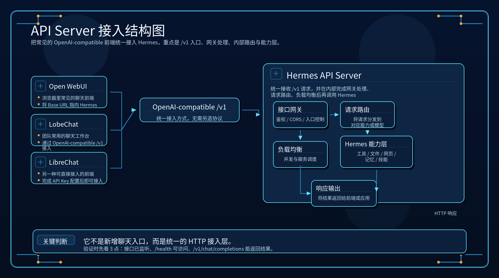

# 🌐 06-把 Hermes 暴露成后端服务

这一页只解决一件事：
当你想让前端、客户端或自己的应用通过 HTTP 调用 Hermes 时，怎样把它暴露成一个可接入的 API Server。



> **一句话结论**：把 Hermes 暴露成 OpenAI-compatible 的 API Server，让前端或应用通过 HTTP 调用它。

**适合谁**：想让 Open WebUI、LobeChat 等前端，或自己的应用通过 HTTP 标准接口调用 Hermes 的用户。
**不适合谁**：只在 CLI 里自己用 Hermes 的个人用户——不需要服务化就先跳过这页。
**最短路径**：启动 Hermes API Server → 配置 OpenAI-compatible endpoint（`/v1/chat/completions`）→ 用前端或 curl 接入验证联通。
**关键限制**：需要先有部署环境（本机或服务器）；API Server 涉及 gateway 配置、端口暴露和访问控制，生产环境需额外考虑鉴权与稳定性。
**下一步**：继续阅读下方 [先判断：你是不是已经进入"服务化暴露"阶段](#-先判断你是不是已经进入服务化暴露阶段) 章节。

---

## 🎯 先判断：你是不是已经进入“服务化暴露”阶段

下面这些情况，通常就该看这一页：

- 你不想只在 CLI 里自己用 Hermes
- 你想接 Open WebUI、LobeChat、LibreChat 这类前端
- 你想让团队成员通过统一界面使用 Hermes
- 你想让自己的应用通过 HTTP 把 Hermes 当后端来调用

如果你只是想自己在本机继续聊天，这一页还不是重点。

---

## 🎁 这一步真正改变了什么

API Server 带来的不是“再开一个聊天入口”，而是能力边界变化：

1. Hermes 开始从“一个人自己用的助手”变成“可被外部系统调用的能力”
2. 你可以把前端界面和 Hermes 后端分开
3. 团队和应用都能通过统一接口接入 Hermes
4. 后面的自动化、产品化、工作流编排才有标准入口

所以这一步很关键，因为它决定 Hermes 能不能从本地工作流走向系统能力。

---

## 🧠 它到底是什么

Hermes 暴露的是：

- OpenAI-compatible HTTP API

这意味着多数支持 OpenAI 格式的前端，都可以直接把 Hermes 当后端来接。

典型前端包括：

- Open WebUI
- LobeChat
- LibreChat
- NextChat
- ChatBox

关键点在这里：
API Server 不是把 Hermes 变成一个只会回文本的裸模型接口。
它暴露出去的仍然是 Hermes 整体能力。

---

## ⚡ 最短接法

### 第 1 步：在 `~/.hermes/.env` 打开 API Server

写入：

```env
API_SERVER_ENABLED=true
```

### 第 2 步：设置 API key

继续写入：

```env
API_SERVER_KEY=change-me-local-dev
```

### 第 3 步：如果浏览器页面要直连，再按需设置 CORS

```env
API_SERVER_CORS_ORIGINS=http://localhost:3000
```

如果你的前端不是浏览器直连，这一步通常可以后放。

### 第 4 步：启动 gateway

执行：

```bash
hermes gateway
```

官方快速路径里，API Server 会跟着 gateway 一起启动。

### 第 5 步：在前端里填入连接信息

常见需要填写这三项：

- Base URL：`http://localhost:8642/v1`
- API Key：你刚配置的 `API_SERVER_KEY`
- Model：通常填 `hermes-agent`

这一步就是把前端原本连接 OpenAI 的位置，改成连接你自己的 Hermes。

---

## 🔍 成功信号

### 1. 启动日志里出现 listening 信息

你要看到类似：

```text
API server listening on http://127.0.0.1:8642
```

### 2. `/health` 能访问

这说明最基础的 HTTP 服务已经起来了。

### 3. `/v1/chat/completions` 能返回结果

例如执行：

```bash
curl http://localhost:8642/v1/chat/completions \
  -H "Authorization: Bearer YOUR_KEY" \
  -H "Content-Type: application/json" \
  -d '{
    "model": "hermes-agent",
    "messages": [
      {"role": "user", "content": "Hello!"}
    ]
  }'
```

只要它能返回正常结果，就说明这条服务链路已经能被前端复用。

---

## 🩺 第一次失败时，先查这 5 件事

### 1. `API_SERVER_ENABLED` 有没有写进去

先检查：

```text
~/.hermes/.env
```

### 2. API key 有没有设置，前端里填的 key 是否一致

这是最常见的接通失败原因之一。

### 3. gateway 有没有真的启动起来

如果 gateway 没起来，API Server 也不会正常工作。

### 4. Base URL 是否填成了正确的 `/v1`

常见目标地址是：

```text
http://localhost:8642/v1
```

### 5. 你有没有先用 `curl` 做一次最小验证

先用 `curl` 跑通，再去排查前端配置，效率最高。

---

## ✅ 什么时候算通过

当你已经满足下面这些判断，这一页就算通过：

- 我知道什么时候应该把 Hermes 暴露成后端服务
- 我知道 API Server 和 CLI 的本质区别
- 我知道 Hermes 暴露的是 OpenAI-compatible HTTP API
- 我知道最短接法是：打开开关、设置 key、按需配 CORS、启动 gateway、把前端指向 `/v1`
- 我知道该用 listening 日志、`/health`、真实 `/v1/chat/completions` 返回做验收

---

## ➡️ 下一步
完成后进入：
- [07-让 Hermes 自己自动跑](<./07-让%20Hermes%20自己自动跑.md>)

如果你想先回到上一阶段入口重新确认位置：
- [04-自己造东西](<./01-总览.md>)
