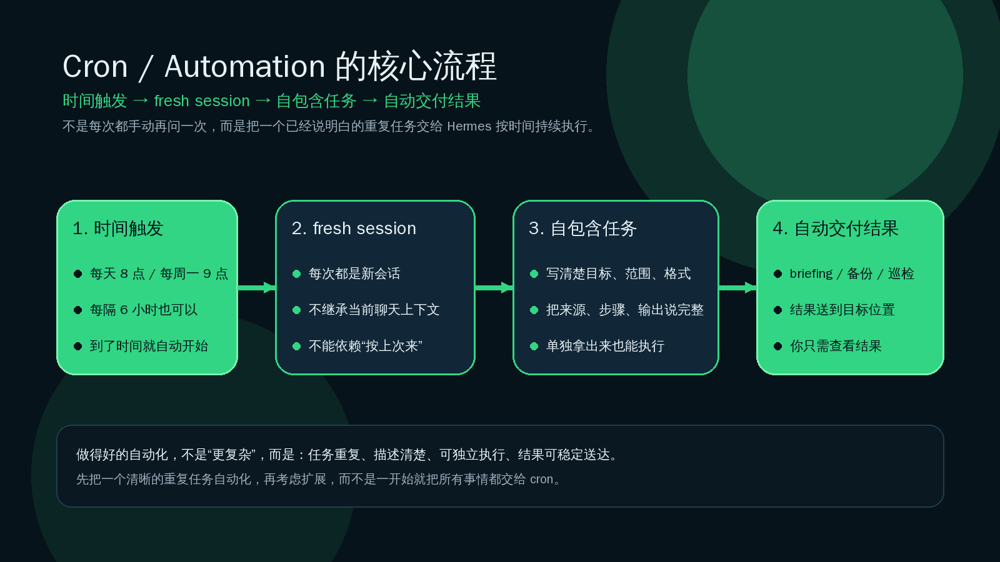

# 06-自动化

这一页只解决一件事：
当你已经有一个明确、重复、按时间发生的任务，不想每次都手动再问一遍时，就可以把它交给 Hermes 的 Cron / Automation。



---

## ❓ 什么情况下值得先走 Cron / Automation

下面这些情况，通常就值得先考虑自动化：

- 这件事会重复发生，而且你已经知道大概多久做一次
- 这件事每次的目标都差不多，比如日报、备份、briefing、例行审查、定时检查
- 你不是不会做，而是不想每次都自己重新触发
- 你希望结果在固定时间自己送达，而不是等你想起来再问
- 你已经能把任务写成一句足够清楚、别人拿去也能执行的说明

一句话判断：
如果你脑子里已经出现“这事每天 / 每周 / 每隔几小时都要来一次”，Cron / Automation 就值得上场了。

---

## ❓ 它和“手动每次问一次”有什么区别

手动触发和自动化，表面上都是让 Hermes 做事。
但它们解决的问题不一样。

<table>
  <colgroup>
    <col style="width: 24%;" />
    <col style="width: 38%;" />
    <col style="width: 38%;" />
  </colgroup>
  <thead>
    <tr>
      <th>方式</th>
      <th>你在做什么</th>
      <th>更适合什么情况</th>
    </tr>
  </thead>
  <tbody>
    <tr>
      <td>手动每次问一次</td>
      <td>你看到需求，再临时叫 Hermes 执行</td>
      <td>一次性任务、临时探索、需求还在变化、你还在试 prompt</td>
    </tr>
    <tr>
      <td>Cron / Automation</td>
      <td>你先定义好任务和时间，让 Hermes 到点自己跑</td>
      <td>重复任务、固定节奏、结果要稳定交付、你不想每次亲自触发</td>
    </tr>
  </tbody>
</table>

更关键的差别在这里：

- 手动问一次，重点是“现在帮我做”
- 自动化，重点是“以后按这个节奏持续帮我做”

所以 Cron / Automation 不是聊天窗口的替代品。
它更像是把一个已经说明白的重复任务，交给时间去触发。

---

## 📌 最短上手路径

这一页不做 cron 参数大全。
先把最短路径走通就够了。

### ➡️ 第 1 步：先挑一个真正重复的任务

不要一上来就想着“把所有事都自动化”。
先挑一个你已经反复在做、而且边界清楚的任务，例如：

- 每天早上出一份 briefing
- 每晚做一次备份检查
- 每周做一次仓库巡检
- 每隔几小时扫一次某类更新

### ➡️ 第 2 步：先手动把它跑顺一次

先在普通聊天或 CLI 里手动做一次。
原因很简单：
如果你现在还说不清 Hermes 到底该做什么，自动化只会把模糊放大。

先把这些点试清楚：

- 查什么
- 用哪些来源或工具
- 输出什么格式
- 发到哪里
- 多长时间跑一次才合理

### ➡️ 第 3 步：把 prompt 改成自包含版本

这是 Cron / Automation 最重要的一步。
官方文档明确强调：cron job 会在 fresh session 里运行，不继承你当前聊天上下文。

这意味着：

- 它不知道你刚才聊过什么
- 它不会自动继承“你平时都这么做”的隐含背景
- prompt 里必须写清楚任务目标、范围、输出格式、交付方式

坏写法：

```text
按老样子做今天的日报。
```

好写法：

```text
搜索过去 24 小时内 AI agents 和开源 LLM 的最新动态，至少查看 5 个来源，选出最值得关注的 3 条。每条输出标题、2 句摘要和原始链接。整体控制在 300 到 500 字，用简洁专业的中文写成晨间 briefing。
```

### ➡️ 第 4 步：创建 job，并确认它已经进入可管理状态

Hermes 的 cronjob 能力支持这些生命周期动作：

- create
- list
- update
- pause
- resume
- run
- remove

对用户来说，最先要掌握的是：

- 先创建一个 job
- 再 list 看它是否真的存在
- 需要改任务时更新它
- 需要暂停时 pause
- 想恢复就 resume
- 想立刻试跑就 run
- 不要了再 remove

如果你用 CLI，常见入口是 `hermes cron ...`；其中“更新任务”这件事，用户最常见的命令形式是 `hermes cron edit ...`。

### ➡️ 第 5 步：让结果按预期交付

自动化的价值不只是“后台跑了”。
而是“结果到了你真的会看到、会用的位置”。

你至少要确认两件事：

- 它有没有按计划触发
- 结果是不是送到了你要的地方，例如本地输出、Telegram、Discord 等目标

---

## 🔹 典型场景：Daily Briefing

如果你第一次接触 Cron / Automation，最容易理解的例子就是 Daily Briefing。

它的心智模型很简单：

- 你每天都想看一份固定主题的简报
- 你不想每天早上再打一遍同样的话
- 于是你先把这份 briefing 的标准写清楚
- 再让 Hermes 到时间自动去搜、整理、输出、交付

可以把它理解成：
不是“每天重新雇一次 Hermes”，而是“把一份明确的晨报任务交给 Hermes 长期值班”。

这个场景通常包含 4 个固定元素：

1. 时间：比如每天早上 8 点
2. 主题：比如 AI agents、开源 LLM、你关注的项目或行业
3. 输出格式：比如 3 条重点、每条带摘要和链接
4. 交付位置：比如 Telegram 或本地文件输出

为什么 Daily Briefing 是好起点：

- 它足够重复
- 它足够容易判断结果好不好
- 它很容易看出“手动触发”和“自动交付”的差别
- 它天然逼你把 prompt 写清楚

如果连 Daily Briefing 都还写不清楚，说明你更需要先手动把任务跑顺，而不是马上自动化。

---

## ✅ 成功信号看什么

这一页最重要的不是背命令，而是知道怎样判断“自动化真的建立起来了”。

你可以看下面这些成功信号：

### 🔹 1）任务描述已经足够自包含

如果你把当前 prompt 单独拎出来，另一个 fresh session 也能理解并执行，说明它已经接近可自动化。

### 🔹 2）job 已经能被列出来和管理

你能确认：

- 它已经创建成功
- 你能 list 到它
- 你知道需要时可以 update / pause / resume / run / remove

这说明它不是一句临时想法，而是一个真正进入系统管理的自动任务。

### 🔹 3）手动试跑的结果和你预期一致

在正式长期跑之前，先 run 一次看输出。
如果它试跑时就不稳定，按时间自动跑也不会 magically 变好。

### 🔹 4）结果会自动送到你真正消费的位置

真正的成功信号不是“后台有记录”。
而是你在该看的地方拿到了结果，而且内容是可读、可用的。

一句话总结：
成功不是“我建了一个 cron job”。
而是“它会在对的时间，用对的 prompt，在 fresh session 里稳定跑完，并把结果送到对的位置”。

---

## 🔹 哪些情况先别自动化

下面这些情况，通常先别急着上 Cron / Automation：

- 你连任务本身还没跑顺过
- 你每次都在改需求，今天要这个，明天又完全不同
- 你的 prompt 里大量依赖“你知道我意思”“照旧”“按上次来”这种隐含上下文
- 结果是否正确，你自己都还没有明确判断标准
- 这个任务发生频率太低，低到手动触发其实更省心
- 你是为了“显得高级”才自动化，而不是因为它真的重复且值得托管

最常见的误区就是：
不是所有事情都该自动化。
Cron 最适合的是“已经稳定、重复、可描述、可交付”的任务。

---

## ✅ 什么时候算通过

当前页学完，至少要满足下面这些判断，才算通过：

- 你已经知道什么情况下值得先走 Cron / Automation
- 你已经能说清它和“手动每次问一次”的区别
- 你已经知道最短上手路径是：先找重复任务、先手动跑顺、把 prompt 写成自包含、创建 job、确认交付结果
- 你已经理解一个典型 Daily Briefing 为什么适合先自动化
- 你已经知道 cron job 在 fresh session 里运行，不继承当前聊天上下文
- 你已经知道 Hermes 的 cronjob 生命周期能力包含 create、list、update、pause、resume、run、remove
- 你已经知道哪些情况先不要自动化

如果一句话判断：
你已经不再把 Cron 理解成“定时替我发一句话”，而是理解成“把一个自包含的重复任务交给 Hermes 按时间持续执行”，这一页就算过了。

---

## ➡️ 下一步

完成后进入:

- [ACP 与 IDE](./07-ACP与IDE.md)

如果你想先回到上一阶段入口重新确认位置:

- [04-自己造东西](../总览.md)
## 🔹 官方依据

- 官方用户文档：<https://hermes-agent.nousresearch.com/docs/user-guide/features/cron>
- 官方用户指南：<https://hermes-agent.nousresearch.com/docs/guides/automate-with-cron>
- 官方 Daily Briefing 教程：<https://hermes-agent.nousresearch.com/docs/guides/daily-briefing-bot>
- 官方开发说明：<https://hermes-agent.nousresearch.com/docs/developer-guide/cron-internals>

这一页只使用了当前页必须用到的边界：

- Hermes 支持 cronjob 生命周期能力：create、list、update、pause、resume、run、remove
- Cron / Automation 的目标是 scheduled automation，例如 briefing、备份、审查、日报等重复任务
- cron job 在 fresh session 里执行，不继承当前聊天上下文，所以 prompt 必须自包含
- 典型上手方式是：先把一个重复任务手动跑顺，再交给 cron，而不是一开始就把所有事情自动化
- 用户层只讲值得不值得自动化、怎么快速上手、怎么看成功信号，不展开完整参数手册
